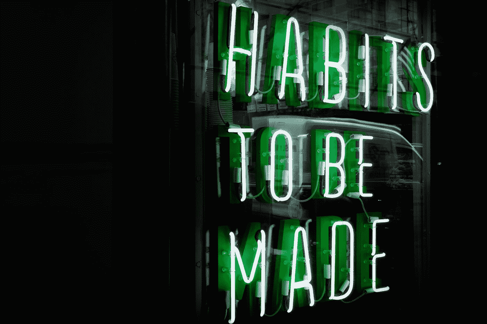

# 我是如何变得始终如一的。

> 原文：<https://medium.com/swlh/how-to-be-consistent-a60ff0d37b29>

Photo by [Drew Beamer](https://unsplash.com/@drew_beamer?utm_source=medium&utm_medium=referral) on [Unsplash](https://unsplash.com?utm_source=medium&utm_medium=referral)

## 你有没有注意到一个好习惯，就像锻炼一样，很难养成，但很容易打破？一个坏习惯，比如整天看电视，很容易养成，但很难改掉？

坏习惯更容易养成，因为它们不费吹灰之力。它们触发了多巴胺的“感觉良好”因子，或者…