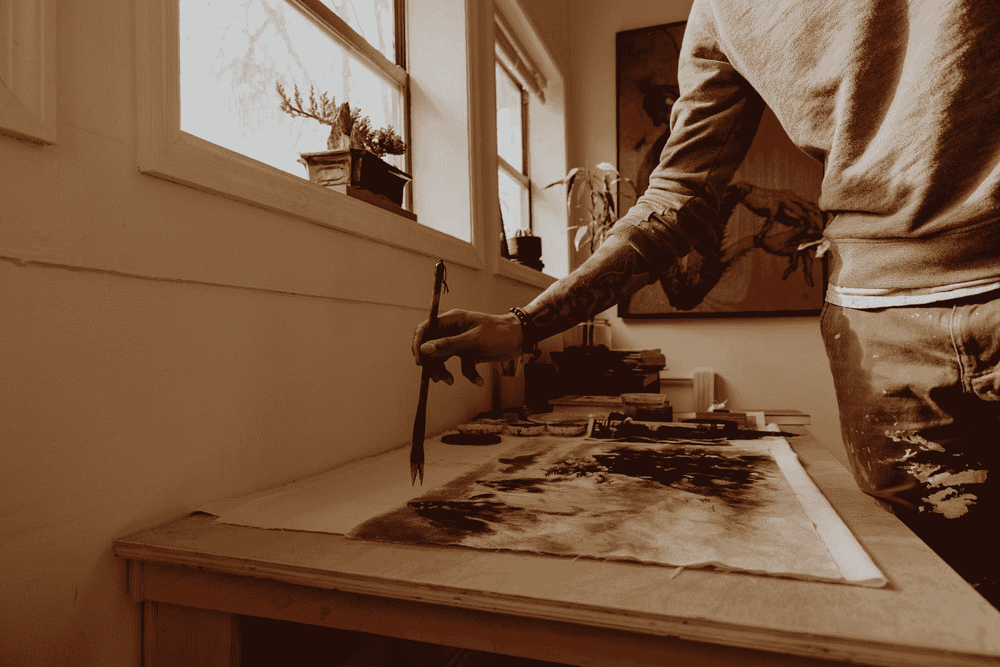

# 如何在不改变日常生活的情况下，提高现在的工作效率

> 原文：<https://medium.com/swlh/how-to-be-more-productive-now-without-changing-your-daily-life-3baebf171975>

生产力因人而异。让我们为你创造一个有效的系统。

Photo by [Antonio Francisco](https://unsplash.com/@reduceddesign?utm_source=medium&utm_medium=referral) on [Unsplash](https://unsplash.com?utm_source=medium&utm_medium=referral)

我大半辈子都是一个自助迷。我听过磁带(那时它们实际上还是磁带)，读过书，上过课。所有方面都有相似之处和不同之处，但有一点我永远不会忘记，那就是个人数据的力量…