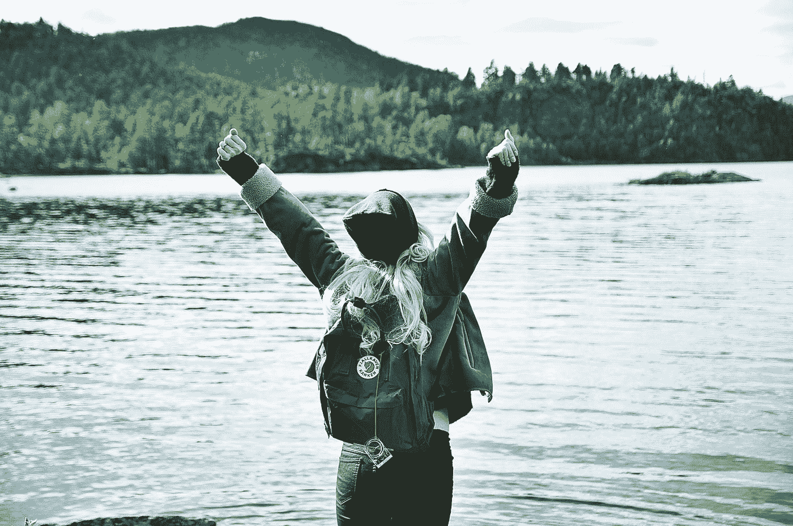

# 如何成为那 2%的一份子

> 原文：<https://medium.com/swlh/how-to-be-part-of-the-2-percent-62fe8cecb796>

## 成为真正学到东西的人的三步计划。

Photo by [Agnieszka Boeske](https://unsplash.com/@kundeleknabiegunie?utm_source=medium&utm_medium=referral) on [Unsplash](https://unsplash.com?utm_source=medium&utm_medium=referral)

你遇到过这种情况吗？

你报名参加某个活动。也许你报名参加一门课程。或者你买一本自助书。或者你买一张去开会的票。

然后你开始，但不要结束。或者，你根本就没有开始。