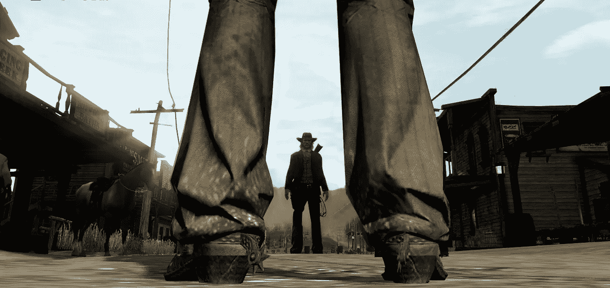

# 如何被视为种马

> 原文：<https://medium.com/swlh/how-to-be-perceived-as-a-stud-ea55c36179ef>

From Red Dead Redemption

## 摆出霍尔拜因的姿势，不要被拍到骑在马上

超人，亨利八世国王，我都用。对于一个男人来说，这是展示自信、可靠和健康男子气概的最简单也是最优雅的方式。这被称为*霍尔拜因姿势。*