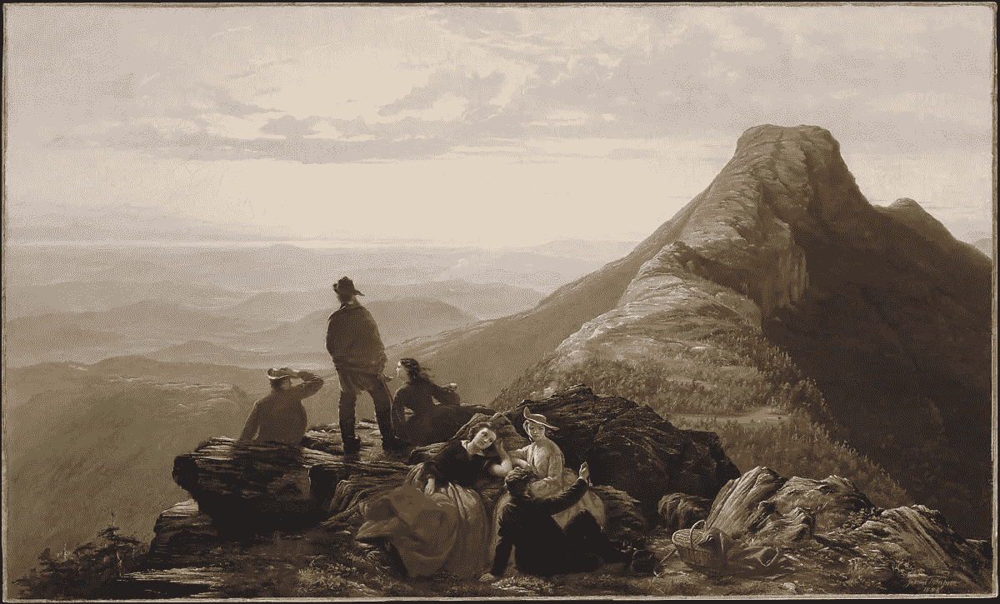

# 当你时间紧迫时如何提高效率

> 原文：<https://medium.com/swlh/how-to-be-productive-when-youre-short-on-time-5240f88b49ee>

[The Belated Party on Mansfield Mountain — Jerome B. Thompson](https://www.metmuseum.org/art/collection/search/12800?searchField=All&amp;what=Canvas&amp;ao=on&amp;ft=hour&amp;offset=0&amp;rpp=20&amp;pos=3)

时间。虽然是幻觉，但它确实奴役了我们。

但是如果我们不必成为它的奴隶呢？

如果我们不必追求生产率，不必阅读无数关于时间管理的文章，或者不必向我们有钱的叔叔们询问成功的秘诀，那会怎么样？

在我之前的文章中，我写了关于提高生产力的正确方法。