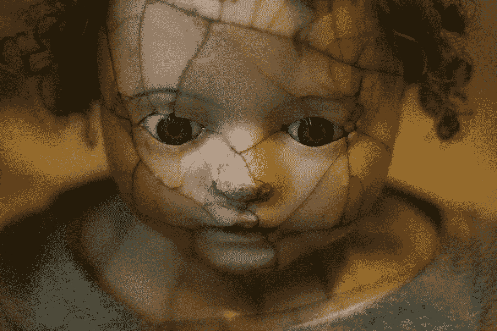

# 如何被恰当地打破

> 原文：<https://medium.com/swlh/how-to-be-properly-broken-deec56c91871>

## 找到合适的比喻来描述你的精神疾病。

Photo by [Aimee Vogelsang](https://unsplash.com/@vogelina?utm_source=medium&utm_medium=referral) on [Unsplash](https://unsplash.com?utm_source=medium&utm_medium=referral)

正常人就是不懂抑郁症。

当他们爱你的时候，他们会努力去爱你，这意味着整个世界。作为一个在这样一个家庭中长大的人，像*疯狂*和*精神病*这样的词是妙语，而*抑郁症*和*疗法*几乎是碰不到的，在那些提供实际的、真实的…