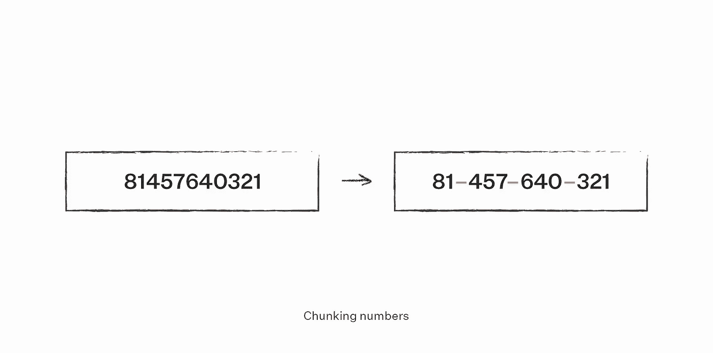
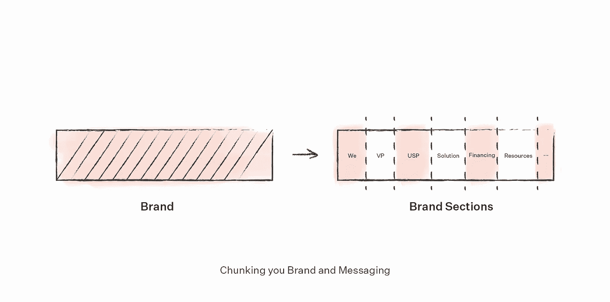
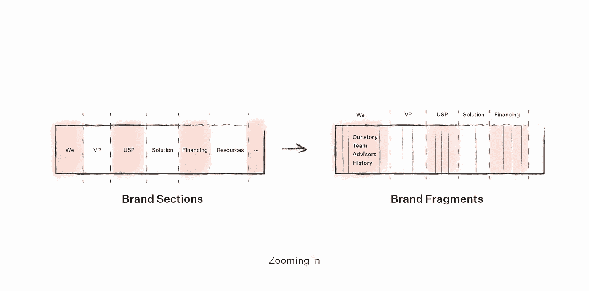
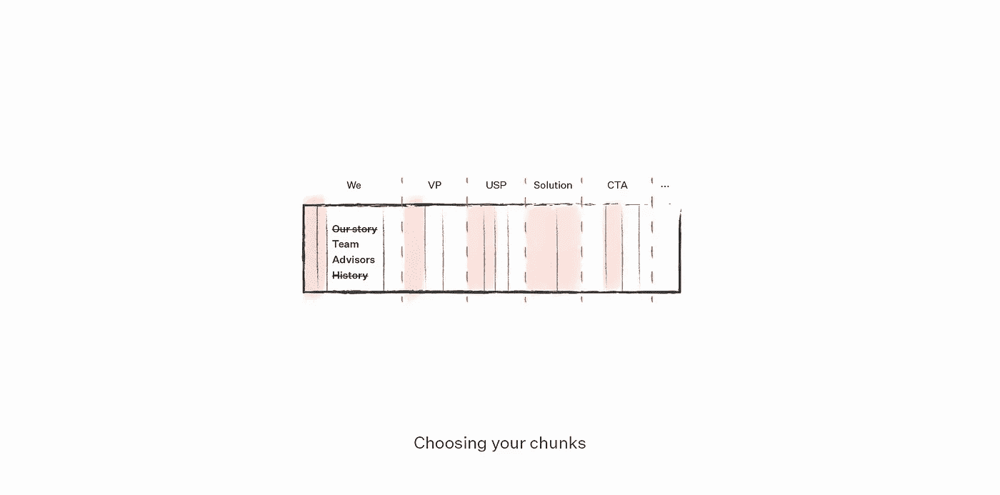

# 如何做到相关？将你的品牌信息分块

> 原文：<https://medium.com/swlh/how-to-be-relevant-chunk-your-brands-message-c3d75985a1dd>

作为一名体验设计师，我经常与科技公司合作。他们的专长是建立大型的、技术性的、复杂的系统来解决真正的人类问题。然而，他们并不总是擅长的是，以一种让我们其他人感到人性化和平易近人的方式来解释这些解决方案。

***什么样子？***

嗯，成为某方面的专家通常意味着对事情的复杂性视而不见。例如，当向不熟悉消化机制的人解释间歇性禁食时:你可以告诉他们胰岛素水平如何下降，身体如何最终转变为酮症状态，然后开始使用脂肪酸代替葡萄糖作为主要的能量来源，逐渐降低身体脂肪百分比…

你可能会分享所有必要的相关信息，但你使用的术语很少有人完全理解。

它是如何发生的？

# 有偏见的知识

这些情况可以用一种被称为“[知识诅咒](https://en.wikipedia.org/wiki/Curse_of_knowledge)的认知偏见来解释这是当你假设其他人和你知道同样的事情。这也让你相信人们比他们实际上更理解你。

我们生活在其中的泡沫往往剥夺了我们在交流中急需的同理心。也难怪；当你沉浸在自己产品的世界中时，很难记起世界上的其他人没有和你走过同样的旅程。这纯粹是人类的特性。然而，这也是行话、速记和狭隘观点盛行的地方，往往只会损害你的观众。

那么，如何推销一个复杂的想法呢？

# 创意的生意

一个想法就像任何产品或服务一样有市场，如果执行得当，也同样有价值。重要的是要记住，推销一个想法从来都不是关于你自己的，而是你要推销给的人。正如《像 Ted 一样说话》的作者卡明·加洛所说；你可以有一个伟大的想法，但是如果你不能说服别人，那就没关系了。没有人会听到你。

用简单的语言销售复杂的东西需要你的心态有两个重大转变。关键是要战略性地看待你的传播，这样你的内容才能与你的受众相关，并能引起他们的共鸣。

正如《分享美好》的作者比尔·斯科沃龙斯基所说:

> 当你的内容被战略性地设计来帮助客户时，它可以被搜索引擎优化以在他们研究时排名，并直接引起他们的共鸣。因为信息是以受众为中心的，它在行业中脱颖而出，将你的业务与其他声称他们做你所做的事情的公司区分开来。

# 相关

我用来推销想法或提炼品牌信息的策略通常是针对特定客户的；然而，这是我最常用的两个:

1.  **提问**
2.  **春分**

提问是一个很好的开始。在你为你的网页或会议写一个字之前，你应该问自己:谁是我的观众？他们的需求和愿望是什么？这段内容的目的是什么？

这是一种非常有用的方法，尽管成功的实现通常需要更多的经验。

另一方面，组块是一个更简单的过程。奥克兰大学工程学教授 Barbara Oakley 最广为人知的可能是她的课程“[学习如何学习](https://www.coursera.org/learn/learning-how-to-learn)”，在该课程中，她介绍了组块的概念。

这是一种策略，通过这种策略，你可以将信息分解成小块，这样你的受众就可以更有效地消化新信息。大脑需要这种帮助的原因是，我们处理信息的工作记忆一次只能容纳有限的信息。

# 品牌信息的分块方法

在传播策略中，**组块有助于您创建品牌信息的简短版本**。你根据背景、目标和你的受众，战略性地简化你的内容。基本上，它使你能够决定说多少话和什么时候说。

> *使其更具关联性；比方说，你是一家加密初创公司，想要验证你的商业想法。为了做到这一点，您创建了一个简单的登录页面，目标是为 beta 测试人员收集电子邮件地址。*

**从大局出发，突出你的目标和背景—** 在这个例子中，可以是:*通过登录页面验证一个想法。*

# 1.确定内容的层次结构

你的内容将如何被组织成一个逻辑和渐进的顺序。从概念上相关的大块内容开始。

*   就品牌及其接触点而言，层级很可能遵循以下顺序:
*   ***品牌*** *= 1。我们，2。价值主张，3。解决方案，4。独特的卖点，5。信任我们的理由……*

# 2.列出您的内容

*   现在你将开始把内容分成更小的相关部分，并与你的部分相匹配。
*   ***品牌*** *= 1。我们(我们的故事、团队、顾问、历史……)，2。价值主张(使命和愿景)，3。解决方案(我们提供什么，我们的产品)，4。独特卖点(*[*)USP*](https://en.wikipedia.org/wiki/Unique_selling_proposition)*—我们的独特之处、优势、规格。), 5.信任我们的理由(证书、认可、专业知识)，…*

# 3.运用你的组块

*   **组织和评估内容，使你的登陆页面的每一部分都由大量相关信息组成。**
*   现在，您将开始在您的登录页面中填入内容。在我们的环境中，语块指的是一小段文本。
*   *考虑你的登陆页面的背景和目标:*作为一家加密初创公司，你肯定应该包括“团队”和“顾问”部分，因为这些可以建立信任。然而，没有必要包括你的团队的全部历史。
*   其他内容也是如此——选择关于您的解决方案、优势和价值主张的首要信息。

# 4.提问:我的听众需要听到什么？

*   登陆页一般都是一页纸，所以你的内容区域相对有限。确定页面内容的最佳目标是询问“**我的观众需要听到什么**”？
*   不仅要告诉他们你的产品能做什么，还要告诉他们如何解决他们的问题。这赋予了它更多的价值。记住去掉任何无关的内容。

# 最终注释

为了与你的观众相关并真正联系起来，你应该把你的内容集中在他们的需求和解决他们的挑战上。通过专注于你自己的特色、产品和服务，你就不会建立同样的联系。

尤其是当你的解决方案非常复杂的时候。你拥有的解决方案越复杂，对我们其他人来说就越遥远。

将你的内容分成几个部分，这样有助于记住你的听众，有助于更具战略性并推销你的复杂想法。

*你创造更多以受众为中心的内容的策略是什么？请在下面的评论中告诉我！*

不要忘记，如果你喜欢这些内容，请与他人分享！

还有，可以报名参加[格局简讯](http://readpattern.com/)。每月垃圾邮件——免费将精选的见解、灵感、采访片段和精选的发人深省的内容发送到您的电子邮件中。

> PS:图案在 [**Instagram**](http://instagram.com/readpattern) 上更有创意

## 这篇文章发表在 [The Startup](https://medium.com/swlh) 上，这是 Medium 最大的创业刊物，拥有+434，678 名读者。

## 订阅接收[我们的头条新闻](https://growthsupply.com/the-startup-newsletter/)。

