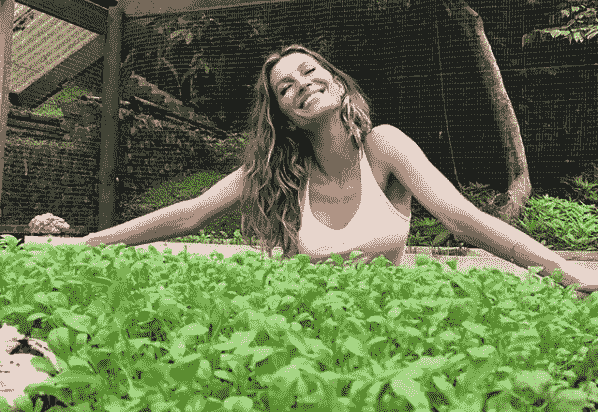

# 爱因斯坦如何变得更聪明，埃隆·马斯克如何变得更有创造力，小威廉姆斯如何变得更运动，克里斯蒂·特林顿如何变得更漂亮

> 原文：<https://medium.com/swlh/how-to-be-smarter-according-to-einstein-more-inventive-by-elon-musk-more-athletic-by-serena-f7ad4ec9769>


作为一个还没有想出如何成为一名拥有运动员身材和公主魅力的亿万富翁发明家的人，我认为尝试向那些已经做到的人学习是有意义的。幸运的是，对于全球自尊来说，没有多少人能够一下子解决所有这些问题，但在每个类别下都有一些名字脱颖而出。

> ***“我没有特别的天赋。我只是强烈好奇。”*** —爱因斯坦

当今世界最令我困惑的事情之一是对天赋和神童的颂扬。有些人生来就很特别，并利用他们独特的天赋获得了荣耀。相信你没有这些天赋可能会让你接受一个平庸的成功，觉得这是不可避免的，因为这就是你。你不是生来就有特殊能力，或者如果你有，你肯定没有发现它。但是，如果这个天才的概念是社会编造的，而你实际上不需要接受任何东西，那该怎么办呢？

从智力开始，爱因斯坦是有史以来最传奇的物理学家之一；以回答别人未能回答的问题而闻名。关于爱因斯坦的一些鲜为人知的事情是，他被认为有学习困难，诵读困难。更不为人知的是，他实际上并不是一位伟大的数学家。这个领域对于理解复杂的科学理论至关重要。

爱因斯坦意识到自己在数学方面的不足，因此他与一位对解决复杂方程有着深刻理解的人合作，最终证明了他的理论。他谈到自己的大脑时说:

> “不是我有多聪明，只是我和问题待在一起的时间更长。” *—阿尔伯特·爱因斯坦*

他相信自己的直觉，并决心克服障碍；无论是个人还是职业。

当谈到伟大的思想时，很少有人比埃隆·马斯克(Elon Musk)更能激起人们的兴趣。作为当今最著名的企业家之一，马斯克通过联合创立 Paypal 赚到了他的第一笔钱，利用这笔交易的资金与特斯拉一起重新定义了电动汽车，最近又与美国宇航局(NASA)竞争让游客前往火星。天生就有高于平均水平的大脑，对吗？也许吧。他当然认为自己比一般人更伟大，但有趣的是他在员工身上寻找的品质:

> “马斯克最推崇的是决心，他尊重那些被拒绝后继续前进的人。”

阿什莉·万斯(Ashlee Vance)在他关于马斯克的传记中透露，埃隆年轻时是一位热情的读者。虽然普遍认为他有一个非凡的大脑是这一迹象的一部分，但我质疑这里的因果关系。他读书多是因为他是天生的天才，还是因为他如饥似渴地读书而变得比普通人更高级、更“聪明”？

> “埃隆年轻时性格中最引人注目的部分是他对阅读的渴望……‘对他来说，一天阅读 10 个小时并不稀奇’”*——金巴尔·马斯克，阿什莉·万斯引用*

仔细听一听埃隆和爱因斯坦的话，听起来似乎天才可以通过做两件关键的事情来培养:

1)满足你的好奇心

2)更加投入

随着年龄的增长，越来越擅长运动似乎越来越难。你观察运动员，他们让你觉得把球扔出 60 码远就像烤面包一样简单，然后你试着去做。那么 NFL 四分卫汤姆·布拉迪是如何做到如此轻松的呢？！

> 近 18 个赛季的职业足球生涯让我明白，持续的巅峰表现不是靠运气。这是关于努力工作、奉献、纪律和我的伟大团队的支持。”— *汤姆·布拉迪*

好的，当然可以，汤姆，但是要参加超级碗比赛，你还必须有相当的天赋和合适的体型？！

> "没人相信我会在大学里打一年球，或者在职业队打一年球。" *—汤姆·布拉迪*

所以如果我们相信汤姆·布拉迪对自己的看法，他是一个失败者。不是最好的，但足够好，可以一次又一次地承诺，每年，每月，每天。他的爱国者队友朱利安·埃德尔曼在他的回忆录《无情》中讲述了一个类似的故事。埃德尔曼的父亲解释说，在朱利安锻造的信念: ***“我们埃德尔曼，我们赶上了。我们总会叙叙旧。一开始我们可能没有，但我们总能找到办法做到。”***

关于小威廉姆斯的伟大，她有什么要说的？她拥有 23 个大满贯冠军头衔，而且还在不断增加，她经常被认为是有史以来最伟大的网球运动员，对许多人来说是有史以来最伟大的运动员。

> “运气与此无关，我已经花了很多很多小时，无数个小时，在球场上为我的那一刻工作，不知道它什么时候会到来。”*——小威廉姆斯*

现在来说说长相。你与生俱来的长相。它们是遗传的，从你的父母那里遗传而来。克里斯蒂·特林顿、吉吉·哈迪德、布拉德·皮特、奥兰多·布鲁姆，他们的脸是来自某种更高力量的礼物。也许吧。但是到底是什么让一个人真正有魅力呢？我不是说人格，因为，当然，但在这里保持肉体的血脉。比方说，你想稍微接近一下当今西方世界的传统“性感”水平，那么什么会有帮助呢？

根据克里斯蒂·特林顿的说法，锻炼是一件大事。

> “我不做很多面部护理或类似的事情，我只是努力吃好和锻炼，因为这是对你的皮肤和健康最好的事情。” *—克里斯蒂·特林顿*

卡梅隆迪亚兹，格温妮丝帕特洛，吉赛尔邦辰。三个“热门”女性的例子，她们都通过出版关于她们生活方式的书籍来扩大她们的商业冒险。他们的生活方式通常侧重于一些习惯，如吃低糖、睡好觉、喝水、高强度有氧运动和抽油。花时间投资于他们的皮肤和头发护理程序。

> **“漂亮是与生俱来的。但是漂亮，那是一个机会均等的形容词。”拉尔夫·瓦尔多·爱默生**

虽然有规律的锻炼和干净的饮食不会改变你的骨骼结构，但它会改变你的皮肤、头发、站姿和你的整体外貌。光芒是美的基本原则之一，它来自于这些东西(通常伴随着快乐)。看一下卡戴珊前后的照片是理解我们对自己外貌真正影响的一种方式。



Gisele loves her Greens!

现在有些听起来可能很明显，因此有点烦人，但信息是:你比你想象的更有能力控制你的外表。这并不意味着你需要在这方面投入时间，关心或认同传统的美丽观念，但在一个不安全感让很多人退缩的世界里，我相信接受更大的权力来控制你生活的方方面面是一种解放。

通过了解杰出的人，我相信你真的可以做任何事情。如果你见过别人做某事，你也可以做。它只是依赖于当其他人停止练习时，你拥有坚持练习的力量，并且相信如果你坚持，你就会成功。

> **“当别人不相信你的时候，你必须相信自己。”** —小威廉姆斯

```
Lexy is a writer, DJ and marketing professional living in London. She is a gemini and a feminist who loves coffee and leather trousers.Instagram.com/cleopatrasworldwide
```

*原载于*[*cleopatrasworldwide.com*](http://cleopatrasworldwide.com/how-to-be-smarter-according-to-einstein-more-inventive-by-elon-musk-more-athletic-by-serena-williams-and-more-beautiful-by-christy-turlington/)*。*

[](https://medium.com/swlh)

## 这篇文章发表在 [The Startup](https://medium.com/swlh) 上，这是 Medium 最大的创业刊物，拥有+416，678 名读者。

## 在这里订阅接收[我们的头条新闻](http://growthsupply.com/the-startup-newsletter/)。

[](https://medium.com/swlh)