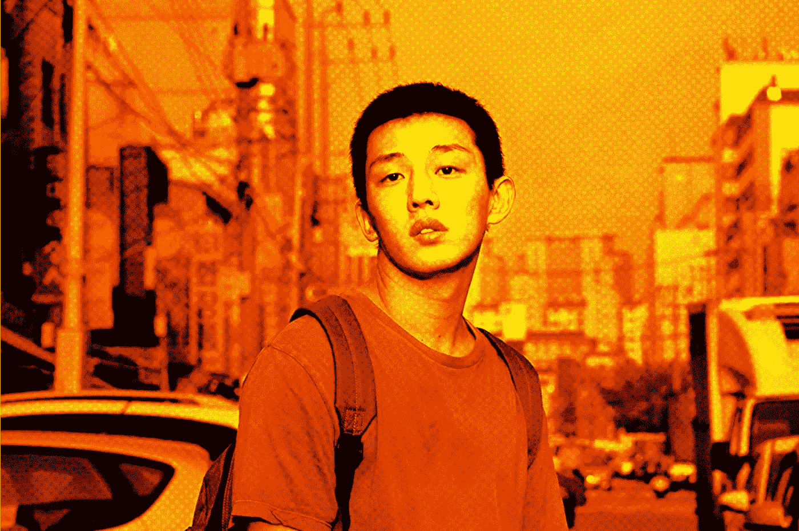

# 如何用三个步骤做你自己

> 原文：<https://medium.com/swlh/how-to-be-yourself-in-3-steps-a41bca0f7b56>

Image Credit: CGV Arthouse/The Ringer

我想象自己是你生活中的一名演员，就好像这是一部好莱坞电影。你按照人们希望的方式行事，这样你就能得到他们的欣赏和关注。

他们的关注让你觉得自己很特别，在短暂的一瞬间，你觉得自己很重要。然后第二天你又醒来，准备好表演你的人生，希望你能获得奥斯卡奖。你的目标是那个奖，因为那个闪亮的…