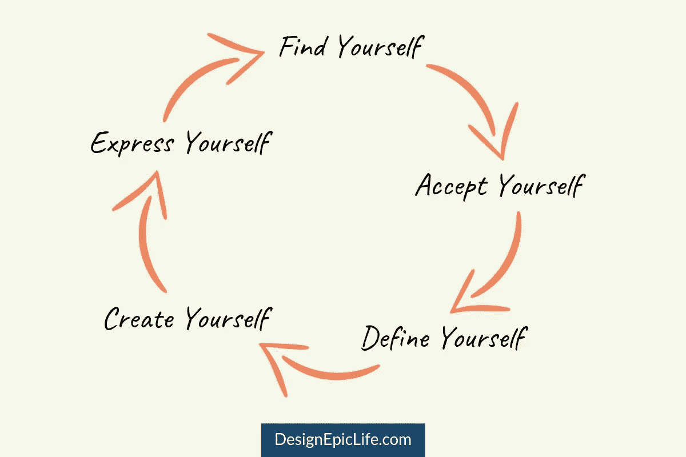

# 当你对自己不自信时，如何“做你自己”

> 原文：<https://medium.com/swlh/how-to-be-yourself-when-youre-not-confident-who-you-are-40b398e6b6b1>

Photo by [Ernest Brillo](https://unsplash.com/@ernest_brillo?utm_source=medium&utm_medium=referral) on [Unsplash](https://unsplash.com?utm_source=medium&utm_medium=referral)

> 我是谁？

如果你以前问过这个问题，你并不孤单。

问题的答案就在*忒修斯悖论*中。

忒修斯乘船回国后，雅典人将忒修斯的船留在港口一千年，以纪念他的英雄行为。一个接一个，他们更换了船的每个部分来维护它，直到他们更换了船的每个部分。

问题仍然是——**哪艘船是真正的那艘？还是老船还是新船？**

这个问题没有正确的答案。这艘船的本质保持不变，但你也可以说它不是同一艘船，因为它的每个部分都被替换了。

同样的悖论也适用于你。

*   你还是五年前的你吗？
*   你是你将来会成为的那个人吗？
*   你是现在存在的那个人吗？

再者，你的哪些部分是“你”？

*   你是你身体的一部分吗？
*   你是你的思想和情感吗？
*   你是你的灵魂和精神吗？

发现自己是一生的过程。你永远找不到所有的你，因为你总是处于测试模式。在你活着的每一刻，你的一部分都在被创造和毁灭。

# 如何做自己

> *了解自己是一切智慧的开始。—亚里士多德*

## 寻找自我

你独一无二。你生来就有某些特质和优势，你可以利用这些特质和优势充分发展。这些特质和优势对你来说可能是显而易见的，也可能隐藏起来等待你去发现。

## 接受自己

一旦你发现了自己的某些部分，你可以保持否认模式，或者你可以利用你的[自我意识](https://designepiclife.com/self-awareness-skill/)去接受和[爱自己](https://designepiclife.com/how-to-love-yourself/)。但是注意不要陷入自我挫败的模式，那会阻止你成长。有了意识，你就会知道什么该做，什么该取消或委派。

## 定义你自己

自我实现的预言是你告诉你的潜意识是真实的事情。当你相信某件事是真的，它就会在你的脑海中变成真的。所以不要忘了，这不仅仅是寻找自我。通过定义自己，用成长的心态超越自我，你会成为你想成为的人。

## 创造自我

成长心态是关于相信你可以实现或改善你下定决心要做的任何事情。你总是可以抛弃你身上不好的部分，把自己改造成一个全新的你。要成为你想成为的人，从别人那里获取灵感，采纳你所钦佩的不同人的习惯、思想、信仰、态度、[价值观](https://fastertomaster.com/planner/start/character-traits/)和原则。

# 表达自己

压抑和隐藏自己是痛苦的最大原因之一。当你不表达自己时，你会一直抑郁，因为抑郁是表达的反义词。表达可能意味着在人前敞开心扉，自言自语，写日记，通过艺术或爱好来表达自己，等等。

# 如何建立自信

> 因为一个人相信自己，所以他不会试图说服别人。因为一个人满足于自己，不需要别人的认同。因为一个人接受自己，全世界都接受他(她)。—老子

在你发现和成为自己的道路上，[自我怀疑](https://designepiclife.com/kill-self-doubt/)和低自信会不时困扰你。虽然你可以善用自我怀疑，但大多数时候它会让你无法采取行动，成为最好的自己。

> *那么，如何培养天生的自信呢？*

培养自信的三大支柱:自我效能、自尊和自立。

# 1.建立自我效能

自我效能感是你对自己实现目标的能力的信念。你需要让你的大脑相信你有能力。

要做到这一点，当你认为自己做不到某件事的时候，你可以一遍又一遍地证明自己(或别人)错了。做一些令人不舒服的挑战，并记录下每次你想通的事情，即使你自己也有疑问。随着时间的推移，你会相信自己，对自己解决问题的能力充满信心。

要开始建立这种自信，先经历一次[个人转变](https://designepiclife.com/personal-transformation/)。转变是你看到减肥或增肌的人充满自信的原因。

> 为了在你自己身上创造这样的改变，你需要认知失调作为催化剂来帮助转变。当你的想法、信仰或态度与你想成为的人不匹配时，认知失调就会发生。

阅读书籍或文章，听播客或有声读物，和你想成为的人呆在一起，这些都是产生认知失调带来的精神不适的方法。

> **我的例子:**在进入健康健身之前，我比较胖。每当我在镜子里看着自己的裸体时，我都会畏缩。我在上大学，我有充分的自由去吃我想吃的任何东西。所以我一直在吃垃圾食品。
> 
> 但是后来，我受够了。
> 
> 我用健康和健身信息狂轰滥炸自己，周围都是健康饮食更好的朋友。为了获得更多的灵感，我在网上关注了一些有影响力的人，他们充当了我的虚拟导师。
> 
> 当我成为一名企业家时，我也是这样做的。我没有告诉自己我是一个“有抱负的博客作者或企业家”，而是学习、实践它，并和几个博客作者成为朋友。我也追随那些已经在做我想做的事情的有影响力的人。

# 2.建立自尊

自尊是对你自身价值的评估。太多会导致自我膨胀，而太少会导致自我泄气。

那么，你如何找到健康的自尊呢？

忠于你选择成为的那个人。换句话说，要有诚信。

虽然随着你的成长，可以灵活地改变你的价值观(或它们的意义)。但是总的来说，你不应该背叛你选择的生活价值观。

如果你不忠于自己，你的信心会明显下降，因为你不再忠于自己。你将不再相信自己，你的自尊将会受损。

> *坚持自己的价值观的另一个好处是，你将不再根据错误的参数将自己与他人进行比较。将自己与他人进行比较的刻板方式是如此病态，它会在你的内心挖一个洞，夺走你的快乐。*

> **我的例子:**和大多数人一样，我拼命追逐金钱。我参加了网上调查，因为一些“大师”告诉我这是一个很好的网上赚钱的方式。
> 
> 在交易了这么多小时(和我的理智)后，我花了一些钱在一个项目上，这个项目承诺我使用他们的“秘密”策略在网上成为百万富翁。结果是，有人向我推销高价的多层次营销项目。
> 
> 所以我不再把时间、精力和金钱浪费在不符合我价值观的事情上。
> 
> 我知道我重视成长、和平、自由和满足感。我喜欢赚钱，因为它给我自由和成长，但如果我开始根据我赚了多少钱来和别人比较，对我来说这是一条死路。因为从长远来看，如果我必须牺牲我的自由和内心的平静，我不会从任何人那里拿一毛钱。
> 
> 这不是我挣多少钱的问题。对我来说真正重要的是我如何赚钱。一旦我掌握了如何赚钱，我就可以在坚持我的价值观的同时，扩大它的规模，以获得更多的增长和自由。

# 3.建立自力更生

自力更生是指依靠自己而不是依赖他人的能力。这意味着对你自己和你的生活承担全部责任。

它更多的是和情感有关，而不是物质资源。当你自力更生时，你不太在乎别人对你的看法，而更在乎你自己对自己的看法。

在情感上变得自立，在防弹的同时变得脆弱。我的意思是。

真正的自信不是来自避免拒绝、憎恨、羞耻或来自他人的评判。事实上，你越是隐藏自己，你就越害怕把自己放出来。真正的自信来自于直面自己的恐惧，变得脆弱。

但是脆弱是不够的，因为当人们不认可你时，你可能会受到伤害。作为一种保护机制，你会学会隐藏自己更多。

> *当你知道人们会不赞同你，但你仍然充满爱心、善良、富有同情心并接纳自己和他人时，真正的自信就来了。*

> **我的例子:**当我第一次离开印度去苏格兰学习时，我很兴奋。我计划成为大学里的社交摇滚明星。
> 
> 当我最终到达我的新学院时，我不能理解大多数人的话，因为他们的口音。
> 
> 我厌倦了让人们重复自己，在交谈中重复自己。所以我开始避免与人交往。当我和别人交谈时，我会在交谈中走神。我渴望得到认可，我渴望人们能理解我，接受我，喜欢我。
> 
> 我会在脑子里编造故事，说我周围的每个人可能都在评判或讨厌我。
> 
> 然后，我沉迷于解决我的问题。
> 
> 我努力控制自己的情绪，观察那些拥有出色社交技能的人，这样我就能在任何环境下成为一个更好的人。

在[提升你的社交技能和治愈你的情绪](http://subscribepage.com/master-emotions)之后，你可以步入一个外国环境，与来自不同文化、背景、口音等的人建立融洽的关系。没有任何麻烦。

一旦你变得刀枪不入，你就会意识到每个人都有自己的议程，你不需要这个世界上任何人的批准证书。不是因为你自大，而是因为你太爱自己(和别人)了，以至于认可都无足轻重。

如果你和某人合不来，分道扬镳对双方都有好处，这样你们都能茁壮成长。爱每一个人，不管有没有你，都希望每个人都能茁壮成长。

同样的要求别人——只允许那些帮助你成为最好的自己的人进入你的生活。亲切地排斥那些做相反事情的人。

# 庆祝你自己

> *“做好自己；其他人都已经有人了。”—奥斯卡·王尔德*

认识你自己，赞美你的个性，因为没有人和你一样。想象一下，如果你是其他人的一模一样的复制品，那该有多无聊。

永远不要背叛你的心，做与它告诉你的相反的事。你有一个角色要扮演。你可以按照你内心的智慧(也就是直觉)告诉你的去做，让你的生活充满意义。

这并不意味着你忘记了逻辑和理性。但是你必须用信任、信念和对自己的信心来平衡它。纯逻辑会让你很痛苦。茁壮成长的人结合了思考和感觉的力量。

你的旅程是独一无二的。不要让它浪费掉。选择成长而不是舒适，选择勇气而不是恐惧，选择[伟大而不是平庸](https://designepiclife.com/you-are-not-special/)，让它成为史诗。

# 自信来自于每天走向成功的行动

## 为高绩效和成功设计你的每日清单。[点击这里下载](http://bit.ly/daily-success-list)你的免费拷贝。

*原载于*[*DesignEpicLife.com*](https://designepiclife.com/how-to-find-yourself-and-build-confidence/)

## 这篇文章发表在 [The Startup](https://medium.com/swlh) 上，这是 Medium 最大的创业刊物，拥有+438，678 读者。

## 在此订阅接收[我们的头条新闻](https://growthsupply.com/the-startup-newsletter/)。

