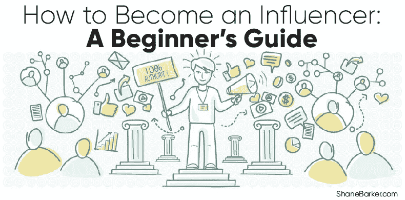

# 如何成为有影响力的人——初学者指南

> 原文：<https://medium.com/swlh/how-to-become-an-influencer-a-beginners-guide-a9891549d2ef>

社交媒体影响者现在风靡一时。品牌希望与他们合作，以扩大他们的影响范围并推动转化。另一方面，影响者的追随者期待专家的建议和推荐。

随着影响者营销的流行，人们越来越好奇如何成为影响者，这是很自然的。

然而，建立和保持一个忠实追随者的社区并不像看起来那么容易。这需要影响者的持续努力。在我们讨论如何成为影响者的一些有用的技巧之前，让我们更深入地了解一下社交媒体影响者的概念。

**精选相关内容:**

*   [识别虚假 Instagram 影响者的 5 个最聪明的技巧](https://shanebarker.com/blog/fake-instagram-influencers/)
*   [如何成为 Instagram 的影响者并开始赚钱](https://shanebarker.com/blog/how-to-become-an-instagram-influencer-and-earn/)

# 解码影响者之谜

简单来说，有影响力的人是拥有大量忠诚和参与的追随者的社交媒体人物。大多数有影响力的人与他们的粉丝有着友好的关系。

反过来，粉丝们通常会将这些有影响力的人视为榜样，并遵循他们的建议。事实上，影响者通常被视为各自领域的权威人物或专家。

由于社交媒体平台的可访问性，[影响者](https://shanebarker.com/blog/influencers-marketing-strategy/)能够与他们的追随者建立个人联系。与传统的名人不同，他们的生活并没有笼罩在神秘的气氛中。

相反，有影响力的人经常向他们的追随者透露他们个人生活的一瞥。这正是帮助他们与粉丝建立友好关系的原因。

影响者是社交媒体名人，他们对自己的粉丝群体有一定的影响力。

区分影响者和高调名人的最重要因素是前者将他们独特和真实的声音添加到他们的内容中。这有助于他们赢得追随者的信任和忠诚。事实上， [70%的千禧一代声称受博主](https://expandedramblings.com/index.php/millennial-statistics-for-marketers/)的影响大于名人。

# 成为有影响力的人的好处

数字营销人员和品牌已经意识到与有影响力的人合作的重要性。影响者营销的最大优势在于，它让营销人员直接接触到影响者的忠实粉丝群。

这也省去了营销人员识别和锁定正确受众的麻烦。影响者已经完成了这项艰巨的任务。这就是为什么 2017 年 [86%的营销人员使用影响者营销](http://www.linqia.com/wp-content/uploads/2017/04/The-Value-of-Influencer-Content-2017_Final_Report.pdf)。

谁不喜欢影响他人的生活和决定呢？事实上，根据 gen.video 的说法，推动转化的最有效和最可信的来源[是社交媒体影响者](http://gen.video/blog/the-influence-of-influencers-new-research-unveiled/)。这清楚地表明影响者有能力说服他们的追随者。

# 影响者面临的挑战

今天，许多人渴望成为有影响力的人。对许多人来说，这似乎是一个有利可图的职业选择和人生选择。然而，在一个有影响力的人的社交媒体资料的浮华和魅力背后，隐藏着大量的努力和耐心。

在社交媒体上培养和留住忠实粉丝并不是一件容易的事。随着越来越多的人试图成为有影响力的人，这变得越来越困难。

因此，赢得追随者的信任是一项艰巨的任务。这需要你坚持不懈的努力，使你的内容真实可信，抓住你的观众的注意力。

而且，作为一个有影响力的人，在与品牌合作时，你必须非常谨慎。你的追随者变得忠诚，是因为你在内容中加入了个人和诚实的元素。用赞助内容轰炸他们会损害你作为一个有影响力的人的声誉，并使你的追随者脱离。

如果你仍然想过有影响力的生活，请继续阅读，学习如何成为有影响力的人。

**精选相关内容:**

*   [什么是影响者营销，2019 年你如何利用它来发展业务？](https://shanebarker.com/blog/fake-instagram-influencers/)

# 如何成为有影响力的人

一个有影响力的人的生活被许多人羡慕。我们常常没有意识到的是，为了过上奢华而有魅力的生活，他们不得不付出不懈的努力。

事实是，对于如何成为有影响力的人这个问题，没有简单的答案。然而，为了让你的努力朝着正确的方向前进，你可以采取一些步骤。

# 确定你的定位

如果你想成为一个有影响力的人，你不能指望成为一个“万事通”选择一个与你的形象相符的利基市场是至关重要的。

一个简单的方法来选择你的利基是评估你的优势和劣势。选择一个能让你展示你的优势和进一步磨练你的技能的领域。

决定一个特定的利基将有助于你精简你的观众和定制你的内容，以适应他们的喜好。

通常，在决定如何成为影响者时，您可以选择以下类别之一:

*   旅行
*   生活方式
*   时尚
*   食物
*   美人
*   运动
*   赌博
*   娱乐
*   技术
*   健康和健身

你不必把自己局限在这些类别中的一个。你可以结合两个或更多的这些利基。确保各个利基市场相互一致。例如，当你决定你的定位时，你可以把旅行和生活方式或者美丽和时尚结合起来。

这并不是强制你坚持这些既定的和众所周知的利基。成为一个有影响力的人的关键是在你做的每一件事情中加入你独特的声音。所以，不要犹豫，尝试和开拓你自己的空间，让你展示自己的优势和怪癖。

例如，24 岁的卡丽娜·加西亚(T1)仅仅通过上传古怪的粘液视频就在 YouTube 上一夜成名。她在 YouTube 上有 800 多万订户，他们恰如其分地称她为“黏液女王”。

此外，她还出版了两本畅销书，并推出了自己的手工艺品牌 Craft City。

**精选相关内容:**

*   [101 位专家揭示营销活动的最佳影响者](https://shanebarker.com/blog/influencer-marketing-campaigns/)

# 选择您的平台

作为一个有影响力的人，你需要在互联网上有强大的影响力。然而，这并不意味着你应该使用所有的社交媒体平台和分销渠道。根据你的定位，某些平台可能比其他平台更适合你的内容。

例如，如果你是一名时尚博主，Instagram 将比 Twitter 和 LinkedIn 等其他平台更适合你的视觉内容。事实上， [93%的社交媒体影响者](https://www.marketingprofs.com/charts/2017/33095/influencers-top-social-networks-for-2018)更喜欢 Instagram，因为它能提供最好的结果。然而，这并不意味着如果你的定位与平台不一致，你就应该把所有的精力放在 Instagram 上。

你还应该考虑你的受众最有可能使用的平台。例如，如果你的目标受众包括千禧一代，你应该把精力放在 Snapchat 和 Instagram 上。如果你选择利用多个社交媒体平台，确保你为每个渠道定制你的内容。

例如，数字营销大师尼尔·帕特尔积极使用 Twitter 来推广他的博客文章和其他内容。考虑到他的大多数目标受众(企业家、数字营销人员、内容创作者等)，这是显而易见的。)很可能会经常光顾这个平台寻找有意义的内容。

虽然建议您选择最适合您的内容和目标受众的平台，但您不应该忽视其他分发渠道。相反，你应该努力获得其他渠道的基本工作知识，以便将来需要时可以利用它们。

# 优先考虑你的内容

高质量的内容也许是如何成为有影响力的人的最有力的答案。发布能引起受众共鸣的独特而真实的内容是极其重要的。

事实上，这是让你的观众被你的内容吸引的唯一方法。不管你创建的是什么类型的内容，它都应该是有意义和有价值的。

根据你的定位和分销渠道，你可以选择不同类型的内容，如博客文章，照片，视频，播客等。

在你创作的每一个内容中加入你的标志性声音是至关重要的。这将使你与其他也想知道如何成为有影响力的人区别开来。

例如，摄影师兼生活方式影响者 Katie Stauffer 在 Instagram 上上传了她两岁女儿 Mila 的视频，获得了广泛好评。

她的内容与其他类似 Instagram 页面的区别在于米拉的对话交付和成熟的表演技巧。如今，Stauffer 有 400 万忠实的 Instagram 用户，他们期待着 Mila 的下一个视频。

非常重要的一点是，你要找到独特的怪癖或特质，将你与你所在领域的其他有影响力的人区分开来。一旦你确定了这个独特的销售主张(USP ),尽可能地将它融入到你的内容中。

除了帮助你的内容脱颖而出，这也将建立你作为一个影响者的形象。建议您也将此 USP 整合到您的赞助内容中。

# 倾听你的听众

确保你的内容吸引人的一个有效方法是创造你的观众想要的内容。

为了获得相关内容的想法，你可以运行一个快速的谷歌搜索你的利基。向下滚动到搜索结果的底部，找到目标受众正在使用的长尾关键词。你也可以搜索 Quora 和 Reddit 等平台，了解你的目标受众在谈论什么。

如果你想让你的内容引起观众的共鸣，你必须对你的追随者群体有深刻的了解。

大多数社交媒体平台都有一个分析部分，可以给你提供关于目标受众的有意义的见解。你可以获得受众的人口统计数据，如性别、地理位置、职业、在线行为等。

此外，你应该密切关注你的社交媒体和博客帖子的评论部分。它可以是你的观众想要阅读/观看的新鲜内容创意的金矿。你也可以进行社交媒体民意调查，让你的追随者告诉你他们的偏好和痛点。

**精选相关内容:**

*   [微观影响者需要向高层影响者学习的 7 件事](https://shanebarker.com/blog/micro-influencers-top-influencers/)

# 打开你的标签游戏

如果你想知道如何成为一个有影响力的人并在这方面出类拔萃，答案是明智地使用正确的标签。你的内容只有在到达正确的受众时才会变得有价值和有意义。

增加内容可见性的一个有效方法是给你的社交媒体帖子添加合适的标签。这对于那些刚刚开始成为有影响力的人，并且需要扩大他们的观众群的人来说尤其有用。

找出你所在领域最相关和最流行的标签。然后把它们放到你的帖子里，让那些可能不知道你存在的全新的观众看到你的内容。

当使用标签时，你应该小心不要让不必要的标签充斥你的文章。作为一个有影响力的人，只使用与你的形象相符的标签。

看看下面的截图，了解布莱恩·凯利，又名[、积分达人](https://www.instagram.com/thepointsguy/)，如何在他的 Instagram 帖子中有效利用标签。

除了使用流行的标签，你还可以创建自己独特的标签来扩大你的影响范围。鼓励你的追随者使用你的品牌标签上传内容到他们自己的个人资料上。这推广了你的标签，并在你的追随者的社交网络中建立了对你的认知。

# 保持一致性

定期发布高质量的内容是保持受众注意力的最有效方式之一。当你定期发布好的内容时，它会在你的观众中产生一种期待感。

这反过来会提高观众的参与度，增加你的影响力。建议您为未来几个月计划发布的所有内容创建一个时间表。你也可以制作一个每周或每月的系列来吸引你的观众。

例如，Nusair Yassin，又名 [Nas Daily](https://www.facebook.com/nasdaily/) ，承诺每天在脸书上传一个 1 分钟的视频，持续一千天。人们开始跟踪他在脸书的页面，看他是否信守承诺。

事实上，纳斯遵守了他的诺言，结果，他获得了 1200 万追随者，影响了世界各地的许多人。

然而，你应该确保你的内容质量永远不会妥协，以保持规律性。如果出现你不能在提议的日期交付内容的情况，发布一个帖子来传达。向你的观众保证，你正在制作内容，它很快就会推出。

当你没有好的内容时，你可以使用 Instagram 和脸书上的故事功能。您可以上传简单的图片，让您的观众先睹为快，看看您的工作空间或客厅。

这有助于吸引你的观众，并帮助你与他们保持联系，而无需花费数小时来完善视频。

**精选相关内容:**

*   [如何开展影响者外展活动并获得令人惊叹的结果](https://shanebarker.com/blog/influencer-outreach/)

# 与其他有影响力的人合作

当你刚刚起步，仍然不知道如何成为一个有影响力的人时，与你所在领域的名人合作会有很大的帮助。它让你接触到他们的粉丝群，让你把他们吸引到你的社交媒体个人资料上。

你必须能够向其他有影响力的人提供一些有用的东西，以吸引他们与你合作。如果较大的影响者似乎遥不可及，你甚至可以与拥有少量但高度参与的粉丝群的微小影响者合作。

# 建立一个网站

如果你问某人如何成为影响者，他们很可能会给你很多关于内容策略和社交媒体平台的建议。

很少有人会告诉你一个网站会对你的声誉产生影响。然而，任何稍微熟悉营销和品牌的人都知道网站有多重要。

随着你粉丝群的增长，许多人会忍不住在谷歌上快速搜索你的名字。拥有一个设计良好、功能齐全的网站可以增加你形象的可信度，帮助你赢得目标受众的信任。

此外，在你的网站上有一个设计良好的博客部分可以进一步建立你在你的领域中的权威。它还能提高你网站的有机搜索流量，从而进一步扩大你的覆盖范围。

# 举办 ama、竞赛和赠品

如果你想知道如何成为一个有忠实追随者的有影响力的人，答案是让他们参与进来。

提高观众参与度的最有效方法之一是在你选择的平台上举办一个 AMA(问我任何问题)会议。除了让你的观众参与进来，这也有助于建立你在特定领域的专业知识。

另一个提高参与度的聪明方法是宣布赠品。通常情况下，你会向你的追随者提供奖励，以换取他们对你的帖子的喜欢、评论和分享。你也可以让他们在赠品公告上标记他们的朋友。

竞赛类似于赠品，只是参与者需要上传特定内容或使用您的品牌标签，才有资格获胜。

竞赛和赠品也有助于你接触到广泛的观众，增加你的追随者。你可以与你所在领域的其他有影响力的人或品牌合作，让他们更加有效。确保你明确规定了规则、截止日期、奖励等。在约定的时间宣布获胜者。对于如何成为有影响力的人这个问题，最好的答案之一就是举办赠品和竞赛来吸引你的观众。

# 启动

对于如何成为有影响力的人这个问题，最简单的答案是与你的听众保持个人联系。

大多数平台，如脸书、Instagram 和 YouTube，允许用户直播并与粉丝分享实时更新。你可以利用这一点，让你的观众一瞥某个事件或聚会的幕后活动。这会让你的追随者感觉和你更亲近，增强他们的忠诚度。

你也可以主持一个现场 AMA 会议，与你的追随者实时交流。这是一个非常有效的提高参与度的策略。同时，它也让你对你的观众喜欢/不喜欢什么以及对你的期望有一个公平的想法。确保你提前通知了你的追随者。

# 回应你的粉丝

随着受众的增长，越来越多的人开始欣赏你的内容，他们很可能会在 DMs 和评论中留下反馈。

回应每一条评论可能是一项艰巨的任务。但是，建议您尽可能多地回复。你的回应证实了你的粉丝对你的信任，让他们觉得和你更亲近。

Savi 和 Vid,[碰伤护照](https://www.instagram.com/bruisedpassports/?hl=en)的旅行二人组，特意在他们的 Instagram 帖子上回应了这些评论。这帮助他们在 Instagram 上吸引了 28.7 万名忠实的追随者。

此外，你还可以大声喊出你收到的任何特别积极的反馈。这会让发送者感到有回报，并增强他们对你的信任。如果你想知道如何成为一个有影响力的人，关键是要像他们重视你一样重视你的观众。

**精选相关内容:**

*   [营销人员的 10 种最佳影响者营销资源](https://shanebarker.com/blog/influencer-marketing-resources/)
*   [品牌如何与有影响力的人建立牢固的关系？](https://shanebarker.com/blog/build-strong-influencer-relationships/)

# 结论

如何成为有影响力的人，这个问题的答案并不简单。在结果开始显现之前，你可能需要几个月的努力和耐心。

关键是找到你独特的声音，并利用它为自己创造一个独特的影响者形象。确定一个特定的利基和分销渠道，最适合你。

此外，任何对如何成为有影响力的人有一点点想法的人都会告诉你创作吸引你的观众的真实内容的重要性。

你还需要努力与你的追随者保持个人联系。只有这样，你才能建立起一个忠诚而投入的粉丝群，在相信你的推荐之前，他们连眼皮都不会眨一下。

***最初发表于***[***Shanebarker.com。***](https://shanebarker.com/blog/how-to-become-an-influencer/)

**关于作者**

[谢恩·巴克](https://shanebarker.com/)是[内容解决方案](https://contentsolutions.io/)和 [Gifographics](http://gifographics.co/) 的创始人兼首席执行官。你可以在[推特](https://twitter.com/shane_barker)、[脸书](https://www.facebook.com/ShaneBarkerConsultant/)、 [LinkedIn](https://www.linkedin.com/in/shanebarker/) 、 [Instagram](https://www.instagram.com/shanebarker/) 上和他联系。

## 这篇文章发表在 [The Startup](https://medium.com/swlh) 上，这是 Medium 最大的创业刊物，拥有+426，678 名读者。

## 在这里订阅接收[我们的头条新闻](https://growthsupply.com/the-startup-newsletter/)。

