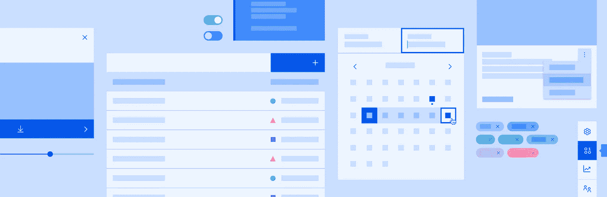

# 如何用 IBM 的碳设计系统引导一个 React 项目(从头开始)

> 原文：<https://medium.com/swlh/how-to-bootstrap-a-react-project-with-ibms-carbon-design-system-from-scratch-d0515860bccd>

[2021 年 7 月更新]

过时警告！

我每周都会收到一封电子邮件，说有人继续阅读这篇文章，这让我大吃一惊！

但是我必须让你知道:我刚刚重读了这篇文章，这里概述的许多概念已经过时了。我很确定它…