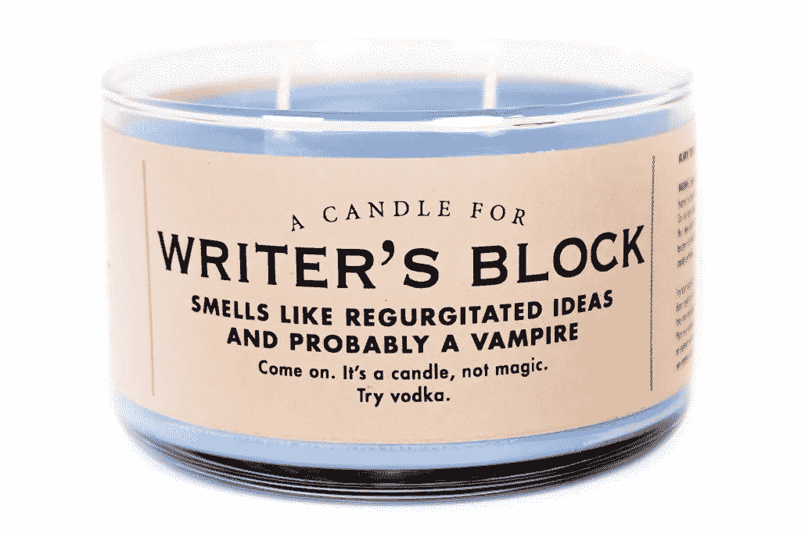
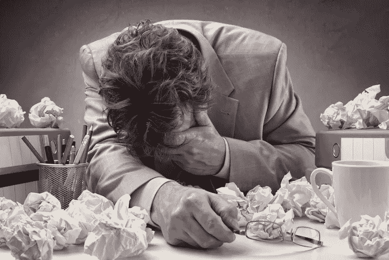

# 如何挣脱文思阻塞！

> 原文：<https://medium.com/swlh/how-to-break-free-of-writers-block-10eceb3dcb92>

*(提示:实际不存在)*

你对一个故事、一首诗或一本回忆录有很好的想法，但似乎不能把它们写在纸上吗？或者你是一个似乎已经没有灵感，但又想回去工作的作家？换句话说，你有没有说服自己，你正遭受作家的阻塞？

这里有一点好消息:没有所谓的作家的阻塞。在我作为职业作家的 20 年左右的 T2 生涯中，我从未拥有过，也永远不会拥有。现在，我生活中确实有过不写作的时候，当我相信自己无法写作的时候，甚至当我选择不写作的时候。但是我不再允许自己相信那种俗称“文思枯竭”的幻觉。

相信文思枯竭会让人衰弱，就像任何错误的信念一样。如果我告诉自己我有写作障碍，我就诊断自己得了不治之症。那我该怎么办？文思枯竭的解药是什么？如果有的话，它肯定不会在阿司匹林或止痒喷雾剂旁边的 CVS 货架上出售。因此，我无助地坐在办公桌前，或者更糟糕的是，我打开电视或滚动浏览社交媒体上的帖子，浪费时间。

但是，如果我们不说“我有写作障碍”并就此打住，而是说“我选择不写”，或者“现在，我不能写。”现在我们夺回了控制权。我们可以解开这些陈述。

让我换一种说法。让我们把“文思枯竭”这个词从英语中驱逐出去，代之以另一个词:“恐惧”当我们触及事物的本质时，生活中只有两样东西，爱和恐惧，只有爱是真实的。因此，既然文思枯竭只是恐惧的另一种说法，那么它就是一种错觉，一种幻觉。然而，这是一个强有力的理由。梦幻世界就是这样。很强大。这不现实。只有当我们放任它时，它才会成为我们的现实。

因此，与其追求治愈文思枯竭的不切实际的任务，我们不如理性地审视我们选择不写作的原因，它们是 **A)外部**或 **B)内部**。

**A)**外部原因我们选择不写

有时候，我们不写作的原因与我们的环境有关。我们没有最大化增加我们成功机会的条件。这意味着定期写作，通常一周五六天。随着写作成为一种日常习惯，我们的大脑习惯了创造力是我们日常生活的一部分这一想法。

我坚信，一周五六天每天写 15 分钟远比一周一天写 8 小时好，原因有很多，其中之一是，15 分钟更有可能延长为一个小时的真正兴奋，这种兴奋会持续很长时间，而 8 小时的延长可能会导致熟练的苦差事，最终导致精疲力竭。

这里的关键是找到符合你自己心理的条件。你喜欢早上写还是晚上写？你需要在一个安静的独处空间，还是在一个像咖啡馆一样的公共场所，充满感染力的能量？音乐是有益还是有害？你喜欢房间里什么样的光线？

对我们中的一些人来说，繁忙的日程可能是写作的外部障碍。这里的关键是明智地安排你的时间。

研究表明，锻炼的积极效果是累积的。也就是说，在健身房持续锻炼一个小时就像在这里锻炼 15 分钟，在那里锻炼 15 分钟，在其他时间再锻炼半个小时一样有益。

我相信写作也是如此。在繁忙的日子里，我可以在上班前做 15 分钟，在午休时再偷半小时，在乘地铁回家的路上再做 15 分钟，这就相当于整整一个小时。

我发现选择适合我的时间范围的写作类型是很有帮助的。在更忙的时候，当我只能写一些简短的文章时，我会做一些小型的编辑作业或研究。当我有更长的时间，比如周末或假期，我可能会做更多的生成性写作。

尽管如此，有时外部因素会妨碍我们。例如，我们真的太忙于工作而没有时间把食物放在餐桌上。接受这一点，当你的时间表移动时，准备好写作。还要记住，让自己饿死或者因为付不起房租而被赶出家门都不是维持写作生涯的好策略。

也许我们正在遭受情感上的痛苦，因为失去亲人或其他生活事件让我们在情感上无法发挥创造力。那不是文思枯竭。这是一个选择不写的完全正当的理由。接受它，处理痛苦，准备在你头脑更清醒的时候写作。

**B)** **内部原因我们选择不写**

外部因素，只要有点独创性，通常可以通过一些时间、计划和思考来解决。更有害的是阻碍我们前进的一系列内部因素。这些想法大多可以归结为“我害怕/担心/担心这不够好”，这实际上是“我害怕/担心/担心我不够好”的简写

可以理解。我们生活在一个更加关注产品而不是过程的时代。此刻，我们并不太关注一天辛苦工作的快乐和回报，我们都太关注我们想象的最终劳动产品有一天会带来的神话般的回报，以金钱、奖励、认可的形式，以及在社交媒体上关注我们的亲戚、朋友和陌生人的爱和崇拜。

我们想写还是想已经写了？我们写作是因为我们喜欢每天面对选择正确词汇的挑战，还是因为我们希望我们写的东西能成为我们生活中过去伤害的某种精神安慰？

正如弗兰·勒波维茨所说，“在高中不受欢迎不仅仅是出书的原因。”

我经常邀请我的学生花一点时间，通过把他们的想法写在纸上，把他们衰弱的自我对话放在显微镜下。如果这些听起来像你，试试这个练习:

想一想你生活中无法写作的特定时刻(或者当你认为自己有“写作障碍”的时候)。用简短的句子回答下列关于它的问题。如果你不知道答案，给出你最好的猜测。

1.  当你有这种不会写字(俗称“文思枯竭”)的感觉时，你在哪里？这一刻是什么时候？在那之前和之后发生了什么？谁在那里？你当时感受到了什么？其中有身体上的感觉吗(如头晕或胃痛)？
2.  相反，能够写作会是什么感觉？
3.  你的文思枯竭是什么颜色？
4.  谁是你的写作瓶颈？
5.  你认为是什么阻止了你在那一刻写作？
6.  究竟是什么让你在那一刻停止了写作？
7.  如果你跳出“我卡住了，我写不出来了”的话，可能发生的最糟糕的事情是什么？
8.  如果你能写作，最好的事情会是什么？哪个让你更害怕，最坏的事还是最好的事？

总是有东西可以写的，即使只是我们不会写。尤其是当我们无法书写的时候。很有可能，如果你愿意挖掘得足够深，你会发现堵塞物下面有一个非常有趣的故事。

但是你为什么还在看这篇文章？该去工作了！

[*亚伦汉堡*](http://www.aaronhamburger.com) *是小说* [涅槃在此](https://threeroomspress.com/authors/nirvana-is-here/)*初学者的信仰*以及故事集*从斯大林头上看风景*的作者，罗马奖获得者。他的文章出现在许多场合，如《纽约时报》、《华盛顿邮报》、《锡房子》、《奥普拉杂志》、《亚热带》。他曾在哥伦比亚大学、乔治华盛顿大学和斯通海岸艺术硕士项目中教授写作。**