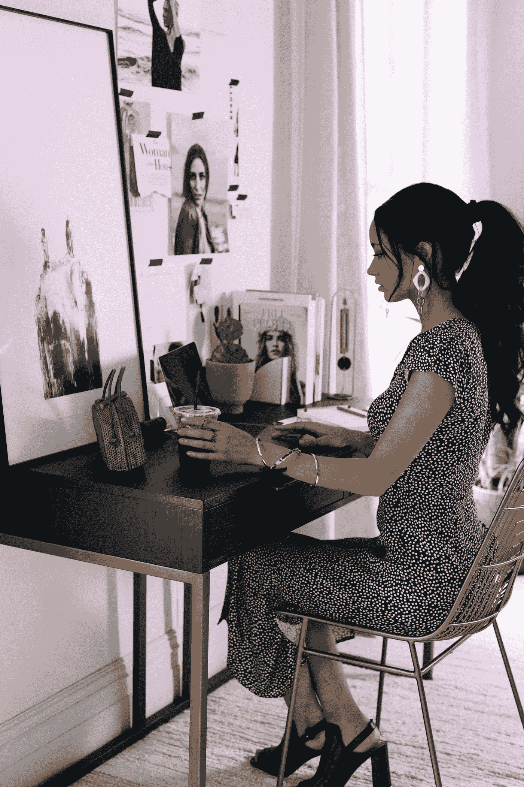

# 如何打破自己拖延的习惯

> 原文：<https://medium.com/swlh/how-to-break-your-habit-of-procrastinating-7c5ae69aa595>

Photo by [Christiann Koepke](https://unsplash.com/@christiannkoepke?utm_source=medium&utm_medium=referral) on [Unsplash](https://unsplash.com?utm_source=medium&utm_medium=referral)

我是一个三十岁的女人。我有自己的生意，这意味着我通常有一个完整的待办事项清单，我喜欢认为我有一个全面完整的生活。然而，今天早上我还是花了一大部分时间专注于 Youtuber 失败的唇膏发布的最新消息。

突然之间，我强烈地感觉到年轻人把他们辛苦赚来的钱花在高价的污染…