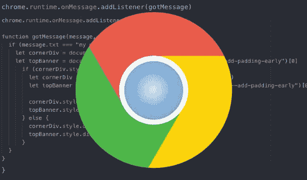

# 如何构建 Google Chrome 扩展

> 原文：<https://medium.com/swlh/how-to-build-a-google-chrome-extension-b35449edd6ce>

当用户在浏览器的地址栏中输入 URL 时，一个请求被发送到一个数据库，该数据库处理该请求并以用户请求的信息作为响应。这包括文本、一些样式和 Javascript 功能。这是开发人员为用户创造的标准体验。这很好，但是如果我们想改变或定制我们的体验，而不仅仅是开发人员最初想做的…