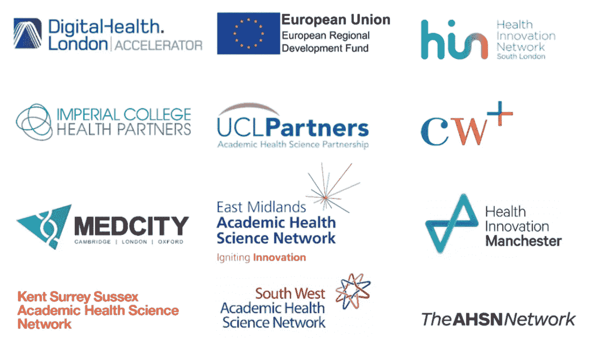
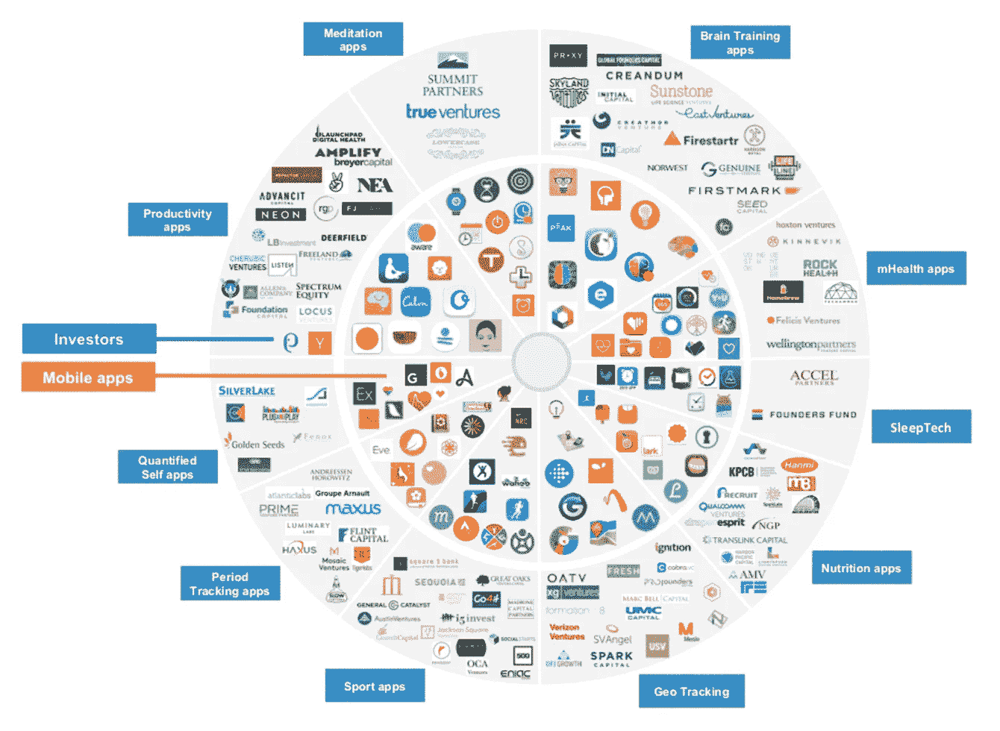

# 如何建立一个医疗创业:一个有用的资源指南

> 原文：<https://medium.com/swlh/how-to-build-a-medical-startup-a-useful-resource-guide-70d4310cfb0f>

# 医疗保健技术的终极资源列表

根据世界银行和世界卫生组织的报告，世界人口的一半缺乏基本的医疗服务。在 T2，死于劣质医疗服务的人数超过了死于艾滋病和糖尿病的人数。技术，尤其是医疗保健移动应用程序开发，旨在改变医疗保健。但是，尽管这项技术充满希望，医疗保健行业却迟迟没有接受它，因为医疗保健生态系统官僚而令人窒息。

然而，医疗保健领域的创新比大多数人意识到的要快。决定建立一家医疗创业公司的个人能够在 2018 年筹集到[95 亿](https://mercomcapital.com/product/2018-q4-annual-healthcare-digital-health-funding-ma-report/)美元的资金。迟早，我们将见证医疗保健技术在全球的大规模应用。

进入医疗保健市场很复杂。保险公司、政府和监管机构等影响价格和政策的参与者的存在造成了相当大的摩擦。此外，许多解决方案未能解决消费者的真正痛点。

为了了解医疗技术的前景，并让你成为一名医疗企业家，我们创建了终极资源指南，其中包含精选的文章、案例研究、统计数据等。该指南解决了医疗保健技术方面的问题，并揭示了覆盖您可能存在的盲点的最佳实践。

# 当今最热门的医疗保健应用有哪些？

数字健康不是神话，而是现实。最好的医疗应用正在赢得医生和患者的青睐，因为它们有助于诊断、治疗和康复，实现以患者为中心的护理。跳到下面的部分，了解医疗保健初创公司、移动健康应用以及吸引用户的功能。

# 成功的医疗创业公司

包括 Ada Health、Doctor Insta 和 Youper 在内的成功医疗保健初创公司在过去几年中获得了增长。了解这些成功创业公司的特别之处:

1.  [硅谷最成功的医疗创业公司有哪些？](https://www.quora.com/What-are-the-most-successful-healthcare-startups-in-Silicon-Valley)
2.  [20 家欧洲顶级健康和医疗科技初创企业](https://www.siliconrepublic.com/innovation/health-medtech-startups-europe-2018)
3.  [关于热门公司、初创公司、投资和并购活动的见解，这些公司的著名投资者、他们的管理团队以及最近的新闻](https://www.crunchbase.com/hub/mhealth-companies#section-overview)
4.  [5 个数字健康成功案例&背后的创始人](https://digitalhealth.careers/digital-health-success-stories/#.XGPP0B9fiV4)
5.  [2019 年值得关注的 31 家最佳医疗创业公司](https://healthcareweekly.com/best-healthcare-startups-to-watch-for-in-2018/)
6.  [改变医学的 50 个成功开源项目](https://nursingassistantguides.com/2009/50-successful-open-source-projects-that-are-changing-medicine/)

# 医生应用

医生对他们使用的应用程序很谨慎。以下是登上头条的他们的最爱:

1.  [最受医生欢迎的三大医疗应用](https://steelkiwi.com/blog/top-medical-apps-for-doctors/)
2.  [医生医疗 app 开发](https://steelkiwi.com/blog/healthcare-mobile-app-development-for-doctors/)
3.  [2018 年最佳医疗应用(至今)](https://www.imedicalapps.com/2018/09/best-medical-apps-of-2018-so-far/)

# 面向患者的顶级移动医疗应用

通过明智的移动健康应用程序开发和使用，可以实现和增强以患者为中心的护理。了解最受患者欢迎的应用:

1.  [苹果面向患者的 22 大个人护理应用](https://www.mobihealthnews.com/content/apples-top-22-patient-facing-personal-care-apps)
2.  [在家门口提供医疗救助的五大医疗保健移动应用](https://www.bmmagazine.co.uk/tech/top-5-healthcare-mobile-apps-bringing-medical-aid-at-your-doorstep/)
3.  [向患者推荐的医疗保健应用](https://www.medscape.com/viewarticle/888903)

# 精神健康移动应用

病人希望过平衡的生活。有时需要一个呼吸应用程序来放松，或者一个日志应用程序来发泄情绪。了解哪些移动医疗创新解决了焦虑、抑郁和其他精神疾病:

1.  [如何开发功能丰富的心理健康解决方案](https://steelkiwi.com/blog/how-to-develop-a-feature-rich-mental-health-solution/)
2.  [十大心理健康应用](https://www.medicalnewstoday.com/articles/320557.php)
3.  [你需要了解的 7 款免费精神健康应用](https://www.youtube.com/watch?v=lgu1NjCtdDE)

# 按需医生应用

为了避免不必要的就医，患者可以在线联系医生。按需医疗保健应用开发找到了完美的市场契合点:

1.  [最适合患者的移动医疗应用:按需医生](https://steelkiwi.com/blog/best-mhealth-apps-for-patients-doctor-on-demand/)
2.  [10 款让你足不出户就能看病的应用](https://www.cheatsheet.com/gear-style/10-apps-that-let-you-see-a-doctor-without-leaving-your-house.html/)
3.  [我使用在线医生的经历](https://www.youtube.com/watch?v=zcSeM-QGN_I)
4.  [按需医生](https://techcrunch.com/2018/04/25/video-consultation-service-doctor-on-demand-raised-74-million-so-everyone-can-see-a-doctor-anytime/)

# 医疗诊断应用

医生寻找价值驱动的产品，这些产品可以帮助他们就患者的状况做出基于证据的决策。以下是可以帮助医生的医疗诊断应用程序:

1.  [最佳医疗诊断应用](https://www.androidapps.com/best-medical-diagnosis-apps/)
2.  [新技术提供更快的疾病医疗诊断](https://www.youtube.com/watch?v=f_5emCzHr9M)
3.  [十大医疗应用](https://www.youtube.com/watch?v=wWbOmw1Hx1g)

受到最佳医疗保健应用的启发？请继续阅读，了解如何打造一款最适合市场的保健产品。

# 我如何知道我的医疗创业是正确的？

产生医疗保健应用的想法、设计和构建医疗保健解决方案涉及产品所有者的大量研究和调查。通过研究获得的信息可以建立你的信心，帮助你发现新的市场机会。

对于数字健康应用程序的开发，研究现有的解决方案，强调它们的优缺点，并熟悉该领域专家和思想领袖表达的观点是至关重要的。换句话说，你需要对你要发展的领域有一个 360 度的视角。为了方便您，我们提供了一些链接，帮助您快速开发下一代医疗保健产品。

# 医疗保健行业影响者

医护人员、患者、药剂师和其他人利用他们的影响力和声誉在 Twitter、脸书和 LinkedIn 上的追随者中形成观点。了解谁是顶级医疗保健影响者，以及这些医疗保健影响者对数字化和医疗保健移动应用的看法:

1.  [最具影响力的 100 人](https://www.onalytica.com/blog/posts/health-tech-top-100-influencers-brands-and-publications/)
2.  [健康科技领域最具影响力的 100 位领导者](https://www.hottopics.ht/23995/top-100-health-tech-influencers/)
3.  [美国 5 位领先的数字健康影响者](https://digitalhealth.careers/5-us-influencer-in-digital-health/#.XGKH9lwzbb0)
4.  [25 位顶级医疗保健影响者](https://izea.com/2018/02/08/top-healthcare-influencers/)

# 医疗保健播客

该领域专家的最佳想法和最佳观察以顶级医疗保健播客的形式提供给你，这些播客由 Med Tech Conference 和 Healthcare Tech Talk 等平台准备。在这些播客中，讨论了一般健康新闻、医疗技术、安全问题、人工智能和其他重要主题，面向医疗保健专业人员和其他希望在医疗保健技术领域拥有发言权的人:

1.  [GeekWire 的健康技术播客深入探讨了技术创新者为数字健康和保健带来的新想法和独创性。](https://www.geekwire.com/healthtech/)
2.  [你需要听的 15 个医疗保健播客](https://www.adsc.com/blog/healthcare-podcasts-you-need-to-listen-to)
3.  [七大健康科技播客](https://www.vertitechit.com/top-health-tech-podcasts/)
4.  [你应该听的 7 个健康科技播客](https://www.healthcareitleaders.com/blog/7-health-tech-podcasts/)
5.  [你需要听的 15 个保健播客](https://www.adsc.com/blog/healthcare-podcasts-you-need-to-listen-to)
6.  [医疗技术讲座](https://medtechconference.com/medtech-talk-podcast/)、[今日数字健康](https://digitalhealthtoday.com/podcasts/)、 [Code Red: HIMSS 网络安全播客](https://www.himss.org/library/podcasts/code-red-himss-cybersecurity-podcast)、[医疗技术讲座](http://healthcaretechtalk.net/)。
7.  [2018 年 5 个最佳医疗保健播客](https://www.healthcaresuccess.com/blog/healthcare-marketing/best-healthcare-podcasts-2018.html)
8.  [医生和医疗保健提供者的 8 个最佳播客](https://www.patientpop.com/blog/marketing/8-business-healthcare-history-podcasts/)
9.  [面向医护专业人员的 25 大医疗播客](https://www.carecloud.com/continuum/top-25-medical-podcasts/)

# 医学博客

初创公司创始人、高管、医疗保健专业人士和市场研究人员讲述的故事，可能对那些希望用技术改善医疗保健的人有用。这些博客谈论 EHRs、网络安全、远程医疗、创业成功案例和失败、资金等等。透过医疗保健博客的镜头获得医疗保健技术的独特视角:

1.  [猎户座健康博客](https://orionhealth.com/global/knowledge-hub/blogs/)
2.  [最佳医疗保健技术博客](https://blog.capterra.com/best-healthcare-technology-blogs/)
3.  [对医疗技术的看法](https://www.cio.com/blog/healthcare-technology-trends/)
4.  [数字健康开发者和医疗保健领导者正在阅读什么来保持他们在技术游戏中的领先地位](https://datica.com/blog/the-2018-hot-list-what-healthcare-developers-were-reading/)
5.  [健康科技](https://www.healthcareglobal.com/health-technology)
6.  [摩比健康新闻](https://www.mobihealthnews.com/)
7.  健康技术杂志
8.  [Techcrunch.com](https://techcrunch.com/2019/02/21/robotics-ar-and-vr-are-poised-to-reshape-healthcare-starting-in-the-operating-room/)
9.  [搜索健康信息](https://searchhealthit.techtarget.com/)

# 面谈

对专家和创始人如 Lloyd Price 和 Samir El-Alami 的一对一采访揭示了成功的故事、建议和愿景:

1.  [问&答:CHIME 首席执行官 Russell Branzell 认为第四次科技浪潮将席卷医疗 IT](https://healthtechmagazine.net/taxonomy/term/817)
2.  [医疗技术是如何通过合作被治愈的](http://www.digitaljournal.com/life/health/interview-how-health-tech-is-being-healed-through-collaboration/article/520735)
3.  [全科医生访谈的结果](https://ruralhealthwest01.blob.core.windows.net/www-production/docs/default-source/rural-workforce-data-and-information/digital-health-interviews-presentation.pdf?sfvrsn=0)
4.  [绘制数字健康地图:采访 Validic 首席执行官兼联合创始人德鲁·席勒](https://datica.com/blog/mapping-digital-health-validic-drew-schiller/)
5.  [发展健康科技公司——劳埃德·普莱斯是首席运营官，也是医疗预约服务公司 Zesty 的联合创始人。](https://www.youtube.com/watch?v=V28itN1Pgnk)
6.  [数字健康高峰工作室 2017](https://livingindigitaltimes.com/portfolio-item/digital-health-live/)
7.  [作为一家健康科技初创公司筹集资金|采访 doctorly 首席执行官 Samir El-Alami](https://www.dr-hempel-network.com/digital-health-startups/raising-money-as-a-health-tech-startup-samir-el-alami/)
8.  [采访 mane esh June ja——数字健康的未来](https://telemedi.co/en/blog/maneesh-juneja-future-digital-health/)

# 会议

他们说，英雄所见略同。对于业内思想领袖来说，没有比会议更好的聚会场所了。这些会议在美国、瑞士、德国、奥地利和其他积极的国家举行。以下会议和活动可以让你接触到有见地的主题演讲和演讲者:

1.  [2019 年医疗保健顶级事件&会议](https://www.adsc.com/blog/the-top-healthcare-events-conferences)
2.  [健康 IT 即将召开的会议](http://healthitconferences.com/)
3.  [2019 年有什么:年度数字健康事件](https://sdk.healthdataspace.org/whats-on-2019-the-digital-health-events-of-the-year/)
4.  [健康卫士联合起来](https://www.himssconference.org/)
5.  [启动健康](https://www.startuphealth.com/)
6.  [即将在美国召开的医学会议](https://www.emedevents.com/usa-medical-conferences)
7.  [医学会议中心](https://www.mdlinx.com/medical-conference/)
8.  [世界医学会议](https://www.conferenceseries.com/medical-meetings)

# 健康技术市场研究和评估

要了解数字市场、其动态以及它对医疗保健行业的影响，请阅读以下报告:

1.  [大观研究](https://www.grandviewresearch.com/)
2.  [数字健康:当前状态&2017–2025 年的未来增长](http://healthstandards.com/blog/2017/10/25/digital-health-trends-2025/)
3.  [数字融合推动医疗技术市场，报告称](http://digitalhealthage.com/digital-convergence-driving-healthtech-market-report-says/)
4.  [2018 年健康技术报告](https://hampletonpartners.com/healthtech-report-2018)
5.  [2018 年顶级数字健康故事:从亚马逊和谷歌到基因编辑婴儿](https://medicalfuturist.com/top-digital-health-stories-of-2018-from-amazon-and-google-to-gene-edited-babies)

看完这些分析，你可以想到与该领域的专家一起努力。与他人合作可以帮助您更快地推出产品。

# 谁能帮我验证我的医疗创业想法？

即使你知道你的业务领域的所有细节，也很难独自推广新想法。考虑与拥有相同价值观的人合作，并希望开发一种产品，使医疗保健变得负担得起并以患者为中心。

为了更好地了解医疗保健生态系统并获得额外的资金和指导，你可以加入一个帮助创业公司的数字健康孵化器或加速器。点击下面的链接，了解一下医疗保健加速器和孵化器的能力。

SOURCE: AHSNNETWORK.COM

# 医疗保健企业孵化器和医疗保健加速器

创新者加入了美国和欧洲城市的数字健康加速器和孵化器。孵化器帮助初创公司获得人才和资本，并获得办公室和实验室等功能性资源，而加速器则帮助中小型公司开发和部署他们的解决方案，并加快采用速度。了解顶级医疗保健加速器和孵化器如何帮助初创公司更快上市:

1.  [你应该知道的数字健康加速器](https://digitalhealthtoday.com/resources/accelerators/)
2.  [15 大健康创业加速器](http://www.medicalstartups.org/top/accelerator/)
3.  [医疗器械孵化器和加速器终极清单](https://www.greenlight.guru/blog/medical-device-incubators-accelerators)
4.  [欧洲最重要的 10 家数字健康孵化器](https://digitalhealth.careers/10-most-important-digital-health-incubators-europe/#.XGLlNFwzbb0)
5.  [德国 60 家孵化器启动你的技术/数字健康创业](https://www.dr-hempel-network.com/digital_health_contact_lists/60-incubators-in-germany-to-launch-your-digital-health-startup/)
6.  [影响医疗保健行业的 20 个创业加速器](https://tech.co/news/20-accelerators-incubators-healthcare-2017-09)
7.  [需要了解的 12 个医疗创业孵化器和加速器](https://www.beckershospitalreview.com/healthcare-information-technology/12-healthcare-startup-incubators-and-accelerators-to-know.html)
8.  [数字健康加速器](https://www.ahsnnetwork.com/innovation/digital-health-accelerators/)
9.  [6 家医疗保健孵化器引领健康科技的未来](https://www.healthcareittoday.com/2014/10/30/6-healthcare-incubators-growing-the-future-of-healthtech/)
10.  [医疗保健加速器:对联邦政策指令的创新回应](https://www.healthaffairs.org/do/10.1377/hblog20141112.042696/full/)
11.  [创业医疗加速器](https://www.redoxengine.com/blog/healthcare-accelerators-for-startups/)

高价值的指导、关系网络和种子资金是初始启动所必需的。跳到下一部分，了解哪些医疗移动应用吸引了医疗保健信息技术市场的投资。

# 医疗基金前景看好吗？

医疗保健是一个很大的行业，包括制药业、医疗器械和医院。医疗保健的每个方面都提供了投资机会。可用的投资水平取决于许多变量，如问题的严重性、人口统计数据和投资回报。尽管如此，医疗保健倡议得到了大量的财政支持，以下来源证明了这一点:

# 健康技术市场地图

以下是医疗保健技术市场概述的链接。这可以帮助您想象您的解决方案如何适应现有的生态系统:

1.  【2018 年健康科技移动应用前景概述
2.  [健康技术领域的难题](/@jp_wise/the-hard-thing-about-hard-things-in-healthtech-66b0d37b428a)
3.  [手握医疗保健:市场地图中的 49 家移动医疗创业公司](https://www.cbinsights.com/research/mobile-health-startup-market-map/)
4.  [健康技术市场概述](https://venturescannerinsights.wordpress.com/tag/healthtech-companies/)
5.  [规划精神健康创业生态系统](/venture-beyond/mapping-out-the-mental-health-startup-ecosystem-5cb4db031b54)
6.  [106 家人工智能创业公司亮相](https://www.cbinsights.com/research/artificial-intelligence-startups-healthcare/)
7.  [150 多家创业公司培育健康产业](https://www.cbinsights.com/research/wellness-tech-startups-market-map/)
8.  [2019 年全球医疗保健展望](https://www2.deloitte.com/global/en/pages/life-sciences-and-healthcare/articles/global-health-care-sector-outlook.html)

# 获得最佳资助的医疗创业公司

2018 年，与 23andMe、Helix、American Well、Heart Flow 和其他许多公司达成了巨额交易，每个公司的融资额都超过了 1 亿美元。查看近年来哪些移动医疗应用获得了大量资助:

1.  [查看哪 10 家医疗保健初创公司获得了超过 17 亿美元的融资](https://healthcareweekly.com/10-us-healthcare-startups-with-over-200m-in-funding/)
2.  [2018 年在纽约市筹集资金的 10 家最热门的数字医疗创业公司](https://www.dr-hempel-network.com/digital-health-startups/10-digital-health-startups-which-raised-funding-in-new-york-city/)
3.  [值得关注的英国健康科技初创公司](https://www.techworld.com/picture-gallery/startups/uk-healthtech-startups-watch-3653416/)
4.  [上升趋势:数字健康初创公司看到 2018 年 Q1 奥运会的风险投资逐年上升](https://www.dreamit.com/journal/2018/4/13/on-the-rise-digital-health-startups-see-uptick-in-year-over-year-venture-funding-for-q1-2018)
5.  [全球数字健康资助报告:2018 年年终回顾](https://www.slideshare.net/StartUpHealth/startup-health-insights-global-digital-health-funding-report-2018-year-end-review-127302187)
6.  [创业健康洞察基金报告](https://www.startuphealth.com/insights-reports)
7.  [数字健康基金和 M &答:2018 年第四季度和年度报告](https://mercomcapital.com/wp-content/uploads/2019/01/MercomDigitalHealthFundingMAQ42018ExecSumm.pdf)
8.  [报告:数字健康市场在 2018 年筹集了 95 亿美元，分析和移动健康成为“大赢家”](https://www.outsourcing-pharma.com/Article/2019/01/25/Digital-health-market-raised-9.5bn-in-2018-with-analytics-and-mHealth-among-the-big-winners)
9.  [查看哪 10 家医疗保健初创公司获得了超过 17 亿美元的融资](https://healthcareweekly.com/10-us-healthcare-startups-with-over-200m-in-funding/)(在美国)
10.  [2018 年终资金报告:数字健康是否存在泡沫？](https://rockhealth.com/reports/2018-year-end-funding-report-is-digital-health-in-a-bubble/)
11.  [2018 年融资第二部分:数字健康 81 亿美元年度的七大收获](https://rockhealth.com/reports/seven-more-takeaways-from-digital-healths-8-1b-year/)

# 医疗保健技术风险投资统计

通过这些来源提供的统计数据，您可以跟踪涉及医疗保健及其他领域的移动应用的近期投资趋势:

1.  [2018 年卫生技术经费创历史新高](https://www.venturescanner.com/blog/tags/health+technology)
2.  [值得注意的数字卫生资金统计](https://storyofdigitalhealth.com/startups/)
3.  [2018 年终资金报告:数字健康是否存在泡沫？](https://rockhealth.com/reports/2018-year-end-funding-report-is-digital-health-in-a-bubble/)
4.  [2006/2007 年至 2017/2018 年医疗技术风险投资在美国和欧洲的投资](https://www.statista.com/statistics/279152/us-healthcare-it-venture-capital-funding/)
5.  [以下是风险投资健康技术投资的 4 个主要趋势](https://pitchbook.com/news/articles/4-trends-in-vc-healthtech-investment)
6.  [健康科技投资报告](http://transjovancap.com/ClientFile/Healthtech_India_Transjovan.pdf)

# 顶级医疗保健风险投资公司

与位于美国、英国和欧洲的风险投资公司合作，启动您的医疗保健移动应用程序:

1.  [健康技术风险投资者数据库](https://www.dreamit.com/journal/2018/7/23/a-comprehensive-list-of-healthcare-venture-capital-firms)
2.  [欧洲 50 家风险投资公司为您的技术、数字健康创业提供资金](https://www.dr-hempel-network.com/digital_health_contact_lists/50-venture-capital-firms-in-europe-to-finance-your-digital-health-startup/)
3.  [这 10 家风投公司今年对医疗保健初创公司的投资最多](https://www.forbes.com/sites/michelatindera/2018/12/27/these-10-vc-firms-made-the-most-investments-in-healthcare-startups-this-year/#d60eac454987)
4.  [富有的医生开始为健康科技创业公司贡献他们的时间和金钱](https://www.cnbc.com/2017/06/11/doctors-investing-in-health-tech-start-ups.html)
5.  [提供商赞助的风险基金的价值](https://medcitynews.com/2018/02/value-provider-sponsored-venture-funds/)

SOURCE: ANALYTICS.DKV.GLOBAL

由于医疗保健移动应用程序开发没有让投资者感到冷淡，现在是时候考虑如何进入移动健康应用程序市场了。

# 我如何建立我的医疗创业公司？

*如何构建 X* 可能是大多数产品所有者谷歌的一个查询，他们这样做是有充分理由的。您希望让您的医疗保健应用程序正确运行，以便在用户中建立声誉和信任。这是因为数据泄露和未能满足移动医疗应用市场的法律要求会让你承担经济责任。

在构建医疗保健应用程序之前，请确保您知道如何为用户提供一个安全的环境，并保持您的业务合法。

# 完成法律工作

有条不紊很好，获得法律咨询可以为你省钱。医疗领域的软件开发很棘手，所以在你开发医疗应用之前，让律师来帮你:

1.  [合法健康对数字医疗公司来说并不容易](https://techcrunch.com/2016/04/13/legal-good-health-isnt-easy-for-digital-health-companies/)
2.  [医疗保健初创公司:免费律师咨询](https://jacksonllp.com/health-tech-startups)
3.  [为英国新成立的医疗保健公司提供专家法律支持](https://www.hempsons.co.uk/services/healthcare-startups/)
4.  [如何知道你的创业公司是否需要律师](https://www.forbes.com/sites/walshpadraig/2016/10/21/when-do-startups-need-lawyers/#48412401447b)

# 应用货币化战略

如何从移动应用中赚钱是每个企业家都会问的问题。这里有一些关于移动货币化策略的文章可供选择:

1.  [医疗移动应用的 7 种盈利策略](https://steelkiwi.com/blog/effective-monetization-strategies-for-medical-mobile-apps/)
2.  [医疗行业数据货币化的两种模式](http://www.ancapetre.com/data-monetisation-healthcare)
3.  [数字治疗货币化](https://www.simon-kucher.com/en/blog/monetizing-digital-therapeutics)
4.  [在医疗器械行业利用软件货币化战略](https://www.wibu.com/us/blog/article/monetizing-the-medical-device-industry.html)
5.  [哪些移动健康 app 商业模式正在胜出？](https://medcitynews.com/2018/03/mobile-health-app-business-models/)

# 医疗应用安全性

最好的移动健康应用是安全的。了解如何保护医疗保健数据:

1.  [关于医疗数据安全的 50 件事&隐私](https://www.beckershospitalreview.com/healthcare-information-technology/50-things-to-know-about-healthcare-data-security-privacy.html)
2.  [2019 年 60 个必须知道的网络安全统计](https://www.varonis.com/blog/cybersecurity-statistics/)
3.  [希帕杂志](https://www.hipaajournal.com/category/healthcare-cybersecurity/)
4.  [关于医疗保健和网络安全的 27 项统计数据](https://www.dizzion.com/resource/blog/27-stats-about-healthcare-cybersecurity/)
5.  [必须知道的医疗网络安全统计数据](https://www.healthcaredive.com/news/must-know-healthcare-cybersecurity-statistics/435983/)
6.  [如何用六个步骤构建安全的医疗手机 app](https://steelkiwi.com/blog/how-to-build-secure-medical-mobile-app-six-steps/)
7.  [如何打造有效的医疗手机 app](https://steelkiwi.com/blog/how-to-build-medical-mobile-app/)

# 医疗保健应用开发中的风险和挑战？

你的目标是成功，但也有你需要意识到的风险和挑战。在医疗保健行业，风险会增加，因为你要处理的是人们的生活。请务必阅读以下文章，了解风险和挑战:

1.  [为什么数字健康创业公司不断失败？](https://www.fastcompany.com/90251795/why-do-digital-health-startups-keep-failing)
2.  [为什么资格认证对你的健康科技创业公司很重要？](https://www.credsimple.com/credentialing-how-tos/what-startups-need-to-know-about-credentialing/)
3.  [家庭护理创业公司面临的挑战](https://kinnser.com/home-health-blog/post/4-challenges-home-health-startups-face-and-how-to-come-out-on-top/)
4.  [医疗保健行业面临的 11 大风险](https://riskandinsurance.com/11-critical-risks-facing-the-healthcare-industry/)
5.  [健康科技初创公司如今面临的三大挑战](https://tech.co/news/key-challenges-health-tech-startups-2016-10)
6.  [数字健康创业公司的主要陷阱](https://techcrunch.com/2016/03/21/the-major-pitfall-for-digital-health-startups/)

一旦你解决了业务问题，权衡了构建医疗保健应用的利弊，并选择了盈利策略，你的下一步就是寻找技术人才。

# 谁能帮我开发一个移动健康应用？

当谈到为医疗保健行业构建移动应用程序时，你需要找到一个在该领域有经验的团队。他们会建议你使用什么技术。

# 医疗保健应用开发者

寻找能够让您的独特想法成为现实的软件服务提供商:

1.  [顶级医疗&医疗保健软件公司](https://www.investopedia.com/articles/investing/010715/top-medical-healthcare-software-companies.asp)
2.  [定制软件产品，创新和优化您的医疗保健业务](https://www.altexsoft.com/health-care/)
3.  [医学网专家](https://www.medicalwebexperts.com/portfolio/)
4.  [健康开发商](https://clutch.co/app-developers/health-wellness)
5.  [Steelkiwi 公司](https://steelkiwi.com/expertise/)
6.  [Medicalwebexperts.com](https://www.medicalwebexperts.com/healthcare-app/)
7.  [Geneticapps.co.uk](https://www.geneticapps.co.uk/case-studies/)
8.  [云无忧](https://www.carecloud.com/solutions/)

# 医疗保健软件供应商

一些公司专门与 EHR 或远程医疗打交道。所以你可以考虑使用他们的服务:

1.  [2017–2022 年十大医疗保健软件厂商及市场预测](https://www.appsruntheworld.com/top-10-healthcare-software-vendors-and-market-forecast/)
2.  [50 家最有前途的医疗保健解决方案提供商](https://healthcare.cioreview.com/vendors/most-promising-healthcare-solution-providers-2018.html)
3.  [医疗软件](https://www.softwareadvice.com/medical/p/all/)
4.  [医院管理软件](https://www.capterra.com/hospital-management-software/)
5.  [最佳保健软件](https://www.g2crowd.com/categories/health-care)
6.  [制药行业数字健康厂商的机遇](https://datica.com/blog/opportunities-for-digital-health-vendors-in-pharma/)
7.  [GlobalMed:虚拟健康平台的平台](https://www.globalmed.com/)
8.  [这 5 家初创公司将在 2018 年改变医疗保健行业](https://www.inc.com/bill-carmody/these-5-startups-will-change-healthcare-in-2018.html)
9.  [生动健康:随处关爱](https://www.vivifyhealth.com/)

一旦你决定由谁来负责你的医疗移动应用程序的开发，想办法来衡量你的业务的有效性。

# 如何衡量我的移动医疗保健应用的有效性？

为了跟踪运营效率，工厂和企业求助于关键绩效指标(KPI)。在医疗保健行业，KPI 可以衡量从设施运营到患者满意度的一切，这有助于您了解自己的做法是否正确，并显示哪些地方需要改进或改变。

# 医疗保健指标和 KPI

查看这些文章，了解医疗行业关键绩效指标的独特观点:

1.  [医疗保健关键绩效指标和指标](https://www.datapine.com/kpi-examples-and-templates/healthcare)
2.  [可视化您的医疗保健 KPI](https://www.sisense.com/kpi-library/healthcare-kpis/)
3.  [25 项医疗保健指标&KPI 今天开始跟踪](https://www.clearpointstrategy.com/25-healthcare-metrics-kpis/)

KPI 是你需要看到你的平台上是否有持续的价值创造。除了跟踪内部流程，您还应该考虑监管机构在您的平台之外实施的法规。各国对医疗保健解决方案的要求各不相同。因此，请务必调查你所在地区的情况。

# 在我的国家我应该准备什么？

如果你要在你的国家推出一个产品，为了在生意中生存，知道该遵守什么规则是至关重要的。更重要的是，你应该知道人们对健康技术的接受程度，所以不要犹豫，浏览下面的链接。

# 医疗保健中技术的采用

了解医疗保健技术在不同人群中的采用率非常重要，这样您就可以瞄准正确的用户群:

1.  [医疗保健领域的技术:采用、挑战和进步](https://www.ghx.com/the-healthcare-hub/2018/technology-in-healthcare-adoption-challenges-and-progress/)
2.  [医疗保健行业的 IT 采用趋势](http://www.ctrls.in/blog/adoption-trends-healthcare/)

## 按部门

1.  [医疗保健行业采用云计算服务:特别关注斯里兰卡科伦坡区的私立医院](https://www.researchgate.net/publication/319900049_Adoption_of_Cloud_Computing_Services_in_Healthcare_Sectors_Special_Attention_to_Private_Hospitals_in_Colombo_District_Sri_Lanka)
2.  [人工智能医疗保健行业——人工智能在该行业的应用](https://decondia.com/ai-healthcare-sector-ai-adoption/)

## 按国家

1.  [快速统计:美国采用](https://dashboard.healthit.gov/quickstats/quickstats.php)
2.  [亚太地区的采用情况](https://www.asianhhm.com/information-technology/healthcareit-asiapacific)
3.  [医疗保健行业 2019 年查看趋势、分析和统计。按国家](https://www.reportlinker.com/market-report/Healthcare/6242/Healthcare?utm_source=adwords1&utm_medium=cpc&utm_campaign=Healthcare&utm_adgroup=Healthcare_Market_Reports&gclid=EAIaIQobChMIlrPLvrK24AIVRIuPCh1wwQqrEAAYAiAAEgLNYfD_BwE)

# 医疗法规

了解哪些法规会阻碍甚至阻碍你的发展，除非你遵守这些法规:

1.  [健康法律和全民健康保险](https://www.who.int/health-laws/countries/en/)
2.  为什么医疗保健监管如此复杂？
3.  [医疗保健走向数字化，但监管难以瓦解](https://globalcompliancenews.com/healthcare-digital-regulation-20171028/)
4.  [GDPR 对您在欧盟的数字健康创业的影响&全球](https://www.dr-hempel-network.com/health-policies-in-india/gdpr-impact-on-digital-health-startups/)
5.  [美国医疗器械法规](https://www.emergobyul.com/resources/regulations-united-states)
6.  [FDA 医疗器械法规概述](https://www.einfochips.com/blog/an-overview-of-fda-regulations-for-medical-devices/)
7.  [移动医疗应用:FDA](https://www.fda.gov/medicaldevices/digitalhealth/mobilemedicalapplications/default.htm) (美国)
8.  [专家对 HHS 医疗保健应用开发指南发表意见](https://searchhealthit.techtarget.com/feature/Experts-weigh-in-on-HHS-healthcare-app-development-guidance)
9.  [国际标准化组织](https://www.iso.org/home.html)

似乎我们已经讨论了所有的事情。但是还有一件事。您应该跟踪医疗技术的未来趋势以保持竞争力，抓住机会发展您的产品，并为用户创造价值。

# 我如何跟上医疗保健信息技术的发展？

你的主要目标之一是确保你跟上医学技术的发展。如果您明智地采用最新技术，您的解决方案可以以您认为不可能的方式发展。这就是为什么你应该仔细监测医疗保健行业的变化，考虑趋势和预测，并阅读正在获得牵引力的项目。

# 未来的医疗保健预测

在这些链接中，您会发现技术前景可能会定义您的长期战略。您的医疗保健初创公司不应错过使用人工智能、预测分析和虚拟现实来增长、改进和交付更多价值的机会:

1.  [医疗保健技术市场:2019 年的 5 个预测](https://www.cio.com/article/3325331/health-care-industry/healthcare-technology-markets-5-predictions-for-2019.html)
2.  【2019 年消费电子展上的健康趋势将是人工智能驱动的健康解决方案
3.  [2019 年医疗保健预测](https://www.hitechanswers.net/2019-predictions-in-healthcare/)
4.  【2019 年的数字医疗保健预测是什么？
5.  【2019 年医疗保健和数字健康预测
6.  [2019 预测:从大数据到小数据，患者数据作为研究数据，等等](https://www.healthdataanswers.net/2019-predictions-from-big-data-to-small-data-patient-data-as-research-data-and-more/)
7.  [数字健康:新技术具有深远的潜力](https://www.credit-suisse.com/corporate/en/articles/news-and-expertise/digital-health-new-technologies-have-far-reaching-potential-201803.html)

# 健康技术市场驱动因素

了解当今推动医疗技术市场的因素和人物，以及它可能如何影响您选择的医疗创业方向:

1.  [美国政府的举措推动了健康科技的发展](https://www.healthtechcapital.com/about/healthtech_market/)
2.  [推动医疗保健技术未来发展的 70 多家公司](https://www.redoxengine.com/blog/70-health-tech-companies-disrupting-healthcare/)
3.  [四大公司如何引领医疗创新](https://healthcareweekly.com/how-the-big-4-tech-companies-are-leading-healthcare-innovation/)
4.  [数字健康应用背后的驱动力](https://techcrunch.com/2016/08/01/the-drivers-behind-digital-health-apps/)
5.  [数字医疗的崛起:5 个驱动力](/mobile-lifestyle/rise-of-digital-healthcare-5-drivers-55f949078afc)
6.  [苹果正在追逐医疗保健行业](https://www.cbinsights.com/research/apple-healthcare-strategy-apps/)

# 创新医疗创业公司

如果没有创新，我们不会看到今天的世界。Nightingale 和 Kry 等应用程序将疾病护理转变为基于价值的护理，让患者过上更健康的生活，并随时随地获得医疗建议。医疗保健领域的创新越多，突破的机会就越多:

1.  [亚洲最具创新性的医疗保健创业公司](https://www.galengrowth.asia/events/most-innovative-healthtech-startup-2018/)
2.  [10 家激动人心的健康创业公司，它们可能会永远改变这个行业](https://www.eu-startups.com/2018/06/10-exciting-health-startups-that-could-change-the-sector-forever/)
3.  [硅谷十大令人兴奋的健康科技初创公司](https://www.proclinical.com/blogs/2018-10/top-10-exciting-health-technology-start-ups-silicon-valley#)
4.  [最佳健康科技创业公司获奖者。2018 年北欧创业奖](https://www.youtube.com/watch?v=ZD4J2luDrLE)
5.  [2018 年 13 大医疗科技创新](https://getreferralmd.com/2018/01/future-healthcare-technology-advancements-2018/)

# 个性化医疗保健

个性化不仅仅是一个时髦词。通过使用患者的数据，医疗保健应用程序可以提供个性化的治疗计划和在线医生咨询，发送健康报告，并对患者的疾病进行教育。要了解是什么推动了个性化健康解决方案的发展，请阅读以下文章:

1.  [是什么推动了医疗保健的个性化？](https://www.entrepreneur.com/article/278472)
2.  [让医疗保健更加个性化的三大趋势](https://medcitynews.com/2017/12/three-trends-make-healthcare-personalized/)
3.  [医疗保健个性化的 10 个例子](https://www.forbes.com/sites/blakemorgan/2018/10/22/10-examples-of-personalization-in-healthcare/#633d669824e0)
4.  [个性化医疗保健技术的承诺](https://healthinformatics.uic.edu/blog/the-promise-of-personalized-health-care-technology/)
5.  [苹果正在追逐医疗保健行业，从个人健康数据开始](https://www.cbinsights.com/research/apple-healthcare-strategy-apps/)

# 面向医疗保健的物联网

物联网医疗设备让您可以为患者护理制作出色的移动应用程序，无论患者身在何处，都可以将数据直接传输给医生。发现物联网示例，了解物联网技术在医疗保健领域的局限性:

1.  [医疗保健物联网可能性和障碍指南](https://searchhealthit.techtarget.com/essentialguide/A-guide-to-healthcare-IoT-possibilities-and-obstacles)
2.  [医疗保健领域物联网的 10 个例子](https://econsultancy.com/internet-of-things-healthcare/)
3.  [物联网和 NHS:为什么物联网将创造一场医疗革命](https://www.zdnet.com/article/iot-and-the-nhs-why-the-internet-of-things-will-create-a-healthcare-revolution/)
4.  [为什么医疗物联网正在兴起](https://healthtechmagazine.net/article/2018/08/why-healthcare-iot-rise-infographic)
5.  [如何在零信任世界中保护医疗物联网设备](https://www.forbes.com/sites/louiscolumbus/2018/10/23/how-to-protect-healthcare-iot-devices-in-a-zero-trust-world/#6e6ae0354862)

我们希望这份资源指南能够帮助您获得对医疗保健技术的宝贵见解。如果您在开发自己的产品时需要进一步的指导和帮助，[请联系我们](https://steelkiwi.com/contacts/?from_page=/)！同时，我们建议你[看看我们的投资组合](https://steelkiwi.com/projects/#medical-healthcare-solution)看看我们已经建立了哪些医疗保健项目。

## 这篇文章发表在 [The Startup](https://medium.com/swlh) 上，这是 Medium 最大的创业刊物，拥有+436，678 读者。

## 在这里订阅接收[我们的头条新闻](https://growthsupply.com/the-startup-newsletter/)。

