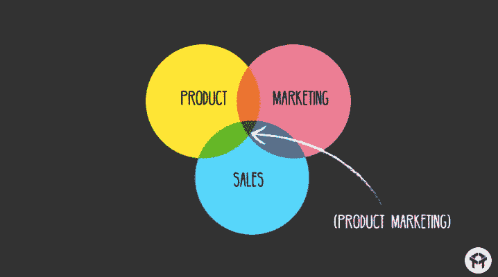
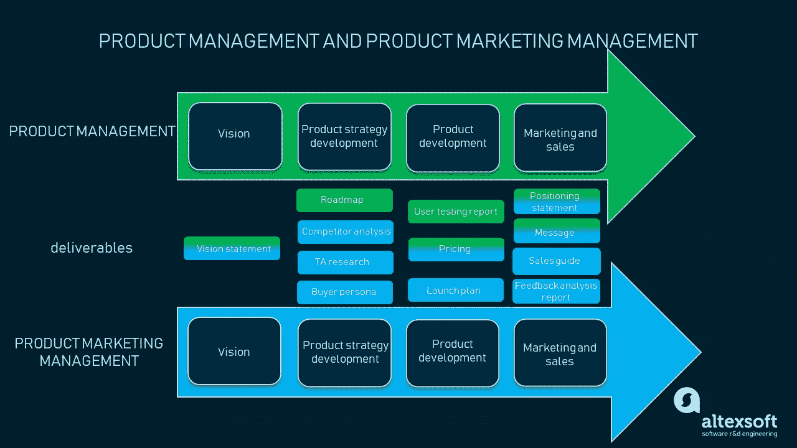
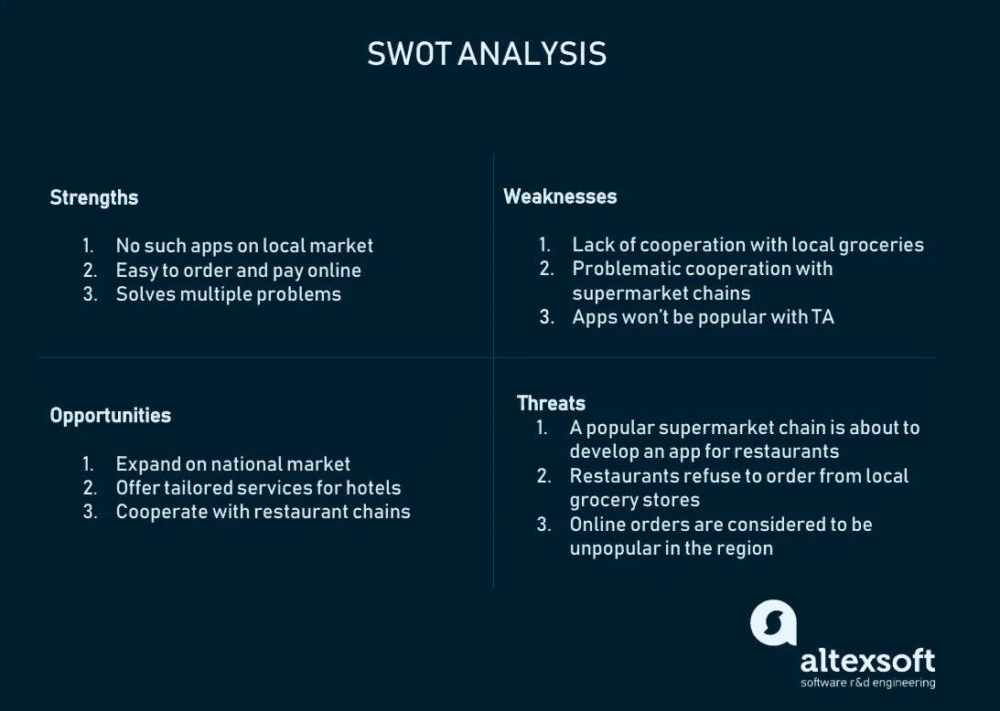
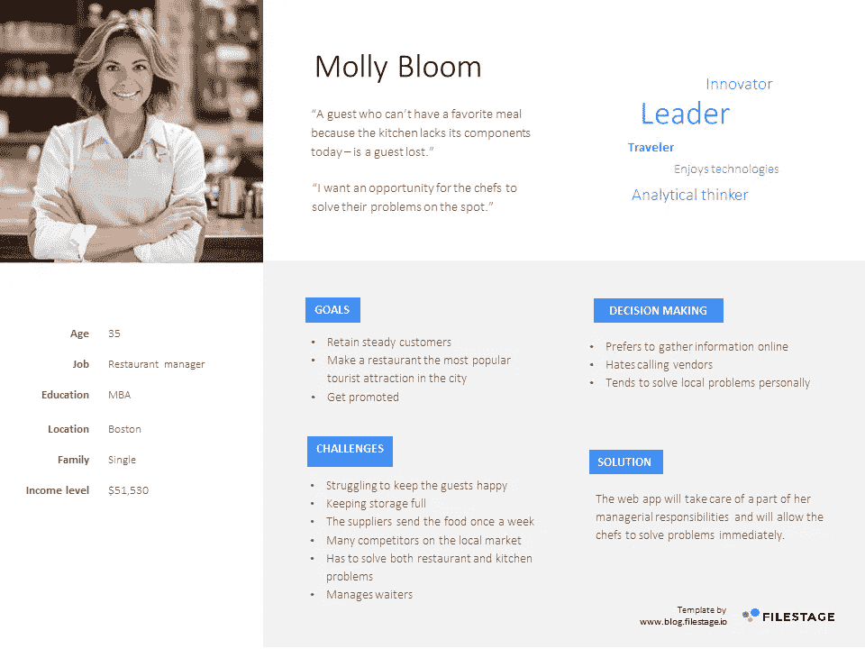
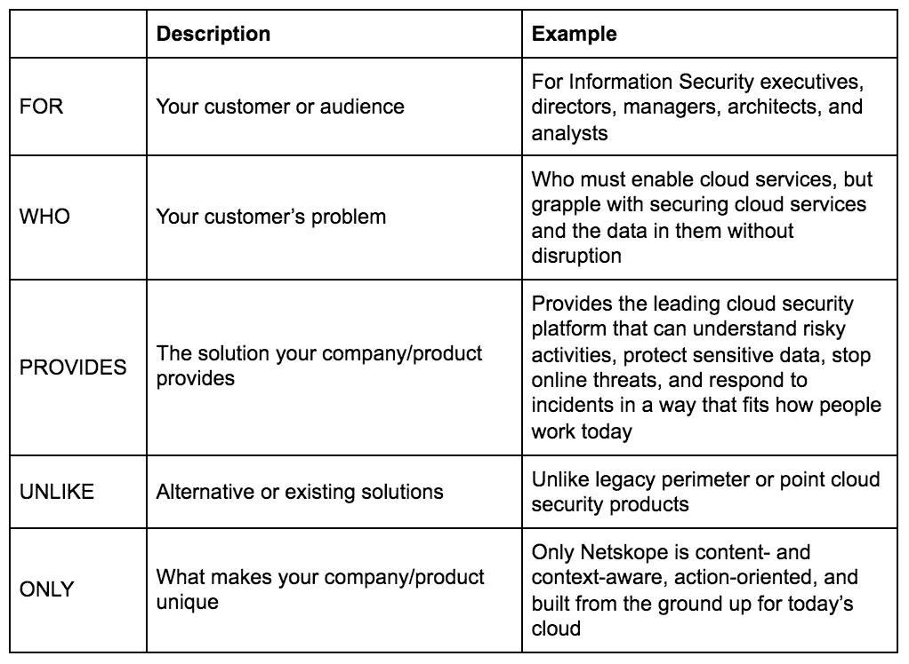
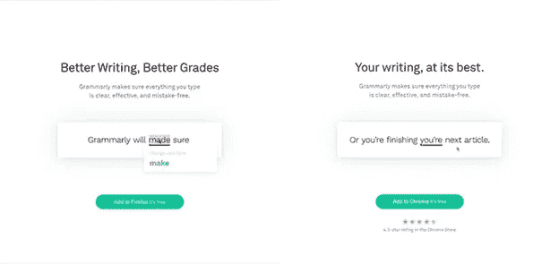
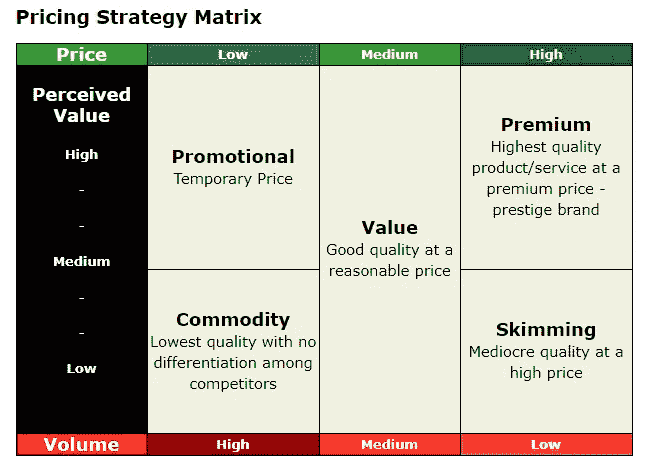
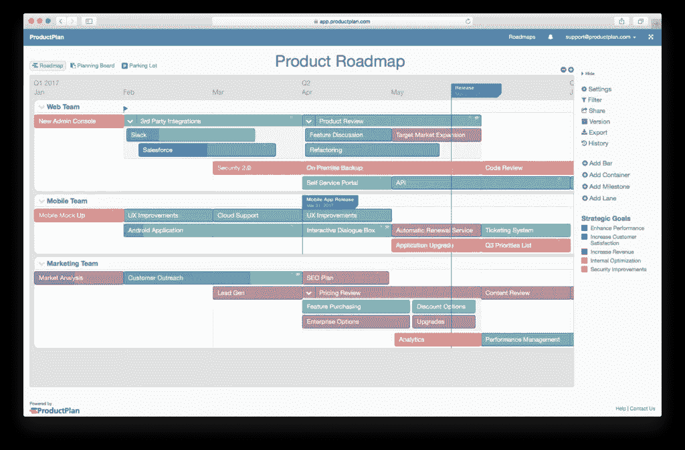
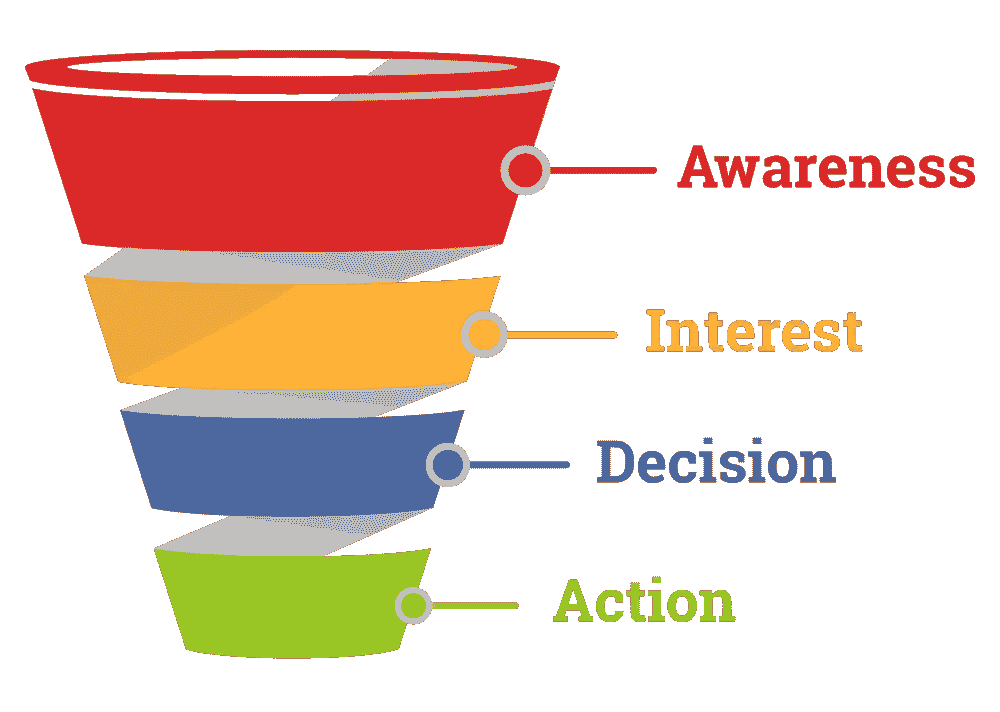
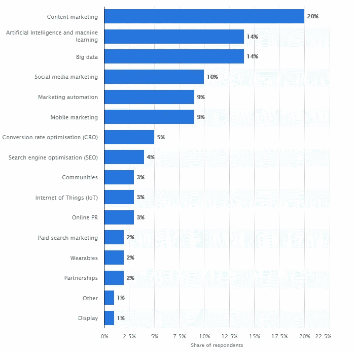

# 如何为您的软件解决方案建立产品营销策略

> 原文：<https://medium.com/swlh/how-to-build-a-product-marketing-strategy-for-your-software-solution-3f983fd35225>

有趣的事实:流行的漱口水 Listerine 最初是作为一种外科手术防腐剂销售的。当它在 1881 年进入市场时，牙医用它来清洁他们的仪器，但到了 20 世纪 20 年代，人们开始购买它来消除口臭。发生了什么变化？不是构图，而是营销策略。有了营销策略，你可以销售新产品或服务，或者增加现有产品或服务的销量。在本文中，我们将解释如何为您的软件解决方案创建一个循序渐进的产品营销策略。不过先来定义一下*产品营销*。

# 什么是产品营销？

产品营销是将产品或服务从概念转移到客户手中的过程。它位于[产品管理](https://www.altexsoft.com/blog/business/product-management-main-stages-and-product-manager-role/?utm_source=MediumCom&utm_medium=referral)，销售和市场营销的交叉点。营销包含四个要素的协调(营销的 4p):*产品*(识别、选择、开发)*价格*、*分销渠道*、*促销策略*(开发与实施)。产品营销由产品营销经理指导，但也需要产品经理和销售团队的参与。

*What is product marketing? Source:* [*Drift*](https://www.drift.com/blog/what-is-product-marketing/)

产品营销与产品管理紧密相连。两个过程都有共享的阶段和可交付成果，如下面的方法所示。

*Product marketing and product management in a nutshell*

产品管理需要对产品、其开发和生命周期进行控制，而产品营销则专注于将产品带给客户。但这两个过程都始于同一点:产品愿景。

愿景是产品或产品线的本质和总体目标。它为产品开发和营销设定了方向。通常，产品愿景是由整个产品团队根据头脑风暴或积压的想法创建的。

在最开始，产品营销经理和产品经理创建一个共享的可交付成果:愿景陈述。产品愿景陈述必须回答三个重要问题:

1.  谁会用？
2.  产品解决了哪些问题？
3.  如何衡量一个产品的成功？

让我们假设你的产品是一个餐馆的送货应用程序。该应用程序的目标是允许厨师通过将他们连接到他们所在地理位置的杂货店供应商来订购他们缺少的项目。该应用程序允许餐厅填补缺口，而无需等待他们每周的供应交付。我们的愿景是*“成为厨师们的头号应用，让他们在任何时候、任何一天都可以买到食品杂货，烹饪他们的客人想要的任何东西。”*

有了愿景，你就可以做 SWOT 分析，了解你的产品在市场上的未来，以及目标受众(TA)研究。

# 1.分析市场

*目标:确定市场和主要竞争对手
主要交付成果:竞争对手名单、目标受众研究、SWOT 分析*

你必须将产品开发、定位和营销策略建立在彻底的市场调查的基础上。你需要的主要有两种类型——市场调研和竞争调研。市场研究阶段将揭示你的想法在考虑当前商业环境、业内客户购买习惯和竞争对手群体时的可行性。

**进行一手和二手研究。**市场调查是产品营销的重要组成部分，它让公司了解用户想要什么，他们已经在使用哪些产品。

使用主要研究来创建购买者或用户角色(我们将在下面讨论)，使用次要研究来进行竞争分析。在*初级研究阶段，*计划与你的潜在或当前客户进行个人访谈、小组调查和焦点小组讨论。准备问题以获得关于需求或缺乏需求、他们已经使用的产品等的答案。在*二次研究*期间，使用已经产生数据的外部资源，这些数据可以在统计数据库、期刊、在线资源等中找到。你未来的用户占你所在地区总人口的百分比有多大？这些人中有多少人倾向于使用在线解决方案？他们谁买得起？这些数字会告诉你创造这个产品是否可行。

列出并分析你的竞争对手。市场研究面向潜在客户，而竞争分析则分析您所在行业的类似产品和供应商。它的要点是找出主要竞争对手，了解自己产品的优缺点。

使用现成的市场研究和行业报告(如尼尔森、IRI、Wood MacKenzie、NPD 集团、视频研究、决策资源集团、Mintel、YouGov、Mediametrie 等来源)，或使用 LinkedIn、谷歌和社交网络手动挖掘信息。

列出所有竞争对手的产品，比较网站流量，分析他们的网站和社交网络。将他们分为三类:一级、二级和三级竞争者。

*   主要竞争对手是那些拥有相同产品或受众或两者都有的人。
*   次要竞争对手是那些拥有类似产品但销售给不同受众的人。
*   第三类竞争对手是那些销售扩展您现有产品的产品或工具的人。

这些信息可以让您了解其他产品有哪些是您的产品没有的，并了解如何定位它。

在你研究了类似产品的市场后，你可以分析你的产品在市场上的位置，并进行 SWOT 分析。

**构建 SWOT 分析网格**。SWOT 分析代表了你的产品或你的竞争对手的优势、劣势、机会和威胁。通常，它们被列在一个网格中，就像你在下面看到的那样。该工具旨在勾画您的内部和外部业务环境，然后发现如何利用优势抓住机会，如何借助这些机会最小化劣势，哪些优势将帮助您避免威胁，以及哪些劣势会使您容易受到发现的威胁的影响。

*Delivery app SWOT analysis*

由于这一阶段的活动，你可以预测产品在市场上的命运。让我们回到我们想象中的送货应用。你研究了当地市场，发现该地区有超过 10，000 家餐馆，没有同类产品的竞争对手，但有 10 家大型连锁超市提供送货上门服务。所以，现在你明白你的产品有市场，可以定义谁会买。

# 2.定义你的目标受众

*目标:缩小 TA
关键交付件:*买方角色

根据你的市场调查结果，你可以创建一个买家角色。这是一幅购买你产品的普通顾客的画像。请记住，购买者角色不同于用户角色。在我们的交付应用程序案例中，目标受众包括位于市中心的大中型餐馆的所有者和经理，因此买方角色是餐馆经理，而用户角色是餐馆厨师。

对现有客户进行一系列采访，并对潜在客户、行业内公司的首席技术官或首席执行官进行一些在线调查。因此，你可以用以下特征来完成他们的肖像:

*   年龄
*   性别
*   位置
*   教育
*   职称
*   收入水平
*   目标
*   挑战
*   性格特征

*Buyer persona example*

有了这些结果，了解你的目标受众需要什么和想要避免什么，你就可以把你的产品定位为一个解决问题的工具，从众多类似的解决方案中脱颖而出。

# 3.开发定位和信息

*目标:定义引人注目的信息的突出特点
主要交付内容:定位陈述、信息*

你知道市场和竞争对手，所以你可以继续进行进一步的活动，并创建一个文档来定义产品在市场上的未来——定位声明。

要做到这一点，从回答以下问题开始:

1.  这个产品是给谁的？
2.  这个产品是做什么的？
3.  这个产品为什么不一样？

在定位方面，你列出你的 TA 的需求/问题以及满足这些需求/问题的产品优势。这项活动有助于形成顾客对所提供产品的认知方式。

*Positioning statement template Source:* [*Jamie Catherine Barnett on Medium*](/@jamiecatherinebarnett/your-must-have-core-messaging-framework-a-guide-for-high-tech-startups-6eb39a6d0864)

对于送货应用程序，一个定位是:*我们出售唯一一个允许餐厅厨师通过立即连接到所有当地杂货店来保持货架满满的应用程序。*在此基础上，您可以针对不同的目标细分市场开发一条或多条信息。

**创建产品信息**，描述产品或服务对目标受众的价值。阐明产品为特定受众解决的问题，它将用于促销活动和不同渠道。在交付应用程序的情况下，您为餐厅经理创建以下消息:*一个快速解决日常供应问题的应用程序，可在任何时候任何一天使用。*

当你对你的信息有一些想法的时候，仔细阅读这个清单:

*   这个信息应该像一个[电梯推销](https://en.wikipedia.org/wiki/Elevator_pitch)——简短并且在一分钟之内解释清楚
*   关注优势，而不是特性
*   来个戏剧性的转变，使用能引起人们共鸣的词语
*   使用反映你品牌的语气

正确的信息和定位是不可分割的。根据细分市场塑造信息，您可以选择如何为不同的细分市场或分销渠道定位产品。例如，Grammarly 的登录页面有针对不同客户群的目标文本。

*Smart content on Grammarly aimed at different segments. Source:* [*Grammarly*](https://www.grammarly.com/)

关于定位的信息会影响促销策略，通常包含在销售指南中，我们将在后面讨论。

# 4.选择定价策略

*目标:评估定价选项
关键交付成果:产品价格*

这种情况你是知道的:市面上有两款功能相似的同类产品，但是一款的成本要高很多。这到底是怎么回事？这取决于[软件商业模式](https://www.altexsoft.com/blog/business/software-business-models-examples-revenue-streams-and-characteristics-for-products-services-and-platforms/?utm_source=MediumCom&utm_medium=referral)以及企业在为其产品和服务定价时实施的策略。

**选择有竞争力或基于价值的定价策略。** *竞争性定价*是最简单的定价方式。这意味着设定与你的竞争对手对类似产品相同的价格。如果你提供独特的东西，你可以把价格定得比同类产品高。记得跟踪公开财务报告，评估你的竞争对手在成本方面的表现。

基于价值的定价更复杂，但也更有效。这种方法可以让你的利润最大化。

*Pricing strategies. Source:* [*MyMarketing Dept*](https://www.mymarketingdept.com/b2b-pricing-strategy/)

*   优质——以高价购买高质量的产品。这一战略面向具有卓越产品价值的独家产品。
*   促销——针对刚刚进入市场的新产品的策略。这种策略有助于产品吸引买家。它把价格定得比市场平均价格低，但后来又提高了。
*   商品定价——针对市场上没有差异化的低价值产品的策略。
*   略读——中等价值产品的高定价策略，通常用于补充产品/服务。

由于我们想象中的交付应用程序在市场上是全新且独特的，您可以从基于价值的定价开始。然而，你也可以尝试一种促销策略，免费发布应用程序，随着应用程序受众的扩大而逐渐增加成本(或提供具有附加功能的订阅计划)。

# 5.制定促销策略

*目标:准备产品进入市场
关键交付物:发布计划、销售指南、促销策略*

为了最终进入市场并接触到你的受众，你需要一个发布计划和推广策略。

**写一份投放计划。**类似于产品路线图的文件，发布计划说明了产品团队的时间表和活动。在发布计划中，您需要列出所有内部和外部活动，包括销售培训、活动、发布和促销活动时间表。许多在线工具和模板可以让你自动做到这一点，因此，即使你还没有准备好承诺特定的日期，粗略地勾勒出你未来的所有活动也是一个好主意。记得设置里程碑——当营销策略的新阶段结束时，检查整个团队的控制点。并使用甘特图来可视化每个人的负荷。

*Example of a product launch plan. Source:* [*ProductPlan*](https://www.productplan.com/resources/roadmap-templates/)

发布计划的目标是向销售团队传达发布时间表。在这个阶段，产品营销经理还为销售团队创建数据表和培训材料。其中有一份销售指南，是销售团队的内部文件。

**创建销售指南。**

销售指南的重点是展示产品特性，使其有别于市场上的其他产品。它用于培训销售团队销售每种产品。这让他们对产品有所了解，并能轻松应对客户可能提出的任何问题。在这里，您列出了有助于销售团队达成交易的产品的所有必要信息:

1.  定位和您之前定义的产品信息。这将有助于销售代表在既定模型内正确展示产品。
2.  产品特性和演示。销售团队必须了解产品是如何工作的，它最擅长做什么，以及它的独特特征。你也可以包括产品经理的联系信息，这样销售人员可以向他们咨询。
3.  定价选项。如果您的软件有几个定价层，销售团队应该能够向客户推荐最适合他们的一个——或者甚至将其作为追加销售的机会。

这些是销售指南中包含的要点，但你并不限于此。您可以扩展它并添加有关竞争对手的信息。这些结果也将用于产品推广策略。

## 促销策略

在购买之前，顾客会经历销售漏斗的几个阶段。它说明了说服客户的过程。一个人从知道你的产品/服务开始，变得感兴趣，做出决定，最后采取行动。

在 B2C 开发团队中，项目营销经理负责漏斗所有阶段的活动。他们是通过创建强有力的行动号召或吸收有影响力的人进行促销来主导最终交易的人。在 B2B 模式中，营销人员通常大量参与提高意识部分，并引导潜在客户进行第一次接触，而其余的则由销售团队负责。

*Sales funnel. Source:* [*Mailmunch*](https://www.mailmunch.co/blog/sales-funnel/)

提高认识的最有效方式是通过多种宣传活动。促销策略是整个营销策略的一部分，负责市场沟通。促销的每个方面都以产品信息为中心。

为了制定促销策略，你必须描述你的团队将使用的所有渠道和方法，以使你的信息传达给客户。促销策略包括广告、销售、活动、电子邮件营销、内容营销、社交媒体等等。下面你可以看到软件解决方案最有效的推广策略。

**计划销售线索挖掘活动。**销售线索挖掘包括吸引潜在客户(销售线索)。潜在客户是已经对你的产品表现出兴趣或者可能有兴趣购买的人。他们被有偿和无偿的广告和促销活动所吸引。销售线索来源有几个主要渠道:

*   搜索结果(有机)
*   网站(直接销售线索)
*   电子邮件活动
*   社交网络
*   其他网站(推荐)
*   付费搜索

考虑到您的预算和人力资源，确定什么样的潜在客户开发策略最适合您。可以是集客营销——通过有机搜索结果或广告帮助客户找到你的产品，也可以是出站营销——利用“租用”注意力来传递你的行动号召。各种活动的组合是更好的选择，但是在建立你的销售线索生成策略时，要考虑你的主要关注点和团队成员。

**写一份内容营销计划。**内容创作仍然是最有效的营销策略。它可以让你建立品牌忠诚度，并推动更多的有机线索。通过创造相关的有价值的内容，促使潜在客户采取行动，从而赢得 TA 的信任。它包括与你的产品行业相关的[登陆页面](https://www.altexsoft.com/blog/uxdesign/how-to-design-a-high-converting-landing-page/?utm_source=MediumCom&utm_medium=referral)，博客，视频，播客，主题信息图。内容营销策略通常需要搜索优化和社交媒体营销。

*Most effective digital marketing techniques according to marketers worldwide in 2018\. Source:* [*Statista*](https://www.statista.com/statistics/190858/most-effective-online-marketing-channels-according-to-us-companies/)

**社交媒体营销。**无论业务模式如何，您都可以通过社交媒体活动接触目标受众并吸引潜在客户。此外，你可以围绕社交媒体建立你的内容策略。

以一款送餐应用为例，你的销售团队可以从挖掘潜在客户开始，直接联系餐厅经理和老板，并针对当地企业使用在线广告。您可以同时使用所有这些策略来增加关键指标，以便跟踪产品的成功。我们将在下一节中研究它们。

# 6.跟上产品成功的步伐

*目标:评估产品成功
关键交付成果:KPI(销量、市场渗透率、NPS、ROI)、客户反馈*

当一种产品上市一段时间后，你的任务就是密切关注它，以便了解什么有效，什么无效。在这个阶段，评估一个产品的成功来修正你的营销策略。你可以通过跟踪销量和其他几个衡量产品成功的指标来做到这一点:市场渗透率、净推广分数和投资回报。

*   市场渗透率允许您通过将现有客户数量除以目标市场的规模，然后乘以 100 来计算营销策略的成功程度。

*市场渗透率=(客户数量/目标市场规模)x 100*

*   净推介值(NPS)可让您衡量客户忠诚度，了解他们推荐您的产品/服务的可能性。要计算净推荐值，首先要进行一项调查，确定贬低者(将你的产品从 0 分到 6 分的客户)、被动者(满分为 7-8 分)和推销者(9-10 分)。然后通过以下公式得出 NPS:

*NPS =(发起人的百分比—反对者的百分比)*

*   投资回报率(ROI)是商业中一个重要的 KPI，用于衡量投入资金的效率和产品的整体成功。

*投资回报率=(投资收益-投资成本)/投资成本*

这些 KPI 允许您跟踪收入，跟踪销售策略的结果，并将其传达给利益相关者和潜在的合作伙伴。还要考虑的一点是客户本身的声音。

收集并分析客户反馈。用户可以发起对话，[生成内容](https://www.altexsoft.com/blog/travel/how-to-foster-user-generated-content-in-travel-key-types-and-best-practices-for-owned-channels/?utm_source=MediumCom&utm_medium=referral)。客户反馈是成功分析、识别用户希望拥有(或消除)的功能的重要来源，也是通过在早期阶段解决问题来提高客户忠诚度的机会。您可以通过以下方式收集信息:

*   电子邮件
*   客户支持
*   社会化媒体
*   网站(全球资讯网的主机站)
*   调查
*   [情绪分析](https://www.altexsoft.com/blog/business/sentiment-analysis-types-tools-and-use-cases/?utm_source=MediumCom&utm_medium=referral)

这款应用已经上市，当地餐馆的厨师很高兴地用它来点他们卖完的蔬菜和龙虾。他们上传应用程序并留下评论。他们中的一些人写道，他们希望能够与网上商店签订永久合同。您可以将此反馈传达给产品经理和开发团队，以改进产品并保持其长期相关性。

# 产品营销经理与产品经理

产品营销经理和产品经理都有共同的责任，尤其是在早期阶段。它们包括愿景开发、定价、产品开发、市场研究和反馈收集。

**产品经理**创建内部和外部产品愿景。这个人负责产品本身，制定定位策略和[产品路线图](https://www.altexsoft.com/blog/business/product-roadmap-key-features-common-types-and-roadmap-building-tips/?utm_source=MediumCom&utm_medium=referral)，同时在整个过程中与利益相关者和开发者合作。

**产品营销经理**在产品营销中起着关键作用。他们的目标是向顾客推销产品。这个角色不同于产品经理，更倾向于促销、定位和销售维护。这是通过市场调研、销售培训、制作营销和公关材料、开发不同的工具和促销活动来完成的。

理想情况下，这是一个拥有 3 年以上产品管理或营销项目经验的人，最好是在技术领域。他们应该将与工程师无缝协作的技术技能和提出独特解决方案的创造性思维结合起来。在所谓的“市场营销”领域工作的人——有资格从整体上推动业务——是产品营销经理职位的第一候选人。实习、指导和专业课程帮助他们跨越鸿沟，学会使用产品作为公司的营销驱动力。

他们的职责包括:

*   制定产品战略，成功推出新产品并推广现有产品
*   当与产品管理紧密合作时，在战略会议讨论中代表营销团队
*   密切了解购买者和用户角色，他们的购买之旅，并与利益相关者交流这些知识
*   确保品牌的声音、信息和愿景是一致和统一的
*   监控和比较竞争对手的策略等。

# 一锤定音

坚实的营销策略是高销售水平的关键。像成功企业的任何部分一样，产品营销必须以客户为中心。因此，一个成功的营销策略包括三个部分:了解目标受众，了解你的竞争对手，以及促销。这意味着，只要您的解决方案存在，您就需要检查客户反馈，并将结果传达给产品和销售团队，以更新和重复上述活动。

*原载于 AltexSoft Tech 博客“* [*如何为您的软件解决方案构建产品营销策略*](https://www.altexsoft.com/blog/business/how-to-build-a-product-marketing-strategy-for-your-software-solution/?utm_source=MediumCom&utm_medium=referral)

**

## *这篇文章发表在 [The Startup](https://medium.com/swlh) 上，这是 Medium 最大的创业刊物，拥有+431，678 名读者。*

## *在这里订阅接收[我们的头条新闻](https://growthsupply.com/the-startup-newsletter/)。*

**