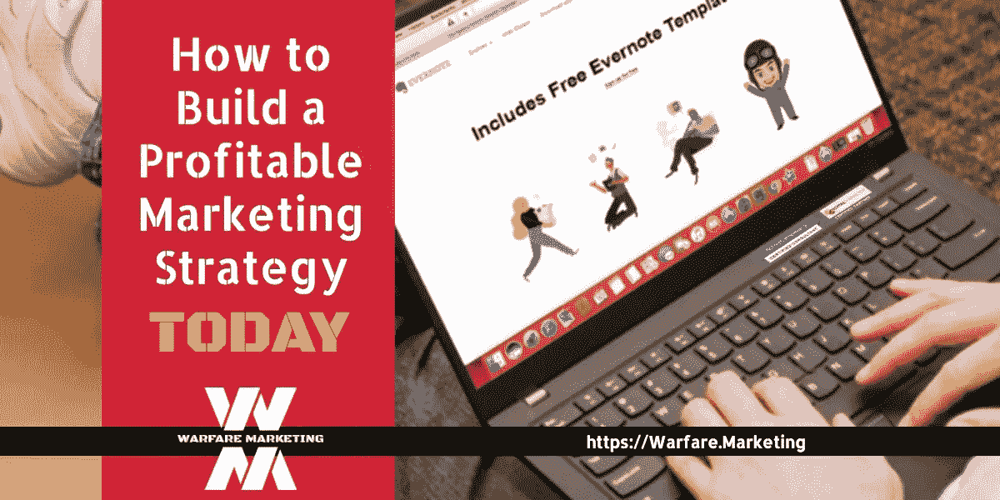

# 如何像瑞安·戴斯一样建立盈利的营销策略

> 原文：<https://medium.com/swlh/how-to-build-a-profitable-marketing-strategy-like-ryan-deiss-57fed3d68708>

## 想让你的生意翻倍？

创办和经营一家企业令人兴奋…

同样令人疲惫、昂贵且耗时。

大多数企业主永远不会建立营销战略…

1.  **这带来了持续的利润，**
2.  **培养客户，**