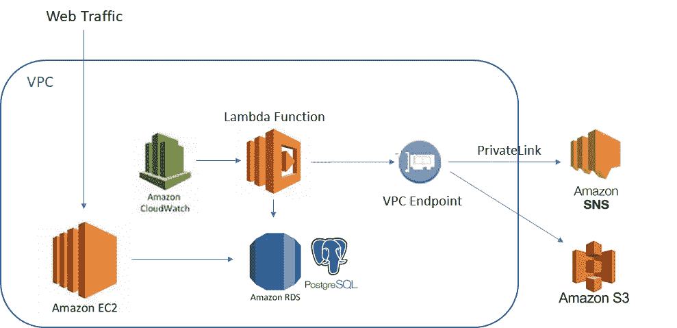

# 如何在 AWS 中从数据集构建简单的业务报告

> 原文：<https://medium.com/swlh/how-to-build-simple-business-reporting-from-your-data-set-in-aws-60194f95328a>

## 连接 VPC 中的资产以生成每周电子邮件报告的分步指南

Lambda function in VPC creating report from database entries

了解客户如何使用你的功能总是好的。在我的副业项目中，了解客户的行为让我可以添加功能来满足他们的需求。在一个小项目中，你可能没有…