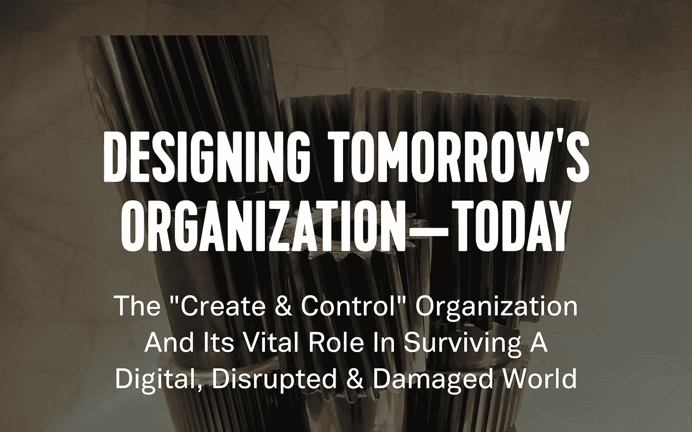
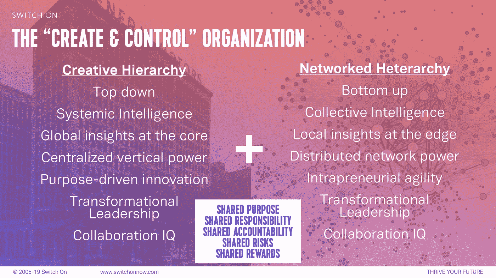
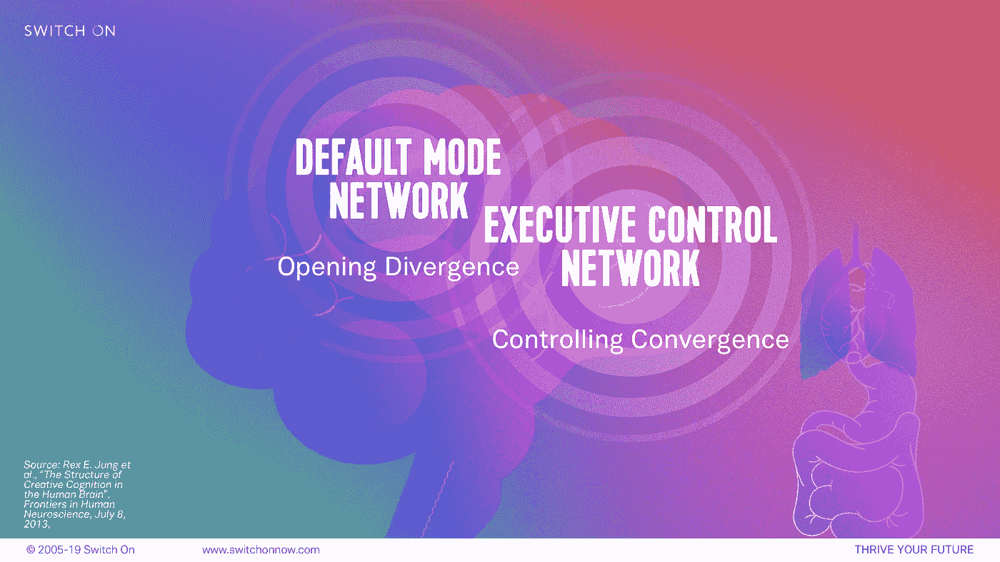
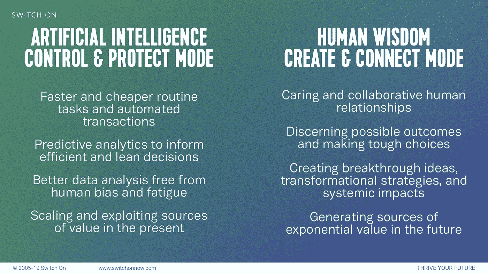

# 如何在今天建立明天的组织

> 原文：<https://medium.com/swlh/how-to-build-the-organization-of-tomorrow-today-c27b148d66ef>

# **一条将您的企业转变为“创造&控制”组织的途径，该组织能够应对数字化的、被破坏的&受损的世界**

M 奥登组织是不可思议的东西。它们让我们能够走到一起，实现前所未有的大胆和雄心勃勃的愿景。它们可以让人类实现令人惊叹的成果，如全国性的福利体系、从摇篮到坟墓的医疗保健，以及个人电脑和应用程序在几乎所有方面的扩展。尽管它们是由个人组成的，但它们凭自己的权利成为(法律)实体。他们有一种独特而持久的文化，这种文化是曾经在他们那里工作过的每个人的感情、恐惧、信仰、假设和习惯的结晶。他们创造了我们的思想(群体思维),正如我们创造了他们的思想一样。它们可以被设计、管理和领导，并承担全部责任；但是尽管我们尽力了，它们永远不可能被完全控制。

在过去的几年里，我的公司与许多世界级的组织合作，尽管他们在产品、商业模式、法律实体和所有权结构方面有所不同，但他们都面临着一个前所未有的挑战:如何设计他们的组织以适应快速变化的世界。从快速消费品巨头到卓越的非营利组织，从全球银行巨头到主要的公共服务提供商，我们参与的每个组织都不得不努力应对内部和外部环境的巨大变化，这些变化使得“现代组织”的形式和功能不再完全符合目的。

> ***在组织中，只有三件事会自然而然地发生:摩擦、困惑和表现不佳。其他一切都需要领导。***
> 
> 彼得·德鲁克

回到大型组织的(嘿)时代，资源(人力、工业、技术、金融资本)在大型层级组织中的集中使得大型项目(从金字塔到苹果 iPhone)以巨大的规模效率得以实现。做生意的成本——人们制造和销售产品的成本——已经降低。交易成本的降低允许对创新进行前所未有的投资。无论我们想到的是东印度公司还是贝尔实验室，这个由等级制度和指挥控制管理支撑的大组织努力积累了难以置信的财富，并将大众消费产品推向不断扩大的全球市场。

当获取生产和分配手段受到巨大成本(土地、机器、劳动力、原材料)的限制时，利用资本(来自投资者或纳税人)的大型组织是唯一能够制造和销售先进创新并从中获利的组织系统。无论是制作和播放电视节目，印刷和发行书籍，发现药物和清洁产品中的化学物质并将其纳入主流，还是建设和普及铁路和摩天大楼，只有那些能够获得大量资本的人才能参与其中，这些资本可以由数百名顺从的工人有效使用。这是现代组织的目的。

导致这种组织形式的工业时代思维假设世界是线性的:一个死的但可预测的算法，而不是一个活的和不可预测的有机体。由通用汽车(General Motors)等公司在 20 世纪 20 年代和 30 年代开创的管理科学是围绕生产线设计的，充满了“效率”、“产出”和“生产率”等机器隐喻。受机器相对容易控制、操作和优化的启发，过去 90 年来，围绕组织设计、组织图、结构、运营模式、融资、审计、会计、改进流程、招聘和解雇、收入和绩效管理的大量思想如雨后春笋般涌现，旨在提高效率、减少浪费和扩大利润。

这本线性的、以机器为中心的工业时代思维的百科全书，现在是从拉各斯到伦敦商学院的 MBA 和管理培训项目中教授的“最佳实践”。这种组织技术试图将社会塑造成生产线整齐的线性形式。电子表格、数据库、P&L 报表、甘特图、客户细分、参与度调查等等，都试图将复杂、混乱、矛盾的人(“人力资本”、“供应链”、“客户细分”)收集到整洁的盒子中，可以对其进行测量和调整，以提高生产率/盈利能力。

这些技巧和技术对交付的规模、效率和卓越性产生了巨大的影响。但正如数百万人所发现的那样，它们也能摧毁创造力、人性和真实性。雷·克洛克如何将麦当劳兄弟在汉堡质量、客户服务和厨房订单方面的自制创新转化为工业时代的庞然大物，这个故事优雅地将这一点带入了生活。我的第一份工作是在伦敦这个庞大帝国的一个前哨做汉堡和油炸食品。在这里，我第一次亲身体验了管理中的绝对等级制度以及现代组织的异化和非人性化。

尽管如此大规模的层级环境从来就不是一个真正适合员工成长的环境，但员工对自主性、目的性、创造性和协作的低期望意味着一个世纪以来，大型层级组织尽管存在明显的弱点，但仍然能够取得成功。他们之所以成功了这么久，是因为社会相对静止，人们普遍被剥夺了权力。你很幸运在一家大公司找到了一份工作:相当安全，相对来说比较有保障，而且薪水也不错。因此，组织已经把他们的线性镜头印到了一个失去权力的工人(和顺从的消费者)的整个时代。

正如我在[的新书](https://www.amazon.com/Spiritual-Atheist-Science-Radical-Philosophy/dp/1999731522/ref=sr_1_2?ie=UTF8&qid=1549050742&sr=8-2&keywords=spiritual+atheist)中详述的那样，在工业时代，人们会周期性地反抗现代组织的机械化趋势。无论是约翰·罗斯金(John Ruskin)的《到最后一刻》(to This Last (这启发了英国工党的诞生和甘地(Gandhi)的作品)还是威廉·威特(William Duncan)[对“组织人”](https://en.wikipedia.org/wiki/The_Organization_Man)(一个西装革履、通常是男性的经理，通过遵守规则获得成功)崛起的抨击，人类有机体都像你一样，拒绝被制成算法。但是几乎没有真正的替代品，所以工业时代的模式继续存在。

但是一切都变了。

工业时代的组织模式不再完全有效。首先，在经济方面，大多数大型组织不再投资于或能够交付真正的转型创新。[研究表明，拥有最大市场力量的组织在研发上花费更少。创新的总数与集中度成反比……随着产业集中度的提高，创新会下降](https://www.google.com/search?q=Zoltan+Acs+and+David+Audretsch+discovered+that+l&rlz=1C5CHFA_enGB772GB773&oq=Zoltan+Acs+and+David+Audretsch+discovered+that+l&aqs=chrome..69i57.498j0j7&sourceid=chrome&ie=UTF-8)[其他研究表明](https://www.oxfordmartin.ox.ac.uk/event/474)随着一个组织变得越来越老越来越大，它变得越来越缺乏创新。创新资金落后于官僚机构的支出，因为组织雇佣更多的人来管理其他人。当 Geoffrey West 检查数据，并根据通货膨胀和市场增长进行调整后，在他的著作《T4 规模》中写道:“所有成熟的大公司都停止了增长”

这意味着，在大多数组织被更有创造力和更敏捷的竞争对手所破坏的时候，大型层级、直线型组织不再在创新上竞争。这是非常不适应的。正如 Zappos(世界上最大的鞋类零售商，被亚马逊收购)的首席执行官所说:“研究表明，城市规模每扩大一倍，人均创新或生产力就会增加 15%。但当公司变得更大时，每名员工的创新或生产率通常会下降。”随着熵和阻力等相反的力量变得越来越强烈，层级组织达到了增长受限的临界点。

面对不断下降的竞争力和生产率，以及创新效率的缺乏，大型组织被迫进行昂贵而高风险的收购，其中很少一部分能为买方或卖方带来回报(更不用说用户了，他们被剥夺了解决痛点的真正新方法)。为了保护他们的利益，他们不去创新，而是游说那些允许他们成为虚拟垄断者的规则，就像联合航空业(United we stand)和在线搜索业务(Google 不作恶)一样。这导致了[更低的实际工资(仅英国工人自 2008 年以来就下降了 30)](https://www.theguardian.com/business/2018/dec/14/average-uk-worker-earn-third-less-than-2008-tuc-real-wage-report?CMP=Share_iOSApp_Other)、更大的不平等和更差的客户体验。选民感受到降低标准和降低尊严的痛苦，感受到制度的腐败——并投票给民粹主义者和煽动家。最近，四分之一的欧洲人投票支持极右翼政党。

正如英国《金融时报》总结的那样:

> “最终规模经济达到极限，需要系统设计中的**基本范式转变**来保持增长。没有这样的转变，越来越多的能源必须用于维护和修理…最终导致系统衰退并开始死亡。”

组织必须进行范式转换和彻底的重新设计，以完全适应他们必须与之共同发展的环境。为了理解这一挑战，理解必要多样性的控制论/进化论[法则](https://www.edge.org/response-detail/27150)，也被称为阿什比法则，会有所帮助。它指出，一个有机体/组织内部必须具有与其存在的外部环境相同的多样性水平。一个组织只有拥有一套像它必须解决的问题一样多样和有创造性的应对措施，才能应对其生态系统中出现的一系列挑战。

在静态的、通常是中央集权的市场中，一个组织不需要太多的多样性——比如多样性、包容性、授权、创造力、目标、共同创造力等等。—在里面才能成功。事实上，工业时代进入了每一个家庭，因为它大大减少了生产线上的品种，以至于每一盒麦片或瓷盘都是一样的。尺寸和组件的标准化对于将曾经极其昂贵的产品和服务扩展到数十亿人至关重要。生产线消除了“差异”;这是不同思维和创造力的另一种说法。换句话说，当前的组织模型是主动设计的，以防止今天必需的敏捷性和适应性。

但是在数字时代，在某种程度上，每个组织都发现自己身处其中的生态系统，这个世界比二十年前更加多样化和复杂。在快速变化和流动的 VUCA 世界(不稳定、不确定、复杂、模糊)，思想、数据、金钱，有时还有人，以令人目眩的速度在网络中流动。不断涌现的需求、能力和技术所带来的复杂性要求许多人同心协力，快速开发集体智慧，并以快节奏的协作行动来执行。今天，非线性的、快速变化的系统连接太复杂了，线性的、层次化的组织系统无法单独应对。这就是为什么我们的许多组织和系统——私人的、公共的和政治的——不再有足够的创造力、灵活性和网络化来生存，更不用说繁荣了。

> 你所做的一切都是为了更好地适应未来，或者与未来渐行渐远，但这从来都不是一成不变的。

在网络生态中，权力被无情地从工业时代的领地和筒仓中推开。权力被向心力抛向边缘:编码员、区块链先锋、前沿潮人、边缘选民和颠覆性创新者。随着制造产品或销售软件服务的成本下降，技术和技巧变得商品化，几乎任何人都可以发起颠覆性创新，推翻工业时代的巨人。

这迫使跨国公司以很低的成本收购他们本可以创造的商业模式创新。一个例子是[联合利华以 10 亿美元](https://www.ft.com/content/bd07237e-4e45-11e6-8172-e39ecd3b86fc)收购 Dollar Shave Club(也就是 10 亿！)，这是一家由一个小团队在 2012 年创立的初创公司，没有联合利华的资本资源，但有大量的愿景、激情和灵活性。联合利华本可以更容易地产生这种创新——以及数百个类似的创新——因为他们可以获得投资、研发实验室、市场营销、广告等等……但恰恰因为层级组织而没有这样做。

正如启发我第一次创业的 [Cluetrain 宣言](http://www.cluetrain.com/)中所写的，数字时代意味着“市场(消费者)变得越来越聪明……比大多数公司都要快”。今天失望而聪明的客户很容易成为明天的指数型企业家。优步的创始人特拉维斯·卡兰尼克是一个没有汽车行业经验的平民，一天晚上，他试图在巴黎拦一辆出租车。这是非常困难的，然而每一秒钟都有或多或少空着的汽车经过。他意识到，他可以通过转型创新来解决全球市场的失败。优步现在比通用、福特或宝马更值钱。

这个世界一直是一个庞大、复杂、适应性强的人类互动系统，有着各种奇怪而奇妙的相互联系和反馈回路。但是这个现实是可以避免的。现在，我们都是复杂的非线性系统的一部分，这一现实变得越来越重要，尤其是在企业全球化的时代，没有一个人，包括首席执行官或总裁，能够了解供应商、技术专家、数据中心、分销商、零售商和客户组成的复杂网络的一部分。系统中的每一个人都变得越来越清醒，越来越有能力，越来越有意识:供应商、消费者、投资者和工人。人们不再完全满足于大半辈子都生活在小隔间里，每天花 10 个小时去实现可疑的目标，为极少数人谋取利益。不满情绪普遍存在。

坚持工业时代的组织原则和管理规则的组织正在努力吸引、激励、发展和留住最具创造力、高素质、变革型的人才。如果不能认识到最有创造力的人把意义、精通和成员资格看得比金钱、权力和晋升更重要，他们就无法留住真正的人才。因此，他们错过了保持精益、适应性和有效性所需的想法、策略和创新(过程和产品一样)。这就是为什么许多主要组织在走向失败的道路上逐渐失去相关性。随着他们与外界失去适应，这意味着他们赖以生存的生态系统，他们变得越来越有挑战性。正如阿什比定律预测的那样，这表现在一系列即将失败的迹象和症状中:

> 专注于提升会计利润，而非转型创新。对商品化产品和服务的依赖。为边际收益付出巨大努力。**敏捷新贵颠覆了过时的商业模式。**以控制为中心的过程增加，导致摩擦和挫折。**需要通过昂贵的收购来扩大市场份额。**缺乏真正的认知和种族多样性和平等。用游说而不是适应来捍卫市场。未得到服务的客户需求导致客户不断流失，且对投诉不予回应。**缺乏服务社会的共同而真实的目的。习得性无助和持续的压倒性削弱了有效性和敏捷性。**晚辈的想法和见解被忽视导致权利被剥夺。**将真正有创造力的思想家边缘化为“特立独行者”。**管理者多，领导者少****

与 T2 有些不同，我不认为这意味着等级制度已经完全消亡(至少现在还没有)。这也不意味着我们将抛弃我们非常有用和必要的管理技能和工具。我们既想包容他们，也想超越他们。但这也并不意味着我们想要接受我所谓的“一致死亡”:平庸的暴政经常出现在那些寻求扁平化等级制度以实现某种形式的神话般的平等的社区中。但这确实意味着我们需要变得更加聪明*和*更加明智地去设计、管理、领导和引导我们所属的层级组织。每个组织需要做的是明智而有力地协调中央/地方和自上而下/自下而上之间的对立极性，以便设计出既能利用两者的优点又能降低任何一个极端的风险的活的组织系统。

一方面，这意味着摆脱“统治等级”,这种等级会产生有毒的领导形式和自上而下的暴政。支配性层级几乎完全由严格层级结构中的指挥和控制经理管理(即使已经做出努力用豆包、参与度调查和免费咖啡机来软化它们)。它们通常包含许多受伤的自我，在权力平衡中胡作非为，不加批判地喝自己的苦艾酒，同时不顾人力成本，全力以赴追求效率、速度、准确性和(通常是个人的)成功。研究表明，它们对重要的人类因素如动力和合作有长期的负面影响。

然而，我们确实想拥抱“创造性层级”的优势和价值。创造性的等级制度允许那些拥有超常技能的人，通常是从对卓越的深刻承诺中来之不易的，做好某些复杂的、系统的或创新的事情[，而不会犯下意味着他们作为人类更有价值的分类错误](http://metamoderna.org/in-defense-of-hierarchies-among-humans?lang=en)。例如，根据 [Philip Tetlock 的研究](https://hbr.org/2016/05/superforecasting-how-to-upgrade-your-companys-judgment)，受过认知偏见训练、形成信任、然后被选择具有预见能力的战略家，其预测未来事件的可能性大约是未经训练的主流预测者的两倍。那么，我们当然希望这样的人处于企业的核心，在全球、系统的层面上塑造战略？

以我的经验来看，那些处于*创意*层级顶端的人应该能够以*更系统*和更有意识的方式思考，而不仅仅是更聪明或更成功(在玩组织人的游戏时)。这意味着实现高级认知复杂性(参见儿童心理学家让·皮亚杰的继承人的模型，如科尔伯格的道德发展阶段模型，以及康芒斯和理查兹的层次复杂性模型)。但也包括我们可能称之为“情感-内感受复杂性”的东西:通过变得越来越脚踏实地、控制我们的情感和目标驱动，能够处理 VUCA 世界固有的恐惧、混乱和困惑。更简单地说，我们需要一个敏锐的头脑(简化复杂性以做出明智的决定)和一颗治愈的心(道德完整性以做出明智的选择)。

理想情况下，自上而下的领导者需要更聪明，而不仅仅是比他们的员工更聪明。事实上，他们可能根本不需要比他们的下属更聪明，而是能够以创造性、创新性和变革性的方式利用技术天才来交付新形式的价值。他们应该能够从事 VUCA 空间和地方的高度道德和地面；因此，从混沌之口中捕捉秩序。他们需要能够根据业务目的以及利润/生产率做出反思性的有效决策。他们应该已经达到了一个发展阶段，可以让他们变得聪明，脆弱，强大，既不占用太少也不占用太多的空间。这类似于哈佛心理学家 Robert Kegan 和 Lisa Lahey 所说的“[自我改造](https://www.fastcompany.com/3068725/this-is-the-mind-set-youll-need-to-thrive-in-the-future-of-work)思维——期望拥有高度的情感、人际和存在智能。

然而，当我们进入一个越来越“根状茎”网络的世界时，我们必须用更扁平、更分散的层级来平衡创造性。想想金字塔上的圆圈。一些人称这种与同伴的人际合作为“T4”式的层级结构。当我们培养具有高度个人掌控和正直的人际网络时，变革性的共同创造力就会出现，这种创造力可以产生比任何一个人单独拥有的想法更复杂和更合适的想法。在正式和非正式的网络中平等地工作，人们可以聚集在一起解决他们的问题，对系统中属于他们的部分有深刻的见解，而不需要(许多)经理检查优秀和责任。我们今天需要解决的重要问题——从气候变化和人口增长到焦虑和抑郁——完全有可能太复杂，只有人类心灵和思想的网络才能破解。布赖恩·伊诺称聪明网络中的天才共同创造力为“场景”。

也许比创造性的等级制度更重要的是，网络化的共同创造需要真正有意识和有能力的人，他们具有我称之为合作智商的很高水平。为了在没有自上而下管理的情况下让共同创造的协作发挥作用，大多数人需要能够做他们说他们会做的事情，倾听并尊重彼此，理解质量是什么样的，并对行动有偏见。如果人们没有表现出足够的正直、个人责任感和自制力(对他们的触发因素、情绪、动机和习惯)，平淡会很快导致自下而上蔓延的平庸暴政。

当人们渴望平坦度时，通常是因为对统治阶层的不信任/愤怒，他们通常会发展出“友好”、避免垂直权力和对完全一致的痴迷的模式。这削弱了真正的共同创造。当每个人都想让自己的观点始终被包含在决策空间中，并在每个决策空间中拥有平等的权力时，结果往往很糟糕。在这种强制扁平化的组织结构中发生的事情……非常少。共同创造的能量和意图消失了，有太多的争论和太多的相互竞争的想法，很少有远见和系统的思考，冲突没有创造性和建设性，项目由于无效和低效的工作方式和软弱的领导而死亡。

什么时候能把创造性的等级和连接性的网络结合在一起，按照古希腊前苏格拉底哲学家赫拉克利特的说法，我称之为“帕林顿式的和谐”。他用*这个词来表示“被画向不同方向的事物与自身和谐一致”这样的组织协调了创造和控制这两个看似对立的事物。在 Create & Control 组织中，我们允许那些处于中心和“顶层”的人为组织进行系统的、战略性的思考。这些系统性的思考者通常拥有多年的经验和智力倾向，他们的工作是获得长期成功，并为持续的转型变革和创新做好准备。我们*希望*他们参与[深层次的破坏性驱动因素:新的指数级数字技术、受损星球的生存风险](/swlh/the-future-of-business-how-enterprises-can-thrive-in-a-digital-disrupted-despairing-world-7084d32aec68)，以及威胁我们所有人的人类社会变革。他们可以提供鸟瞰、自上而下的见解和情报。*

与此同时，我们还希望那些处于边缘的人——在采煤工作面的人——能够敏锐地发现客户的信息，并根据这些信息采取行动。他们需要对只有他们才能接触到的现实情况做出实时反应。我们付钱让他们站着思考，以真诚的方式与他们服务的人联系，并从边缘到核心自由地反馈新的见解，以便可以对“微弱的信号”采取行动。当然，创造和控制之间的确切结合，以及为两者赋权和赋能而出现的过程，对于每个企业、其商业模式和其文化来说都是独特的。

在中，Create &控制组织——将最佳的线性与非线性、经理与员工、创造力与控制——以及“资本”与“劳动力”相互配合，共同解决对最终用户真正重要的问题。他们尊重以低交易成本高效完成工作的需求，不需要太多的争论或创造力。他们还认为有必要定期向所有人开放对话和决策，以便他们能够实时调整战略和战术；根据新的客户洞察进行创新；共同寻找方法，为所有利益相关者实现目标。在这个模型中，名义上处于顶层或底层的人都没有被体验到像人类一样的价值。两者都不是对方的附庸。事实上，正如分权管理先驱[汤姆·托米森](https://encode.org/)所说:“*的目的*就是老板”。系统中的每个人都服务于这个目的，而不是英雄般的领导者或投资者董事会。所有人都被视为组织系统的重要组成部分，具有与人类同等的固有价值。利润(或业绩或生产率)和目标也保持着帕林顿式的和谐。

我相信，在我们这个时代，组织创新、敏捷性和适应性的绝对必要性——由[颠覆性数字技术和存在性全球风险](/swlh/the-future-of-business-how-enterprises-can-thrive-in-a-digital-disrupted-despairing-world-7084d32aec68)驱动和促成——提供了一个在没有暴力、煽动或压迫的情况下重新校准全球社会阶层之间平衡的具体机会。如果组织和国家的战略和政策是以一种“中间向外”的方式制定的，通过集体意识和决策，但具有创造性的等级制度以实现问责，我们就可以修复腐蚀的社会契约和失败的福利国家。通过汇集自下而上的采煤工作面洞察力和自上而下的系统洞察力，我们可以实现真正的社会公正。爱尔兰[公民大会](https://www.theguardian.com/politics/2019/jan/09/what-is-a-citizens-assembly-brexit-explainer)的成功(关于新的堕胎立法)指明了方向。公民大会包含一个 c.100 同行(不是同行)的代表性样本，就具有挑战性的主题进行合作性的对话。但是它们由共同创造的*专家*促成，由代议制民主的等级制度实施和“拥有”。

与此同时,[挑战](https://nslsfacts.org/2017/09/26/lost-utopia-why-did-holacracy-fail/)像[全息](https://qz.com/work/1397516/is-holacracy-the-future-of-work-or-a-management-cult/)的自组织管理系统这样的完全扁平化模型表明，虽然自组织和分布式权力是有价值的，但那些接近组织“底层”的人也享受管理者制定的[明确的期望](http://www.gallup.com/businessjournal/26281/First-Element-Great-Managing.aspx)、角色、界限和责任。也就是说，控制力和创造力之间的平衡是理想的(至少在我们进化的这个时刻)。麻省理工学院的一位教授提供的证据[与我自己在跨国公司和大型国家公共实体中为成千上万名员工赋权的经历相吻合，即人们想要一个创新的&控制组织:来自传统管理实践的清晰和秩序与分布式网络的开放、透明和大规模赋权的融合。](https://www.strategy-business.com/article/Can-Conversation-Supplant-Bureaucracy?gko=613b1)

此时此刻，许多员工(和他们的经理)没有实现真正网络化、分散化组织的必要意识水平。全息摄影的创始人布莱恩·罗伯逊说过:“没有比这更深层次的变革了……要实现这一点需要高度的成熟。”仅仅因为你希望整个组织的人被赋予更多的权力，并不意味着他们有能力或意愿站出来。有些人只是不想增加真正决策权的责任(和权利)。其他人想把宝贵的自由支配的精力花在生活的其他方面。一些人已经被设计不良的系统和管理实践拖累了太久，这些系统和管理实践产生了太多的摩擦，以至于让人筋疲力尽([估计掠夺了组织 25%的“产出”](https://hbr.org/ideacast/2017/03/globalization-myth-and-reality-2.html)不适应的支出是生产力损失的最大窃贼)。

缺乏对分布式管理和同伴驱动型领导的兴趣和能力可能表明，员工在被告知做什么、如何做以及何时做之后，已经形成了[“习得性无助”，就像笼子里的动物一样。](https://www.ncbi.nlm.nih.gov/pubmed/1150935)这种对管理的相互依赖往往会变成一出受害者/迫害者的戏剧，让它看起来“正常”，可能需要数年时间才能转变。它还可能暴露出组织中缺乏明确和令人信服的目标，因此人们根本没有动力去前进，对组织的工作没有什么意义和成就感。在这种情况下，需要投入大量的精力和精力来释放组织的全部潜力。

忽视变革的步伐，坚持低效的简单指挥和控制组织可能很有诱惑力。但这是板上钉钉的事。不管我们喜欢与否，随着外部世界变得越来越网络化，组织需要不断努力建立一个由成熟、有意识的人组成的内部网络，以保持适应性并提供所需的变化。在这个旅程中，重要的是要认识到，如果人们对真诚地分享他们的想法感到不安全，并且犯了错误而没有报复，他们将会陷入更加抗拒和无能为力的行为中。这就是为什么所有的组织变革都必须与在整个组织中植入和体现[【心理安全】](https://hbr.org/2017/08/high-performing-teams-need-psychological-safety-heres-how-to-create-it)的巨大努力相平衡。

当一个组织做对了，创新就会开花结果。自上而下和自下而上的权力之间的创造性张力似乎解释了古代雅典公民和文化创新的巨大繁荣，这种繁荣如此影响了我们的现代世界。正如斯坦福大学历史学家 Josiah Ober 在他的著作《古典希腊的兴衰》**，*中指出的那样，在中央集权制度下，统治者“决定谁在商品生产中做什么，谁在分配中得到什么……财富和权力集中在中央，由中央分配。”相比之下，“希腊奇迹”在一定程度上是分散化、网络化合作以及分布式创新和投资的结果。Ober 认为雅典最大的成就是通过标准化、统治、命令和控制把人们团结在一个有凝聚力的整体(即一个组织)中，而没有消除他们之间的差异。*

*“创建和控制”组织对战略、计划和决策制定有一种中间向外的方法:同时包括自上而下和自下而上。它在两根纱线*上编织出一张公司织物图，这两根纱线对于 *one* 组织的形式和功能都是必不可少的。风险由上层和下层分担，这意味着回报也必须如此。这种逻辑的必然结果是，它将变得越来越分散([这是分散化组织的一个巨大资源列表](https://hackmd.io/s/Skh_dXNbE))，所有权、权力和薪酬将向边缘靠拢，就像在数字网络中一样。**

*然而，这种财富和权力的分享必须发生在我们不失去特别有创造力、远见、智慧和企业家的“高峰”的好处的情况下。这种 palintonic 式的组织方式旨在融合*一种创造性的(非支配者的)层级结构*和*一种分布式的、扁平的(有点像)、充分授权的人员网络，在服务、制造和通信的接触点进行交付。它只能由组织中每个级别的真正变革型领导来指导。**

**

*引人注目的学术研究已经开始创造一个坚实的证据体，支持一个创造和控制组织的现实世界的有效性。在《纽约书评》最近的一篇文章中，美国公民自由联盟的法律主任大卫·科尔评论了两本新书，这两本书的作者研究了在我们这个数字化、混乱和被破坏的世界中出现的各种社会变革运动。他指出，从反对酒后驾车的母亲和全国步枪协会等各种各样的活动家那里，有一些明确的教训:*

> *“如果运动鼓励发展本地化的附属团体(边缘的敏捷力量)，这些团体是国家战略(核心的系统力量)的一部分，但在各自的地区行使相当大的独立性和主动性……这需要指导和独立性的结合，因为自上而下的国家结构有可能抑制地方一级的积极性，而协调是在国家一级取得成果的必要条件。”*

*他接着说，阿拉伯之春和占领华尔街运动未能实现可持续转型的关键原因是，它们遭遇了太多的网络化创造力，而没有足够的系统性控制。两者都需要在创造性的紧张中保持平衡，以获得最佳效果。*

*T 他既/又在思考创建&控制组织映射到最新的脑科学和最新的心理学上。这加强了它与环境的适应性，因为自然趋向于分形。就像炼金术士艾萨克·牛顿在 1920 年说的那样:上面是这样，下面也是这样。首先，我们看看脑科学。正如我在工作中经常分享的那样，有两种关键模式——与特定的大脑网络相关——驱动着领导力和组织行为。在控制&保护模式中，与执行控制网络相联系，我们是目标导向的、聚合的、专注的、传统的聪明的、乐于独立工作的，并且被最佳实践所引导。这是与传统的命令和控制事务管理相关的模式，所有组织都使用这种模式来提高效率。然而，这种模式很难适应快速变化的环境，在协作方面也不太成功。*

**

*我们有另一种模式，创造和连接模式，与默认模式网络相关联，在这种模式中，我们富有想象力、发散性、开放性、智慧性、协作性，并且能够发明下一种实践。[最新的神经科学功能磁共振成像研究](https://www.scientificamerican.com/article/why-are-some-people-more-creative-than-others/)表明，这些网络*

> *“通常不会同时被激活。例如，当执行网络被激活时，默认网络通常被停用。我们的结果表明，有创造力的人能够更好地*共同激活*【我的斜体】通常独立工作的大脑网络。”*

*换句话说，想象和执行高价值新想法的复杂过程——我们称之为转型创新——“涉及自发思维和受控思维之间的复杂相互作用——既有自发集思广益的能力，也有故意评估它们以确定它们是否实际可行的能力。”换句话说，创造和控制组织可以反映我们的大脑网络在帕林顿式和谐中一起工作的方式，以进行发散和收敛思维。*

*自上而下和自下而上的“中间向外”的运作模式也可以在新的认知理论中窥见一斑，比如由[加州大学洛杉矶分校精神病学家和理论家丹·西格尔](https://aeon.co/essays/how-the-old-and-the-new-make-the-mind-ebb-and-flow)提出的理论。这些表明，我们通过自上而下(“大脑皮层中较高的”认知功能)和自下而上(“来自身体、内脏和感官的较低的”内部感受信息)的认知交响乐进行思考。西格尔说*

> *“感知的经典观点是，大脑以自下而上或‘自外而内’的方向处理感觉信息:感觉信号通过受体(例如视网膜)进入，然后深入大脑，每个阶段都招募越来越复杂和抽象的处理……亥姆霍兹观点颠倒了这一框架……感知内容由相反(自上而下)方向流动的感知预测携带，从大脑深处向外流向感觉表面。”*

*我的感觉是,/和都是有效和重要的。这当然对[人工智能的真正潜力](https://hackernoon.com/leaders-vs-ai-there-aint-no-such-thing-as-artificial-wisdom-8556e45dfc89)有着重要的意义。*

**

*控制和创造之间，保护和连接之间的紧张关系对整个社会来说似乎是真实的。心理学教授米歇尔·盖尔范德的研究研究了 33 种民族文化，发现它们的“紧密”或“松散”程度决定了社会的自制力、创造力和变革能力。在接受《T2 自然》采访时，她说紧密的文化“有更多的 T4 秩序”。它们更协调，更统一，人们表现出更强的自制力。相对来说，松散的文化更没有组织性，自制力也更差。但是松散的文化更加开放——他们对新思想(更有创造力),对新人(他们不那么种族中心主义)更加开放，他们对变化更加开放……最好在两个方向都不要走得太远。这不仅适用于国家，也适用于组织。*

*因此，事实证明，哲学家托马斯·霍布斯和让-雅克·卢梭都是正确的:我们需要强大的等级制度来防范我们的黑暗阴影，并做出保护和控制的决定；但是我们也需要让所有的公民平等地参与进来，在文化条件安全且负担得起的情况下，用开放的心灵和开放的思想去创造和联系。回到生物学:任何没有细胞膜的生物都会死亡。它需要是一个连贯的整体，能够控制物质的流入和排泄，并保护自己免受威胁。但是如果这层膜不是半透性的——让新鲜的资源(也就是美国领导人的想法和见解)进入——细胞也会死亡。有趣的是，如果这样的细胞膜不能连接到其他膜，我们仍然是单细胞变形虫，无法形成更复杂的组织结构。*

*将你的组织转变成一个稳定和灵活、责任和权利、严格的秩序和创造性的无序、高效和有效、生产力和目的和谐共存的组织不可能也不应该在一夜之间发生。持续一年或两年的单一线性变化计划可以交付结果的日子已经一去不复返了(值得一提的是，根据研究，只有 30%的此类计划曾经有效，[)。这种转变一定是持续的，因为世界是持续变化的。](https://www.mckinsey.com/business-functions/organization/our-insights/the-irrational-side-of-change-management)*

*就像技术公司在“持续测试”中推出他们的产品一样，我们都必须在不断制造、调整和适应的过程中驾驶飞机。包括流程和 IT 系统在内的一切照常的业务必须能够持续适应，而不会陷入太多的混乱(这会危及和耗尽每个人)。我们需要能够不断地从一个不再适合的秩序进入“混乱边缘”的无序状态，并回到一个更适合、更高层次的秩序，从而带来更多员工、企业和生态系统的繁荣。*

> *没人说在[这个数字、混乱和破坏的时代生存和发展会很容易](/swlh/the-future-of-business-how-enterprises-can-thrive-in-a-digital-disrupted-despairing-world-7084d32aec68)！*

*有*没有*银弹去如何建立明天的组织。但是，有一个在任何地方、任何时候都有效的转化途径和过程。我们称之为转换曲线(见下图)。它对于个人变革和组织及系统变革同样重要。我花了很多时间来教导、授权和帮助人们沿着这个原型的转变蓝图来领导自己和他人。*

*我的公司的部分目的是帮助组织抵制将他们的适应性问题外包给管理顾问的诱惑。)而是允许跨职能和多代团队转变他们自己的组织——从内部运营和 IT 系统到以用户为中心的产品和服务——以推动时代最重要的成果。*

**

*首先，组织中的每一个人都必须知道(并感觉到)如何承担责任，与他们信任的团队一起承担他们职责范围内不适应的事情——并拥有解决他们自己的问题所必需的创新技能、思维方式和工具，无论这些问题是否已经解决(费用！)流程或未满足的用户需求，以敏捷、自适应和精益的方式执行转型解决方案。我们的混合[领导力和创新项目](https://switchonnow.com/leadership/leadership-development-programs/)完全平衡了变革型领导者的发展与流程和实践，使他们能够领导和实现打造未来的变革型创新。这将领导力发展从课堂和场外的事情转变为一种工作方式，这种工作方式对有形的问题产生创新驱动的影响，并加速持续的在职学习。*

*这消除了外部顾问将在纽约或伦敦看似聪明的创新和增长战略——他们永远不必完全拥有或执行——强加给他们可能不合适、可能不起作用或患有“不是在这里发明”综合症的组织的悲喜剧。我曾经就是这样一个人，并设计了我的新事业来超越这一现实。也许没有人会因为引入麦肯锡/BGC/贝恩而被解雇，但这并不意味着利用工业时代的咨询将数字时代的挑战转化为具体的价值。在某种程度上，解决方案必须从内部产生。科技公司 Blinkist 发现了这一点，当他们将全息管理引入该组织时，却发现当他们在他们所谓的 [Blinkist 操作系统](/key-lessons-from-books/the-whole-story-of-holacracy-65ec6bc855c3)中开发出自己的混合权力下放过程和原则以及他们自己的价值观和文化时，结果更好。*

*工业时代的管理顾问和流程工程师永远不会像内部人员那样了解客户企业的文化和工作方式。他们也跟不上变化的步伐和速度——即使他们可以带着激情和目标拥有并实现他们的想法。很少有人拥有必要的变革型领导技能来应对混乱和巨大的复杂性，平衡傲慢和谦逊以领导和实现真正的变革。这并不意味着组织不应该在适当的时候引入内部和外部专家。但他们必须始终拥有自己的转型问题和适应性解决方案。我们再次回到了内部本地所有权和外部系统性专业知识之间的创造性紧张状态。*

*第二，我们设计我们的产品，以便每个级别的每一个人都有机会开启并成为下一级自我改造的人，每个组织都需要改变并将其转化为具体的价值。这意味着让年轻和新兴人才成为变革型领导者，而不仅仅是那些高管。显然，如果组织中的人类发展本身仍然局限于工业时代的师生模式，这就不可能实现。这就是为什么我们花了十多年的时间[开发颠覆性的(现在是数字化的)工具和技术，将昂贵的精英领导思维和技术大众化](https://switchonnow.com/leadership/the-leadership-system/)，以便那些处于顶层和底层的人可以成为最有目的、最有意识和最有创造力的自己。我们需要释放他们的潜力，以便他们有大量的应对措施，确保他们的组织拥有生存和发展所需的必要多样性。这就使得权力更加分散，因此大幅度减少了官僚主义，*

*显然，这种进行转型和组织演变的方式要求那些“拥有”组织发展、人员、结构、运营、商业模式、战略和创新的人聚集在最高层，分享他们的预算和才华，并交付他们系统愿景的全部重量，以有目的地同时推动文化变革、领导力、战略和创新。这要求高管们认识到一些他们在 MBA 课程中没有教授的东西(至少不是我讲授过的许多东西):无论是谁塑造了一个组织的*人*和文化，使之成为变革型组织，谁就拥有了未来成功王国的钥匙。你可以在这里看到关于这个[的视频和文章。](/@nickjankel/the-secret-of-21st-century-business-success-which-they-dont-teach-on-mbas-196a9cf65575)*

*为了实现这一点，在某个时候，现有层级中的一两个变革型领导者必须开启并加快步伐，改变变革的方式。他们必须放弃寻找安全、线性和增量的工业时代解决方案来解决复杂、快速发展、网络驱动的“转型问题”——并准备好引导和培育非线性转型解决方案，以适应数字时代的交付内容和交付方式。要做到这一点，首先必须打破高层的孤岛，摆脱对外部管理顾问解决问题的依赖——很容易雇佣，也很容易指责——并在内部拥有问题和解决方案。*

*虽然我很少见到高层领导能够获得这种变革性的工作方式，或者有信心和空间去实现它，但我遇到了足够多的人，让我充满希望。我相信，越来越多的高管层领导人将意识到，管理变革、进行组织重组和培养人才的旧方式正在失败。在我的转型理论中，衰退和失败的痛苦最终不可避免地会更多地寻求这种真正的转型，以确保他们的组织能够不断适应一个越来越数字化、越来越混乱、越来越受损的世界。*

*另一种选择是等待触底，当(敌意)收购出价到来或破产程序已经提交。但是到那时，可能没有足够的关心、信任、精力或时间来制定和实施复杂的转化途径。问问柯达、百视达和诺基亚就知道了。*

*简单来说，正如传奇 CEO 杰克·韦尔奇所说:*

> *在你不得不改变之前改变。*

**

## *这篇文章发表在[《创业](https://medium.com/swlh)》上，这是 Medium 最大的创业刊物，有+421，678 人关注。*

## *订阅接收[我们的头条新闻](https://growthsupply.com/the-startup-newsletter/)。*

**