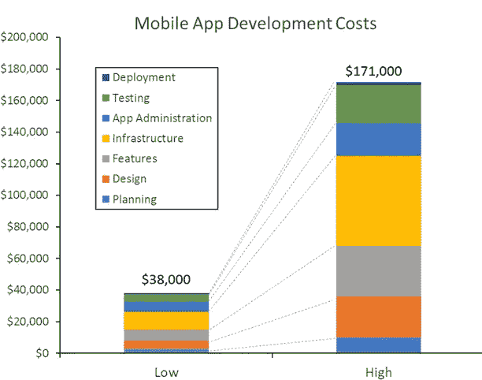
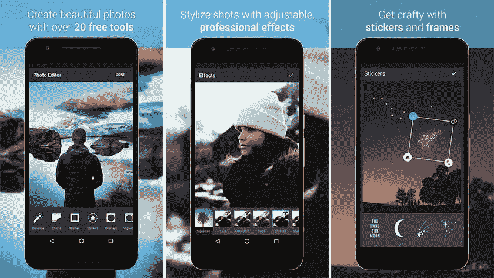

# 如何计算一个社交网络 App 开发预算？

> 原文：<https://medium.com/swlh/how-to-calculate-a-social-network-app-development-budget-4d64d7373469>

计算社交媒体项目预算的问题是项目开发的核心。毕竟，你需要知道该分配多少资金。事实上，你需要考虑创建社交媒体应用所需的大致价格，比如 Instagram。

参考 Clutch 的图表是有用的，该图表调查了 12 家即将上市的领先移动应用开发公司的代表，以计算制造一部 iPhone 的成本，更重要的是，与成本相关的关键变量。

正如我们在这里看到的，大部分社交媒体开发成本与开发应用基础设施、功能、界面和设计、测试以及应用开发的高端和低端成本(38，000 美元至 171，000 美元)相关。

开发社交媒体应用通常意味着由后端、数据库和移动客户端组成的三层架构，这些都是开发移动应用时需要考虑的重要因素。你还必须考虑你的应用程序的各种目的(例如，你是否试图吸引新客户，娱乐现有客户，数据收集，货币化，提高品牌知名度)。

这些特性决定了社交媒体开发的成本，因为它们揭示了你以后要开发的特定功能服务，当然，还有你要雇佣的专家团队。在我们将成本和时间分解到预算计算中之前，认真考虑采用 5W 方法(谁、什么、哪里、什么时候和为什么)来确定你的应用程序到底想要完成什么。

你的用户真正想要的是什么？了解你的用户将有助于你确定他们需要什么，因此你可以更好地确定在这些需求和功能的背景下开发一个准确的社交网络应用程序的成本。

# 特性和功能的成本

为了计算一个准确的估计，你需要清楚你的社交媒体应用的两个特性:你的**特性**和你的应用**功能**。

从一开始就要考虑到，这些功能通常价格较高:

*   第三方 API 集成。
*   计费集成。
*   数据库加密。
*   具有强大分析和众多功能的高级管理面板。
*   用户之间的自定义交互机制(社交网络的确切情况)。

您的主要社交媒体应用通常包含以下功能:

# 账户授权(通过电子邮件、脸书或电话号码进行)

设置授权是移动社交媒体应用程序开发的重要组成部分。您可以通过两种不同的方法之一来授权您的用户:通过注册新帐户(包括登录名、密码、电子邮件和电话号码)或通过现有的社交媒体帐户登录。

后端和移动 iOS 开发设置授权可能需要 160 个小时，通过电子邮件进行注册/授权需要 40 个小时，开发登录/注销功能需要 40 个小时，设置社交媒体登录和登录需要 40 个小时，通过电话号码进行授权大约需要 30 个小时。

# 创建/编辑配置文件

您的社交媒体应用程序应该允许用户通过更改个人数据来修改他们的个人资料，包括他们的联系方式、姓名、性别、电话号码、网站等信息。这将花费你大约 80 个小时，大约 60 个小时用于 iOS 移动开发，20 个小时用于后端开发。

# 消息交换

你的用户应该能够通过你的应用进行实时交流。这将花费你 1200 小时:700 小时用于 iOS 移动开发，500 小时用于后端开发。

# 调整设置

你的应用程序应该拥有各种可调整的功能，使你的社交媒体应用程序更方便使用。这包括设置适当的界面语言、启用或禁用推送通知的能力、将用户帐户设置为私有等。开发和设置这些可调功能所需的时间从 96 小时到 126 小时不等。

推送通知需要大约 64 小时，iOS 开发需要大约 24 小时，后端需要 40 小时。“其他设置取决于其数量和复杂程度 32-64 小时(iOS 开发 24-40 小时；后端 8–24)”。

# 使用数字滤镜和额外功能上传和定制照片

这一功能将允许您的用户通过应用 filers、旋转、锐化、拉直图像等功能，以不同的方式更改和修改照片。这项功能的 iOS 开发需要 320 个小时，包括应用滤镜(120 个小时)、创建自定义滤镜(120 个小时)、裁剪和旋转照片(80 个小时)。

用户将进一步拍摄照片、上传视频、发表评论和给照片添加额外的标签。实现这些功能估计需要 160-340 个小时，其中 40 个小时用于开发上传图片的必要技术，另外 80-300 个小时用于任何额外的选项(标记、评论、活动订阅等)。).

# 链接不同的社交媒体账户

用户应该能够通过在他们所有的社交媒体平台上分享照片和视频来相互交流。开发链接不同社交媒体账户的技术将花费你多达 80 个小时进行 iOS 和后端开发。

# 地理定位功能

这是用户分享视频或照片拍摄地点的能力。良好而精确的地理定位技术将花费你 120 个小时，其中 80 个小时用于 iOS 移动应用开发，40 个小时用于后端开发。

# 最后，搜索不同参数的特征

这是用户在你的应用程序中搜索某些东西的能力，你需要花 120 个小时来开发(iOS 开发 80 个小时，后端开发 40 个小时)。地理位置进一步决定了你的应用定价和设计成本，因为不同国家的开发团队的可变费率是不同的。

你的团队将由两名中级/高级 iOS/Android 开发人员、一名高级 UX/UI 设计师、一名确保你的移动应用程序开发项目走上正轨的项目经理、一名问答忍者以及前端和后端开发人员组成。

例如，美国团队每小时收费在 50 美元到 100 美元之间，因此总成本为 32，000 美元，中位数成本较低。英国设计团队的收费在 65 美元到 130 美元(40- 80 美元)之间，所以你的总体预算成本会更高，即使是较低的中位数 41，600 美元。

乌克兰设计师通常为他们的项目收取较低的费用，每小时 30 至 50 美元。印度设计师的起薪是每小时 20 美元以上。此外，您的成本将取决于您的平台选择(即 iOS、Android 或两者都有)、功能(如上所列，更具包容性的应用程序往往开发成本更高)、维护成本，以及您的应用程序是自下而上定制还是从现有的白标解决方案改编而来。

# 测定值

既然我们已经分解了社交媒体应用程序开发的时间和小时，我们对构建应用程序所需的基本时间有了更好的了解，大约为 1640 小时。对于 Android 应用程序开发，平均开发时间为 1537 小时，后端大约为 1729 小时。UX/UI 占 410，质量保证占 830，总体项目管理估计为 720 小时。考虑到这些时间，根据你的团队和它的位置，如前所述。

我们将使用乌克兰开发人员(35 美元/小时)和美国团队(100 美元)的每小时估计值。按照较低的费率(35 美元/小时)估算，你的 Android 预算总计为 53，795 美元，iOS 开发预算为 57，400 美元。

但更高的范围让你在 Android 开发上花费 153，700 美元，在 iOS 开发上花费 160，000 美元。所以你的产品系列和预算真的会受到很多因素的影响！

下面是我们对 X type 应用程序的开发时间和成本的估计，如前一篇文章所述:

*   社交登录:30-40 小时，1100 美元以上
*   推送通知:80-100 小时，费用 2800 美元以上
*   地理定位:大约 70-100 小时，最高 2500 美元以上
*   上传图片和视频:80-160 小时，3000 美元以上
*   评论和评级:80-160 小时，2800 美元以上
*   过滤器集成:300 多个小时，15，000 美元以上
*   按类别过滤:40-60 小时，1400 美元以上
*   预订:200–250 美元，7000 美元以上
*   用户简介:300-340 小时，10，500 美元以上
*   购买应用程序:120-160 小时，4000 美元以上

正如我们所看到的，由于评论和预订功能以及高度集成的用户配置文件，这种类型的应用程序的时间和金钱范围增加了。因此，这确实说明了在移动应用程序开发过程中，你必须考虑价格、时间和每小时的费用。

因此，为了最好地分解你的社交媒体应用程序的项目定价，请调查你正在使用的技术堆栈、在项目上花费的小时数以及你雇佣的社交媒体专家的小时费率。

为了更好的参考，看看 [Next Web 估算](https://thenextweb.com/dd/2013/12/02/much-cost-build-worlds-hottest-startups/)各种社交媒体应用和网络的最高价格。

*   **类似 Twitter 的应用**:5 万到 25 万美元
*   **Instagram 克隆**:10 万到 30 万美元
*   什么消息信使:125，000 美元到 150，000 美元
*   Snapchat:7.5 万美元到 15 万美元

这六个数字很高，但这不是通往成功的唯一途径。为社交媒体应用开发制定预算有很多因素。这可能看起来很广泛，但请记住，更贵的应用程序并不一定意味着你的应用程序在产品质量方面更好。如果你有类似的想法，想把你的项目变成商机，请在[info@octodev.net](mailto:info@octodev.net)与我们分享你的需求。

如果您需要帮助来集思广益完美的应用程序(以及满足您需求的预算)，请[联系我们](https://octodev.net/contact-us/)。我们拥有丰富的设计和开发经验，致力于帮助贵公司和社交媒体应用，[见成功](https://octodev.net)。您可以联系我们进行免费对话、咨询和调查，这样我们可以根据您的业务和技术需求以及您的创意愿景和预算来帮助您构建社交媒体应用预算应用。

*本文原载于* [*Octodev 博客*](https://octodev.net/how-to-calculate-a-social-network-app-development-budget/) *。*

如果你喜欢这篇文章，请点击下面的拍手图标告诉我！

## 这篇文章发表在 [The Startup](https://medium.com/swlh) 上，这是 Medium 最大的创业刊物，拥有+441，678 名读者。

## 在这里订阅接收[我们的头条新闻](https://growthsupply.com/the-startup-newsletter/)。

