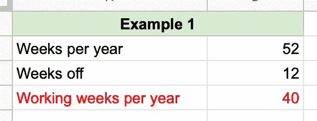
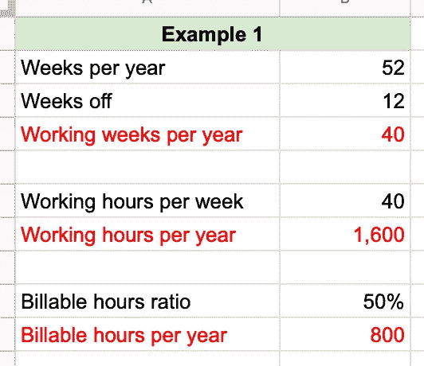
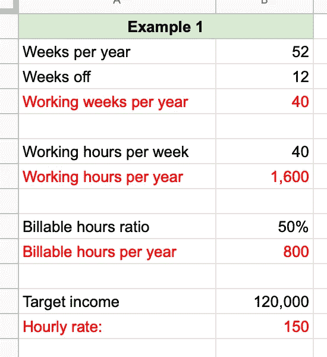
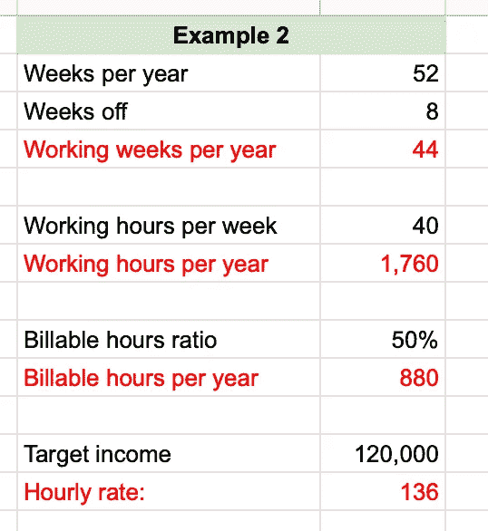
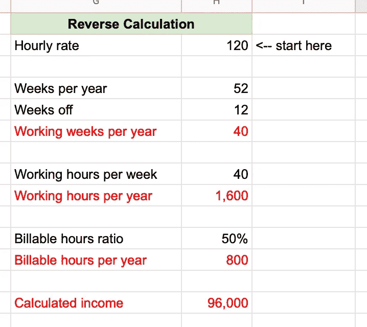

# 如何计算你的时薪

> 原文：<https://medium.com/swlh/how-to-calculate-your-hourly-rates-334e87659804>

Photo by [rawpixel](https://unsplash.com/photos/LTxCtKYw-_E?utm_source=unsplash&utm_medium=referral&utm_content=creditCopyText) on [Unsplash](https://unsplash.com/search/photos/calculator?utm_source=unsplash&utm_medium=referral&utm_content=creditCopyText)

当你开始从事咨询业务(或任何按小时收费的业务)时，你将面临的最具挑战性的问题之一是你应该收取多少费用。即使你已经经营了一段时间，你也可能想不时地检查一下你的费率，看看它们是否还在需要的地方。

我不再按小时计费了，但是我最喜欢的检查费率的工具还是一样的。在本文中，我将向您展示:

*   如何使用这个简单的计算器计算您的利率；
*   关于竞争你该怎么做，别人在收费什么；和
*   为什么你一开始就不应该按小时收费。

让我们从简单的计算器开始。

# 计算费率的简单方法

我的简单计算器最好用作电子表格。我将向你展示一个使用 Google Sheets 的例子——你可以[在这里](https://docs.google.com/spreadsheets/d/16fVQkX_amIX-zYJbw_-SumOClA_bdC2KvAzxx-Ujgvc/edit?usp=sharing)查看电子表格，并保存你自己的副本以便编辑。

**第一步:你打算休假几周？**
我们将从写下一年的周数开始，然后决定你将为假期、病假、家庭紧急事件等预留多少周。

这看起来是这样的(红色的项目是计算出来的):

每年“休假”12 周似乎有些过分，但是我已经包括了 8 周的假期，2 周的病假和另外 2 周的家庭紧急事件。实际上，你现在决定几周并不重要——你可以以后再调整。

**第二步:你能充电多少小时？下一步是计算你每周要工作多少小时，其中有多少是你可以报销的。这看起来是这样的:**

这里的关键是*计费小时比率*——这是你认为你能够向客户收费的工作时间的百分比。我的建议是你永远不要超过 50%——你需要另外的 50%用于营销、销售、管理和其他后台任务。

在示例电子表格中，我每年可以开出 800 小时的账单。

第三步:你的时薪是多少？现在你需要决定你想挣多少钱。你可以以后再调整——现在我决定每年 12 万美元。用这个数字除以你的计费小时数，你就得到你的时薪:

在这个例子中，要想每年挣 120，000 美元，假设你能抽出 50%的工作时间，你就必须以每小时 150 美元的价格抽出时间，每周工作 40 小时，一年工作 40 周。(说你将一年工作 20 周，每周工作 40 小时，听起来很有吸引力，但很少会这样。)

第四步:玩假设游戏
现在你可以玩转数字，看看事情是如何运作的。例如，只要把的*休假周数从 12 改为 8，你的时薪就会从 150 美元涨到 136 美元:*

这个简单的电子表格对我来说是检查我的咨询率的一个快速简单的方法。使用计算器，我可以开始思考我的费率对我来说是否合理——但不一定是客户是否会支付这些费率。

# 比赛呢？

完成基本计算后，我通常会被问到的第一个问题是*竞争情况如何？*

如果你不得不与提供同样服务的人竞争，你只有两个选择:

*   降低费率，保持竞争力；或者
*   以某种方式让自己与众不同，以证明更高的费率是合理的。

**价格竞争是一场逐底竞争**
第一种选择没有吸引力——价格竞争总是一场逐底竞争，没有人会赢——包括你的客户。低劣的工作很快就盖过了你客户的短期成本优势，因为价格，而不是质量，现在是决定性因素。这对你来说更糟糕——你必须工作越来越长的时间来获得同样的收入。总会有人比你便宜。

如果你不得不在价格上竞争，你可以做同样的计算，但是从你的时薪开始，看看你在那个时薪下一年能赚多少:

价格竞争对你和你的客户都没有好处。一个更有吸引力的选择是将你自己与竞争对手区分开来，这样你就不必在价格上竞争。

**脱颖而出，这样你就不必在价格上竞争**
让你在竞争中脱颖而出有两个基本要素:

*   **从专注于定义明确的利基市场开始**。不要把自己定位成一个商业顾问，而要把自己定位成一个“小型建筑企业的商业效率专家”。或者，不要说你是一名平面设计师，你可以专攻“Etsy 制造商的一流包装”。[阅读这篇文章，了解更多关于如何工作的信息](https://blog.britewrx.com/the-power-of-specialisation-and-how-to-do-it/)。
*   然后你需要**生产你的服务**。你不是按小时收费，而是将你的服务打包成固定价格的“产品”，这样你的客户就知道他们在支付什么，你也知道你需要提供什么。[阅读这篇文章，了解更多关于如何为你工作的信息](https://blog.britewrx.com/why-you-need-to-productize-your-services-and-how-it-works/)。

这两个基本要素是从竞争中脱颖而出的关键，同时也是摆脱按小时计费的关键。

让我们再来看看为什么按小时计费对每个人都不好。

# 为什么你不应该按小时计费

当企业需要专业知识时，按小时计费是一种由来已久的方式，无需全职或兼职员工的管理费用。对作为顾问的你来说，这似乎也不错，因为你做得越多，收费就越高。

这就是问题所在。

按小时计费是放慢速度的动力
当你按小时计费时，你就没有动力尽快完成工作。事实上，情况正好相反——即使在潜意识里，你也会被激励工作更长时间来增加收入。

**你的客户必须判断你的时间是否合理**
我能听到你的抗议“但我绝不会那样做”。也许你不会，但雇佣你的人很清楚你是按小时收费的，所以他们会看你的发票和时间表，以确保你的收费合理。如果他们不这么认为，你就必须证明你在这个项目上花费的每一个小时都是合理的。

你在迫使你的客户考虑更便宜的选择。当客户第一次质疑你的发票时，他们也会想知道他们是否能以更低的成本完成同样的工作。这不再是质量的问题，而是价格的问题。这场竞赛只会走向低谷。

另一方面，按小时计费不利于你提高自己的技能。随着你变得更好，你会工作得更快，因此能够在更短的时间内完成同样的工作。这是向你的客户收取更多费用的一些理由，但我还没有看到客户认为这是一个论点。(你的客户不会知道你是否比要价一半的人好一倍。)

关于为什么按小时计费对你(和你的客户)不好，还有很多要说的。

# 摘要

总结一下我们所讲的内容:

*   你可以用一个简单的电子表格来计算你的时薪。用这个作为理智检查，看看你是否接近你想要的收入。
*   通过专业化来避免价格竞争。专家可以收取更多的费用，因为他们比任何人都更了解某个特定的主题。
*   与其按小时收费，不如将你的服务产品化，让你的客户知道他们得到了什么，他们为此付出了多少。这对你和你的客户来说都是更好的交易。

# 你现在能做什么

在这篇文章中，我提到了另外三个有用的阅读方法，如果你想摆脱按小时计费的话:

*   [专业化的力量及其运作方式](https://blog.britewrx.com/the-power-of-specialisation-and-how-to-do-it/)。
*   [为什么你需要将你的服务产品化，它是如何运作的](https://blog.britewrx.com/why-you-need-to-productize-your-services-and-how-it-works/)。
*   [按小时计费对你和你的客户都不好。](https://blog.britewrx.com/billing-by-the-hour-is-bad-for-you-and-for-your-clients/)

这三篇文章是一个很好的地方，让你开始思考如何计算你的费率，以及为什么你不想按小时收费。

这是谷歌表单的链接(保存你自己的副本，以便编辑):

*   [在这里打开谷歌床单价格计算器](https://docs.google.com/spreadsheets/d/16fVQkX_amIX-zYJbw_-SumOClA_bdC2KvAzxx-Ujgvc/edit?usp=sharing)。

祝你生意兴隆。

*原载于 2019 年 2 月 4 日*[*blog.britewrx.com*](https://blog.britewrx.com/how-to-calculate-your-hourly-rates/)*。*

## 这篇文章发表在 [The Startup](https://medium.com/swlh) 上，这是 Medium 最大的创业刊物，拥有+420，678 名读者。

## 在这里订阅接收[我们的头条新闻](http://growthsupply.com/the-startup-newsletter/)。

