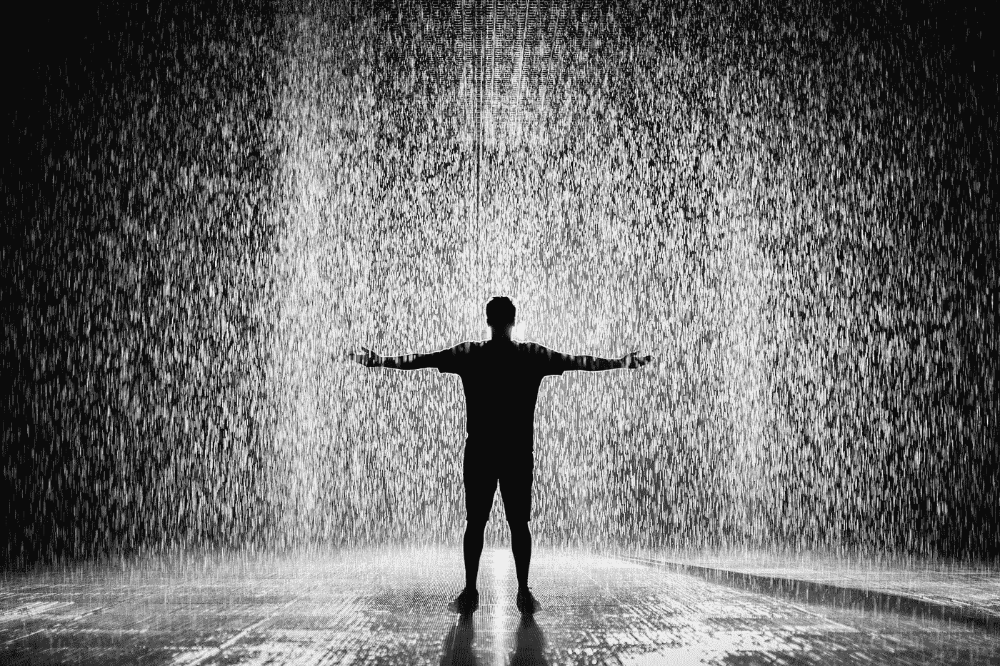

# 如何捕捉灵感

> 原文：<https://medium.com/swlh/how-to-catch-inspiration-91ebd0aca59e>

Photo by [Aleksandar Pasaric](https://www.pexels.com/@apasaric?utm_content=attributionCopyText&utm_medium=referral&utm_source=pexels) from [Pexels](https://www.pexels.com/photo/silhouette-and-grayscale-photography-of-man-standing-under-the-rain-1530423/?utm_content=attributionCopyText&utm_medium=referral&utm_source=pexels)

## 这里有一个提示…开始

灵感有两种。闪电和星期三早上的那种。

我们很容易将闪电浪漫化，而忽略了周三的早晨。我在这里告诉你，奇迹发生在周三早上(或者任何你最意想不到的时候)。

在很长一段时间里，我所知道的唯一一种灵感就是闪电。它就像风，来来去去随心所欲。无法控制。这是天赋也是诅咒。当它出现时，那是一种天赋——天才的一击。我们尽可能地乘风破浪。当它过去的时候，就像往常一样，我们坚持的时间比我们应该坚持的时间长，试图乘风破浪，但我们所做的一切都是沉在平坦的水面上。依靠这种灵感会导致心碎和绝望。最重要的是，这会导致很多等待。这种灵感不能强求。你不能再造它，尽管很多人都在尝试。我们所能做的最好的事情就是接受这种灵感作为礼物，感谢上帝或宇宙或运气，让灵感流过我们，然后带着感激挥手告别，因为我们有机会体现这种灵感，即使是短暂的。

还有周三早上的那种灵感。不是很性感的那种。那种不常被提起或者我们在电影里看到的。这种灵感是肌肉。像任何肌肉一样，它可以随着时间的推移而增强。正如史蒂文·普莱斯菲尔德在他的书《艺术的战争》中所揭示的那样，这种灵感是给“T0”专业人士的。我们，专业人士，不会等待天才的一击或闪电。我们知道我们会等得太久，我们的工作太重要了，不能等。那么，我们该怎么办？我们出现了。在同一把椅子上，在同一时间，每周三早上… **我们开始**。我们从有温暖模糊感觉的日子开始。我们开始的日子里，咖啡是唯一让我们保持清醒的东西。但是我们总是开始。说到有意义的工作，开始的部分总是最难的。一旦我们开始，就会有一股期待灵感到来的冲动——而且总是如此。

> 专业人士和业余爱好者之间的主要区别是——专业人士开始时有或没有灵感，业余爱好者等待灵感降临。

我曾经认为我缺乏创造的基因。我不相信我有足够的灵感来创作有意义的艺术。有一段时间，我弹吉他，写自己的音乐，画风景画，写诗，但我总是放弃。我确信闪电击中了一些人，但不是我。灵感枯竭了，我变得心灰意冷，导致我放弃了我的创作追求。

直到最近我才发现，灵感真的更像雨，而不是风或闪电。当我还是个业余爱好者的时候，我会等着下雨，然后疯狂地跑来跑去，试图将雨水全部吸收。现在，我已经采取了专业人士的心态。我学会了每天出门，拿出空罐子来收集水。雨落在每个人身上。它有不同的形式。有时像薄雾，有时是倾盆大雨，有时是晨露。但是不管它是如何发生的，我每天都带着空罐子出去。这已经成了一种习惯。当下雨的时候，我比以前收集了更多。

你现在正在阅读的是在一个非常普通的星期三早上写的。

> 我带着空罐子出去了。我现在满载而归。

你在等闪电吗？

今天你拿出一个空罐子看起来像什么？

开始吧。