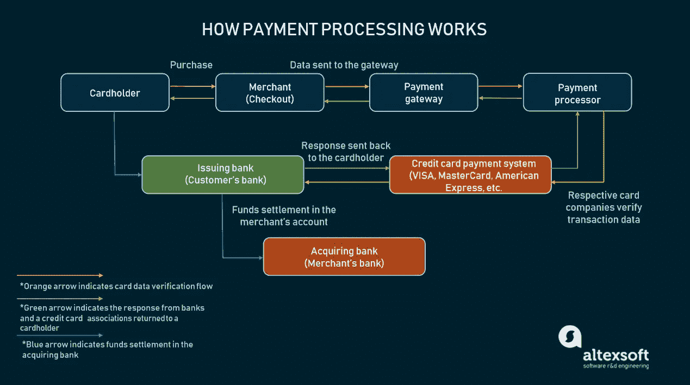
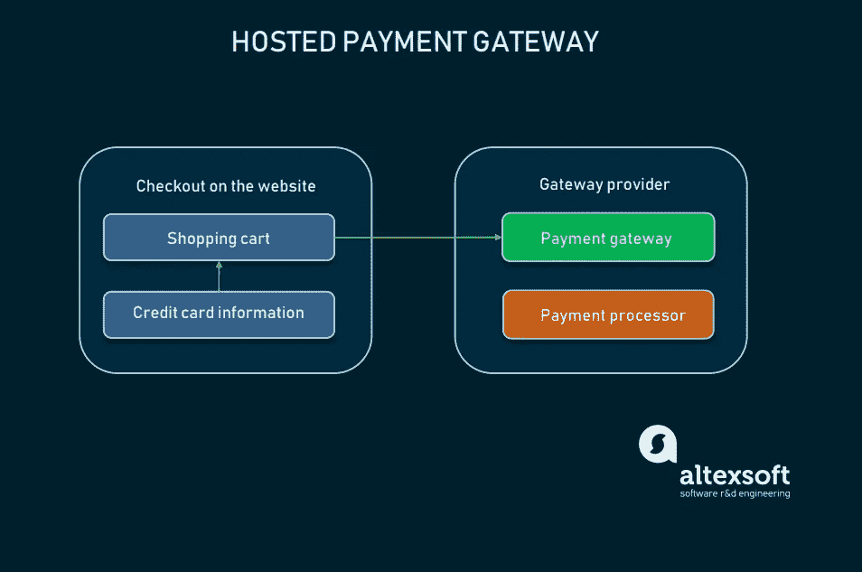
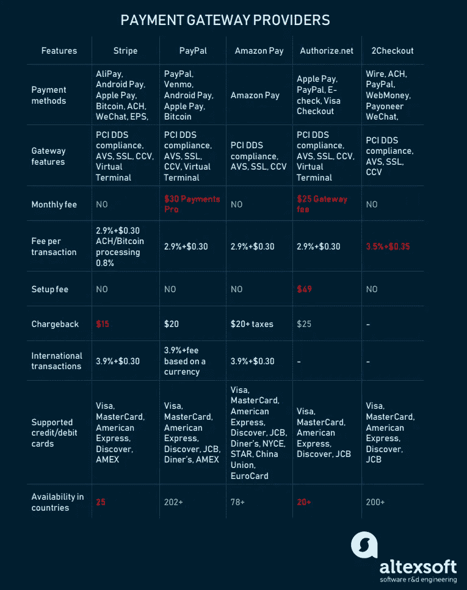

# 如何选择和整合支付网关:在线支付、交易处理和支付网关提供商

> 原文：<https://medium.com/swlh/how-to-choose-and-integrate-payment-gateway-online-payments-transaction-processing-and-payment-9050b62026af>

无论您是电子商务平台的所有者，还是仅仅维护您的在线业务，您都希望为您的客户提供一个安全、快捷、易用的支付系统。所选择的支付解决方案必须同时满足客户和企业的需求。所以，它必须[免受欺诈](https://www.altexsoft.com/blog/business/how-to-choose-fraud-detection-software-features-characteristics-key-providers/?utm_source=MediumCom&utm_medium=referral)，支持多种支付方式，使用方便，并且与你的平台兼容。

为了接受电子支付并能够处理信用卡或借记卡，商家使用支付网关。选择正确的支付网关将决定您可以接受的货币、交易费用、资金进入您的商家帐户的速度以及您将提供的支付方式。

根据 Invespcro.com 的调查，[超过 23%的顾客](https://www.invespcro.com/blog/shopping-cart-abandonment-rate-statistics-infographic/)因为复杂的结账系统(11%)或完成结账所需的信息太多(12%)而放弃他们的购物车。这些统计数据证实，选择合适的支付解决方案提供商与优秀电子商务网站的其他[方面同样重要。但是，为了选择支付解决方案，首先，我们需要了解什么是支付网关及其工作原理。](https://www.altexsoft.com/blog/uxdesign/usability-with-sales-in-mind-best-ecommerce-practices-that-drive-conversions/?utm_source=MediumCom&utm_medium=referral)

# 什么是支付网关？

**支付网关**是一种授权和处理网上和实体店支付的服务。一个网关作为一个门户来促进客户和商家之间的交易流程。它使用安全协议和加密来安全地传递交易数据。数据从网站/应用程序/移动设备传输到支付处理器/银行，然后再传输回来。

支付网关可以执行以下交易类型:

**授权** —一种用于检查客户是否有足够资金支付的交易类型。不包括实际的转账。相反，在授权期间，商家确保持卡人有能力支付订购的商品。授权交易用于需要时间装运/制造的订单。

**捕获** —对之前授权的支付进行实际处理，导致资金被发送到商家的账户。

**销售** —授权和捕获交易的组合。持卡人首先被授权。那么资金可能被捕获，也可能不被捕获。这是一种针对即时购买的常规支付方式，比如订阅购买或电子门票。

**退款** —取消订单的结果，商家将不得不申请退款支付处理以退款。

**Void** —类似于退款，但如果资金尚未被捕获，则可以进行退款。

# 支付处理基础设施

在线支付处理的基础设施比你想象的要复杂一些。对于顾客来说，它表现为一个小窗口，或者一个独立的网站，他们必须在那里通过收银台。但实际上，处理涉及几个金融机构，或工具，验证两端的交易数据，让客户在几秒钟内完成购买。

当客户结账时—传递卡号、到期日和 CVV —支付网关必须执行几项任务，大约需要 3-4 秒钟:

1.  **客户**。顾客按下“购买”按钮并填写必要的字段以传递交易数据。数据被加密并通过 SSL 连接发送到商家的网络服务器。
2.  **商户和支付网关**。收到交易数据后，商家通过另一个加密的 SSL 通道将其传递给支付网关。
3.  **支付处理器**。这些信息会传到支付处理器。这些公司作为第三方提供支付处理服务。支付处理器与商家账户和支付网关相连，来回传输数据。在那个阶段，支付处理器将交易传递给卡网络(Visa、Mastercard、American Express 等)。).
4.  **维萨/万事达/美国运通/探索**。卡网络的作用是验证交易数据并将其传递给发卡行(生产持卡人信用卡/借记卡的银行)。
5.  **发卡行**。发卡行也接受或拒绝授权请求。作为响应，银行向支付处理器发回一个代码，其中包含交易状态或错误详细信息。
6.  **支付网关**。交易状态返回到支付网关，然后传递到网站。
7.  **客户和发卡银行**。客户通过支付系统接口收到交易状态(接受或拒绝)的消息。
8.  **发卡行**。在几天之内(通常是第二天)，资金被转移到商家的账户。该交易由发卡银行向收单银行执行。

*Payment processing scheme*

现在，我们正在向各种支付网关靠拢。要将支付系统集成到您的网站中，您必须遵循多个步骤。

# 决定合适的集成方法

通常，集成支付网关有四种主要方法:

# 托管网关

托管支付网关充当第三方，因为它要求您的客户离开您的网站来完成购买。

*Hosted payment gateway work scheme*

托管支付网关的优点是所有的支付处理都由服务提供商承担。供应商也存储客户卡数据。因此，使用托管网关不需要 PCI 合规性，并且提供了非常简单的集成。

**缺点是缺乏对托管网关的控制。客户可能不信任第三方支付系统。除此之外，将他们从你的网站上重定向会降低转化率，对你的品牌也没有帮助。**

**如何集成**:集成指南一般在厂商网站上公开。作为一个集成托管网关的例子，你可以看看 [PayPal 快速结账指南](https://developer.paypal.com/docs/checkout/)。基本上，您会收到一段 JavaScript 代码，在您的网站上放置一个按钮。点击按钮将激活 PayPal 的 REST API 和结帐流程来处理交易。

**最适合**:更适合使用外部支付处理器的小型或本地企业。

# 直接邮寄法

直邮是一种集成方法，允许客户无需离开您的网站就可以购物，因为您不必获得 PCI 合规性。Direct Post 假设在客户点击“购买”按钮后，交易数据将被发布到支付网关。数据立即到达网关和处理器，而不是存储在你自己的服务器上。

**这种方法的优点**相当于一个集成的支付网关。您可以获得定制选项和品牌功能，而无需遵循 PCI DSS 规范，这一点我们将在下面讨论。用户在一个页面上执行所有必要的操作。

**缺点是直接发布方法并不完全安全。**

**如何集成:**供应商将在您的购物车和其支付网关之间建立 API 连接，以发布卡数据。

**最适合:**可用于各种规模的企业。

# 非托管(集成)方法

一个集成的支付网关可以让你在购物时把用户留在你的网站上。非托管支付网关提供商允许通过 API 进行集成。

好处是你可以完全控制你网站上的交易。您可以随心所欲地定制您的支付系统，并根据您的业务需求进行定制。

缺点一般都是关于维护你的支付系统的基础设施和相关费用。要使用集成网关，首先你必须兼容 PCI，因为你必须将所有客户的信用卡数据存储在你自己的服务器上。此外，如果您想添加自定义功能，集成网关可能会很棘手。

**如何集成**:非托管支付网关通过 API 集成到您的服务器上。因此，需要一个工程团队来执行集成。大多数供应商都有记录良好的集成指南、API 参考或开发人员门户。

**最适合**:非常依赖品牌和用户体验的大中型企业。

# 考虑获得 PCI DSS 合规性

对于中大型商户，一个 [**支付卡行业数据安全标准**](https://www.pcisecuritystandards.org/) **(PCI DSS)** 是处理卡支付的必备要素。这一安全标准是由四大信用卡协会于 2004 年制定的:Visa、MasterCard、American Express 和 Discover。因此，如果你要在你自己的服务器上处理信用卡或存储客户的银行数据，你必须符合 PCI 标准。

正如我们提到的，有些集成方法使用支付网关而不存储信用卡信息。在这种情况下，所有工作都由供应商完成，因此不需要 PCI 认证。

要符合 PCI 标准，您必须完成 5 个步骤:

1.  **定义您的合规级别**。遵从性有四个级别，由您的企业完成的安全交易数量决定。如果交易是通过万事达卡、维萨卡、美国运通卡或发现卡完成的，交易也算，并且有一定数量的成功交易。
2.  **研究** [**PCI 自我评估问卷(SAQ)**](https://www.pcisecuritystandards.org/documents/SAQ-InstrGuidelines-v3_2_1.pdf) 。SAQ 是一组需求和子需求。最新版本有 12 个要求。
3.  **完成合规认证(AOC)** 。AOC 是你看完需求后参加的一种考试。不同的业务有 9 种 AOC。零售商需要的那种叫做[AOC SAQ D-商家](https://www.pcisecuritystandards.org/documents/AOC-SAQ_D_Merchant-v3_2_1.pdf?agreement=true&time=1548344197440)。
4.  **由经批准的扫描供应商(ASV)** 进行外部漏洞扫描。asv 的名单可以在[这里](https://www.pcisecuritystandards.org/assessors_and_solutions/approved_scanning_vendors)找到。
5.  **将您的文件提交给收单行和卡协会**。这些文件包括 ASV 扫描报告和您填写的 SAQ 和 AOC。

设置完成后，在选择支付网关时，还需要考虑其他因素:

*   整合方法
*   交易费用
*   支持的支付方式和接受的货币
*   实物和数字产品许可

# 选择支付网关提供商

现在，您可以考虑所有因素、业务细节和客户，为您的企业选择支付解决方案。以下是在决定供应商之前需要考虑的一些事情。

# 研究定价

支付处理是复杂的，因为它包括几个金融机构或组织。与任何服务一样，支付网关需要付费才能使用第三方工具来处理和授权交易。参与支付验证/授权或处理的每一方都收取费用。交易通常根据金额、地点(跨越某个国家或国际)和产品类型(实物或数字)来计费。

每个支付解决方案提供商都有自己的使用条款和费用。通常，你会有一个网关安装费，每月网关费，商家帐户设置，以及每笔交易处理的费用。阅读所有定价文件，以避免隐藏的费用或额外开支。

# 考虑商家账户选项

商户账户是商户和收单银行之间的协议，通过该协议，商户允许银行处理他们的交易。此外，商家同意遵守信用卡公司制定的信用卡处理操作规则。

商家账户可以通过银行或支付网关提供商来开设，这些银行或支付网关提供商提供商家账户作为服务的一部分。这包括支付处理器。如果你已经有了一个商家帐户，考虑一下该提供商提供的服务。否则，最好选择一开始就提供商家账户的提供商。

# 确保供应商支持必要的支付方式和多种货币

根据 2017 年 3 月的[统计，最受欢迎的支付方式仍然是信用卡(42%的在线购物者)、PayPal 等电子支付(39%)和借记卡(28%)。但这并不意味着您必须只支持那些方法。例如，移动支付每年为企业带来更多收入，全球](https://www.statista.com/statistics/508988/preferred-payment-methods-of-online-shoppers-worldwide/)[在 2018 年](https://www.statista.com/statistics/226530/mobile-payment-transaction-volume-forecast/)达到 9300 亿美元。在电子商务中，移动支付意味着使用电子钱包。这些应用程序，如 Apple Pay、PayPal 和 Google Pay，可以存储你的信用卡信息，或者自己存储你的钱。这意味着你可以在没有银行账户的情况下进行网上购物。

因此，请确保您的支付网关支持您所在行业、地区或国家流行的所有必要的支付方式。

另一个方面是多币种支持。如果你的业务是国际性的，你希望你的客户能够支付，无论他们使用什么货币。流行的网关提供商提供多币种支持处理，收取或不收取额外费用。如果你打算使用托管支付系统，也有本地化的检查可用。

# 确保您的产品类型得到提供商的许可

一般来说，提供商考虑的产品有两种:数字产品和实物产品。

一些支付解决方案提供商同时为实物和数字产品提供服务。但是只有一种类型的产品可用于特定系统的情况并不少见。因此，在订阅提供商之前，确保它允许你的产品类型。

# 流行的支付网关提供商

大量的网关提供商势不可挡，所以我们选择了一些最大、最可靠的选项。

*Table of payment gateway providers features*

# 种类

[Stripe](https://stripe.com/) 是一个电子商务定制支付解决方案。Stripe 接受所有主要的支付方式，包括 Apple Pay、微信支付、支付宝和 Android Pay 等移动支付提供商。

这项服务充分利用了其全面的文件、国际支持和监测系统。它具有简化的 PCI 合规程序，支持 135 种货币，并允许与其他第三方平台集成。

[定价](https://stripe.com/us/pricing) : Stripe 不收安装费。标准套餐每笔交易收费 2.9%+$ 0.30。此外，国际卡处理也要收费(1%)。但 Stripe 也为大型企业提供定制的解决方案和定价包。退款金额是固定的 15 美元。

# 贝宝

PayPal 是世界上最广泛接受的电子支付方式之一。PayPal 为不同规模的企业提供可扩展的解决方案。通过其网关，PayPal 提供所有主要信用卡和借记卡的处理，以及 PayPal 支付本身和各种其他方法。它还提供多种服务，包括 [PayPal Payments Pro](https://www.paypal.com/us/webapps/mpp/paypal-payments-pro) 、 [PayPal Express Checkout](https://www.paypal.com/ba/webapps/mpp/express-checkout) 和 [Braintree](https://www.braintreepayments.com/) 。

PayPal 通常被集成为托管支付解决方案。PayPal Payments Pro 是一款升级产品，如果您想在自己的网站上集成结账功能，您可以使用它。PayPal 快速结账是最简单的选择，因为它只需在您的网站上添加一个 PayPal 按钮。Braintree 是一个独立的支付解决方案，但它是 PayPal 的一个部门。使用 Braintree 的主要优势在于，它无需支付额外费用即可对国际交易进行计费。

[定价](https://www.paypal.com/us/webapps/mpp/merchant-fees) : PayPal 的定价模式很复杂，包括小额支付、平台使用和国际交易的不同计算方法。国内交易的费率为每笔交易 2.9%+$ 0.30。在美国以外的交易是 3.9%加上基于所用货币的费用。标准 PayPal 没有月费，但 Payments Pro 每月收取 30 美元的订阅费。退款金额为 20 美元，对于 Braintree，在交易定价相同的情况下，退款金额为 15 美元。不包括安装费。

# 亚马逊支付

[亚马逊支付](https://pay.amazon.com/us)是一家电子商务巨头，其平台专为在线零售商设计。Amazon Pay 通过 API 集成，提供半集成的支付解决方案。它适用于各种设备，主要用于移动设备。亚马逊服务还支持所有主要的支付方式和信用卡。

[定价](https://pay.amazon.com/us/help/201212280):国内交易按每笔交易 2.9%+$ 0.30 计费。国际利率为 3.9%。退款金额为 20 美元+税款(如果适用)。没有设置或每月费用。

# Authorize.net

[Authorize.net](https://www.authorize.net/)是为中小型企业设计的。他们的服务还提供所有主要的[支付方式](https://www.authorize.net/our-features/payment-types/)支持，包括 PayPal 支付和 Apple Pay。Authorize.net 通过其[高级欺诈检测套件](https://www.authorize.net/our-features/advanced-fraud-detection/)保护用户免受欺诈交易。它们还支持与移动应用程序的集成。

价格:每笔交易 2.9%+0.30 美元。网关的月费为 25 美元，商户账户设置费为 49 美元。如果你已经有一个商业账户，你可以注册一个支付网关。

# 2 结账

[2Checkout](https://www.2checkout.com/) 为不同规模的企业提供可定制的选项，以及集成的支付解决方案。它最大的优势是它的可伸缩性，可以为不同的产品类型打包。2Checkout 支持所有主要支付方式、87 种货币和 15 种语言本地化。

[定价](https://www.2checkout.com/pricing/):2 退房包含 3 种不同费用的套餐。没有设置，每月或定期付款。2 销售费用是每笔交易的 3.5%+$ 0.35。2Monetize 是为数字产品卖家量身定制的套餐，其定价为每笔交易 6.0%+$ 0.60。

# 自定义支付网关

有许多支付网关提供商为您的客户提供完整的购物体验和各种集成方法。但是，如果你是一家大型企业，你可能有兴趣建立自己的支付解决方案，以摆脱供应商的限制。

# 如何构建自定义网关？

创建自定义支付网关需要几个步骤:

支付网关提供商注册。通过收单银行向一家(或几家)信用卡公司注册支付网关提供商。

1.  **与银行签约**。签约银行将作为支付处理者为你处理实际的处理。多家银行可以为您提供不同的国际转账交易费，或不同的货币兑换费率。
2.  **API 开发**。为您的网关开发 API，并根据 PCI DSS 合规性的要求编写可靠的文档。
3.  **PCI DSS 认证**。通过实施所有必要的安全措施并在您的网站上集成商家欺诈保护机制，实现 PCI DSS 合规性。
4.  **选择附加支付方式**。如果您需要其他方法，如 PayPal、比特币或移动钱包(如 Apple Pay)，您需要将它们分别与它们的 API 集成。
5.  **管理工具开发**。开发一个商家管理 web 应用程序，或者简单地开发一个管理面板，让您的员工可以控制商家的运营。

您也可以使用开源支付网关解决方案。可以使用开源支付网关(如 [OmniPay](https://github.com/thephpleague/omnipay) 、 [PayU](https://github.com/PayU/plugin_opencart_2) 或 [Active Merchant](https://github.com/activemerchant/active_merchant) )软件来降低工程成本。但是它将再次限制您的定制选项。

开发一个独立的定制网关和支付处理基础设施需要大量的费用，费用在 150，000 美元到 800，000 美元之间。这个价格包括工程、维护、PCI DSS 合规认证、SSL 认证、编写 API 文档和管理费用。除了财务问题，它还需要时间来启动一个完整的工作系统，并将其应用到您的产品中。

然而，定制支付解决方案可以带来许多好处:

**降低交易费用**。建立您的网关，您避免网关提供商作为一个自由形成的因素，这降低了交易费用。

**定制**。大型企业业务可能会受到供应商产品的严格限制。即使你找到一个交易费用低、支付方式多的供应商，也总是有一些限制。开发定制支付解决方案可以让您实现任何想要的功能，无论是定期支付还是多币种交易。

**将支付网关作为产品提供**。通过您自己的定制支付解决方案，您将能够向其他商家和代理商提供该解决方案。

作为一项长期投资，开发一个定制的支付网关对于一个年收入巨大的公司来说是非常合理的。对于每年处理不到 2 万笔交易的公司，客户支付解决方案是不必要的。但是对于进行超过 100-200 万笔交易的商家来说，节省的费用会迅速增加。

优化您的网关和节省交易费用是合理的考虑因素。您应该注意的陷阱是安全问题，这通常由网关提供商承担。但是，获得 PCI 合规性并使用欺诈管理将有助于您赢得客户的信任。

# 结论

所以，无论你是选择支付网关/处理器提供商，还是计划建立自己的支付门户，对于一个在线商家来说，这总是一个更有利可图的解决方案，除非你是一个非营利网站。使用内置支付系统的网站更受顾客信任。如果您正在寻找一种提高客户信心的方法，请集成一种能够激发信任、支持多种支付方式并防范欺诈行为的支付解决方案。

*最初发表于 AltexSoft tech 博客“* [*如何选择和整合支付网关:在线支付、交易处理和支付网关提供商*](https://www.altexsoft.com/blog/business/how-to-choose-and-integrate-payment-gateway-online-payments-transaction-processing-and-payment-gateways-providers/?utm_source=MediumCom&utm_medium=referral)

**

## *这篇文章发表在 [The Startup](https://medium.com/swlh) 上，这是 Medium 最大的创业刊物，拥有+438，678 读者。*

## *在这里订阅接收[我们的头条新闻](https://growthsupply.com/the-startup-newsletter/)。*

**