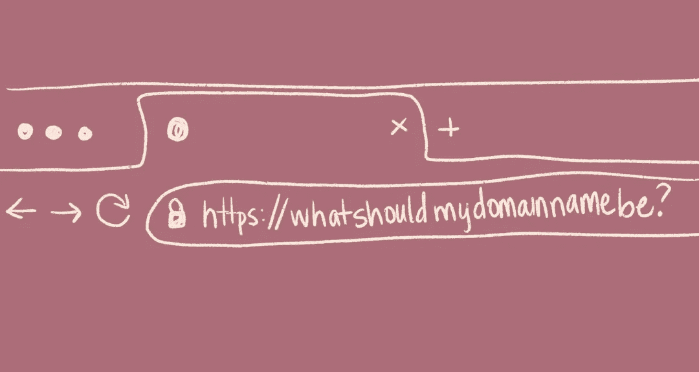
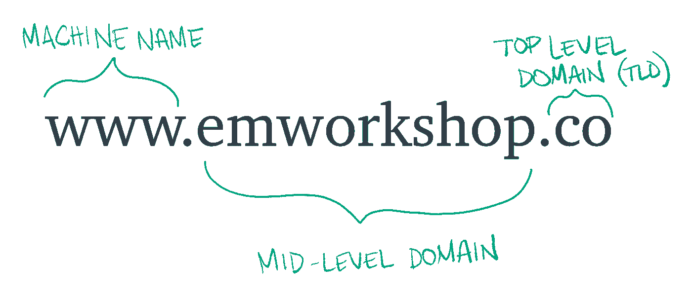

# 如何选择你最好的网站域名

> 原文：<https://medium.com/swlh/how-to-choose-your-best-website-domain-name-c8d79965a556>

©erinmichaela

选择域名的任务可能会从你待办事项清单上的一个简单的复选框迅速发展成为一个令人难以置信的令人生畏的决定。毕竟，这是人们在网上找到你的地方！你要把这个名字贴满社交媒体，印在名片上，并与你的邻居分享。就像选纹身一样！如此永久的决定…

恐惧，不是我的朋友-我会保护你的。

我们将一起浏览这篇文章，到最后，你会知道:

1.  **什么是域名？**
2.  **哪里可以买到域名？**
3.  选择一个好域名的注意事项
4.  如果您想要的域名不可用，该怎么办？
5.  **选择域名要避免什么？**
6.  **你的域名对你在谷歌搜索上的影响有多大？**

*好了，准备好开始了吗？我们开始吧！*

# 什么是域名？

你的域名是人们在网上找到你的地方，通常是你的品牌或企业名称。比如我这里网站的域名是“emworkshop.co”。如果我们没有域名，我们就必须记住一长串数字，才能访问我们最喜欢的博客或购物网站(想象一下，如果这是现实生活！😅).

创建域名是为了让人们更容易浏览整个网络。记住“emworkshop.co”比记住“1.438.56.739”要容易得多。你的网站仍然有一个 IP 地址，但作为人类网民，我们看不到他们。

**域名由 3 部分组成:**

1.  “www”或机器名称
2.  中级域名或简称域名。这就是我们通常认为的域名。
3.  顶级域名或 TLD。TLD 是我们域名末尾的一位，就像。com 或者。组织等。*(。com 在历史上用于商业。组织的组织。edu 对于学校来说(这些对于购买有特殊的要求，而且你要经过特定的* [*注册员*](https://net.educause.edu/) *)，。gov for the(注册* [*要经过特殊流程。gov*](https://home.dotgov.gov/registration/#prepare-to-make-your-request) *域)*

# 你可以在哪里购买域名？

域名可以在许多被称为域名注册商的网站(见下文)上购买。这些注册商基本上是所有信息的持有者，例如与你选择的域名相关的 IP 地址。注册商将有不同的域名可供选择，所以你可能要在多个地方寻找。这里有两个我喜欢的，但有很多选择，[如果你感兴趣，这里有另一篇关于这个的博文](https://makeawebsitehub.com/reviews/domain-registrars/)。

[**GoDaddy**](https://www.godaddy.com/)
这是我**去**找新域名的时候

我喜欢 Squarespace，因为 1)他们有很多创造性的选择 2)它让你的网站变得比以前更容易。

# 选择一个好域名的注意事项和 DONT

# 做

1.  **使用普通顶级域名**
    *。com 仍然是最受欢迎的域名选择。co，。net 和 org 也是很好的选择。如果您的业务是位置特定的，那么国家特定的 TLD 可能是一个很好的选择，如。纽约市“或”。英国”。越来越多特定行业的 TLD 变得可用，如“社区“”。艺术”等。这不会是我的第一个建议，但如果它符合你的品牌，也许，你的第一选择不可用，那么我会说去吧。*
2.  **让它相对简短而难忘。理想情况下，你的客户和顾客不需要点击链接就能访问你的网站，因为他们知道如何去那里。尽你所能保持简短和甜蜜，这样当他们需要你的时候，你就可以在他们身边了！**
3.  适当的时候使用关键词如果你拥有一家瑜伽馆，那么拥有一个类似“www。“但永远不要觉得有义务在你的域名中使用关键词，除非它符合你的品牌。这对谷歌不会有太大影响。使用关键字的主要好处是，当有人进行搜索时，谷歌会在搜索结果中突出显示被搜索的术语。请看下面的例子，单词“yoga”在所有搜索结果中以粗体显示。这不是一个巨大的好处，只是一些需要了解的事情。
4.  **选一个自己觉得好的域名。**
    *在一天结束的时候，你应该为能与他人分享和代表你的企业而感到自豪。没有任何技巧或提示或方法可以“玩弄系统”来赢得一个让你自豪地在全世界发布的名字。*

# 不

1.  用关键词塞满你的域名过去，用关键词或者你的客户在谷歌上搜索的词塞满你的域名，会让你在搜索引擎优化游戏中赢得高分。那个时代已经过去了。谷歌关心的是相关的、有用的和鼓舞人心的内容，而不是最关键的域名。仅仅因为某人拥有域名“www.besttshirtever.com ”,并不意味着他们实际上制作了有史以来最好的 t 恤。
2.  **注意你的域名年龄。就像你的信用卡使用年限会影响你的信用评分一样，拥有一个你已经使用了一段时间的域名可以为你的帖子提供一点点帮助。理论是，如果你有一个已经存在了一段时间的博客，你就是一个真正的人，发布真实的、有价值的、发自内心的内容——而不仅仅是某个地方的某个机器人。也就是说，如果你没有有价值的相关内容，拥有一个旧域名(意味着你已经拥有了几年)不会给你带来任何优势。**
3.  **不要压力太大**
    *高于一切，不要做这种巨大的、无法承受的决定。选择目前对你和你的企业来说合适的方式。根据现有资源，做出一个深思熟虑但又不过分耗时的决定，然后将注意力转向撰写优秀的内容、提供有价值的服务，并弄清楚你将如何通过这个新网站、博客或你的企业来改变世界。*

# 几个例子只是为了好玩…

所以，你准备买一个域名，但是你选择什么呢？
让我们一起来评价一些例子:

*假设你叫厄尼，在纽约市开了一家纸杯蛋糕店。你写下以下想法:*

[**www.erniescupcakes.com**](http://www.erniescupcakes.com)*这是一个很棒的选项！它很短，容易记忆，并且使用了单词 cupcakes，这主要是为了突出我们在上面谈到的相关性*

[**www . erniescupcakes . NYC**](http://www.erniescupcakes.nyc)

*这是另一个很好的例子，你的纸杯蛋糕店位于纽约市，所以这会给谷歌一点提示，帮助他们引导在纽约市寻找纸杯蛋糕店的人去你的店*

[**www.bestcupcakeshop.com**](http://www.bestcupcakeshop.com)

***这个可能有用，但它并没有充分说明你的品牌。除非你把你的店叫做“最好的纸杯蛋糕店”，否则我会坚持用一个感觉真实、能代表你的名字。***

**[**www . newyorkbestpackets . biz**](http://www.newyorksbestcupcakes.biz)**

***这感觉有点像我们在试图游戏系统，不是吗？记住，你所在领域的关键词并不重要。你的域名应该适合你的品牌和你的故事。不应该觉得廉价或者勉强。谷歌知道这一点，当你试图利用这个系统时，你就会丢分。***

**所以总而言之——所有的域名*都可以为厄尼和他的纸杯蛋糕店服务。没有对错之分。这里的关键是坚持对你和你的品牌来说最真实的东西。你的**故事和你的**服务最终会赢。***

# **如果你想要的域名不存在，你能做什么？**

**于是你为自己的网站想到了一个完美的域名，冲过去在 GoDaddy 上的搜索框里输入，然后“射！”，不可用。😫深呼吸！它发生了🤷‍♀️(“em workshop . co”不是我的第一选择)。但是今天我在这里，仍然很强大，实际上喜欢极简主义的氛围。**

**以下是度过这场小危机的几种方法:**

1.  ****试试不同的 TLD**
    *如果。com 不可用，你试过吗？co，。org 或另一个相关的 TLD？***
2.  ****你还能在你的企业名称中加入或添加什么词？总是从较小的开始，你可以从那里添加额外的信息或上下文到你的域名。例如，你可以试试“happybellyyoga.com”而不是“happybellyyoga . com”。****
3.  **它是待售的吗？在某些情况下，如果您认为域名对您的业务成功至关重要，您可以联系域名所有者并出价购买该域名。意识到你愿意花多少钱，你的预算是多少。祝你好运！**

# **你的域名对你在谷歌搜索上的影响有多大？**

**这可能是我的社交渠道和电子邮件中遇到的最常见的问题之一，所以要一劳永逸地解决这个问题，答案是……*请敲鼓*…**

**它没有🎉(唷！)**

**谷歌在确定网站在搜索结果中的排名时，会审查大约 200 个不同的因素。你的域名只是这个等式中非常非常边缘的一部分，事实上，它的影响更可能是下降而不是上升。**

**无论你决定使用你的品牌名称，还是使用一些关键词来提高你的知名度，最重要的是，你为你的网站访问者创造了伟大的内容。**

**好吧，我的朋友们，我希望这有助于消除你在为你的博客、企业或项目选择最佳域名时可能有的任何困惑。记住，域名甚至比冰山一角还要小——重要的是它所依附的网站的内容、服务、心脏和灵魂！快乐创造✌️🎉**

***PS。如果你正在寻找更多这样的指导，加上一个鼓舞人心的健康领袖社区，以学习、成长和庆祝成功，我邀请你加入我的* [*太空营*](https://emworkshop.teachable.com/p/spacecamp) *！是时候翻开剧本，看看如何用爱、轻松和成功来发展一个创意企业了。***