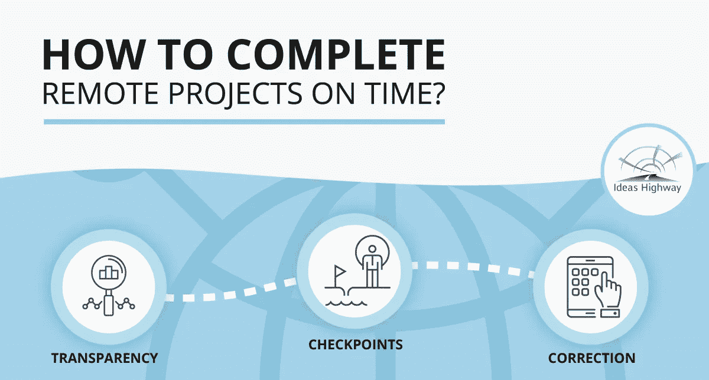

# 如何通过团队跟踪，每次都按时完成远程项目

> 原文：<https://medium.com/swlh/how-to-complete-remote-projects-on-time-every-single-time-with-team-tracking-714ab337558b>

无论您是远程管理项目还是在现实世界中管理项目，它们都有一个基本的、共同的方法:您有一个范围，并且您需要找到一种方法来实现这个范围。不管你是使用传统的线性方法，比如瀑布，还是敏捷的迭代方法:实现范围是最重要的。