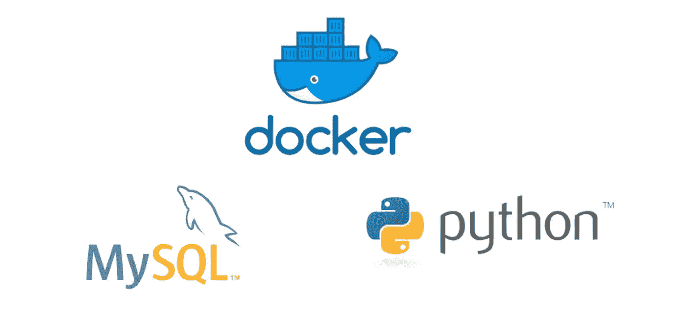

# 如何从 MacOS Mojave 上的 Python 应用程序连接到 mysql Docker

> 原文：<https://medium.com/swlh/how-to-connect-to-mysql-docker-from-python-application-on-macos-mojave-32c7834e5afa>

最近，我很难从本地`Python`应用程序连接到我的 MacBook 上本地托管的`mysql` docker。所以，我想写这个指南来帮助人们节省他们的时间，不去想如何去做。

在这篇文章中，我将带你从头到尾地完成这个过程，从安装`mysql` docker 一直到编写`Python`脚本来连接它。

