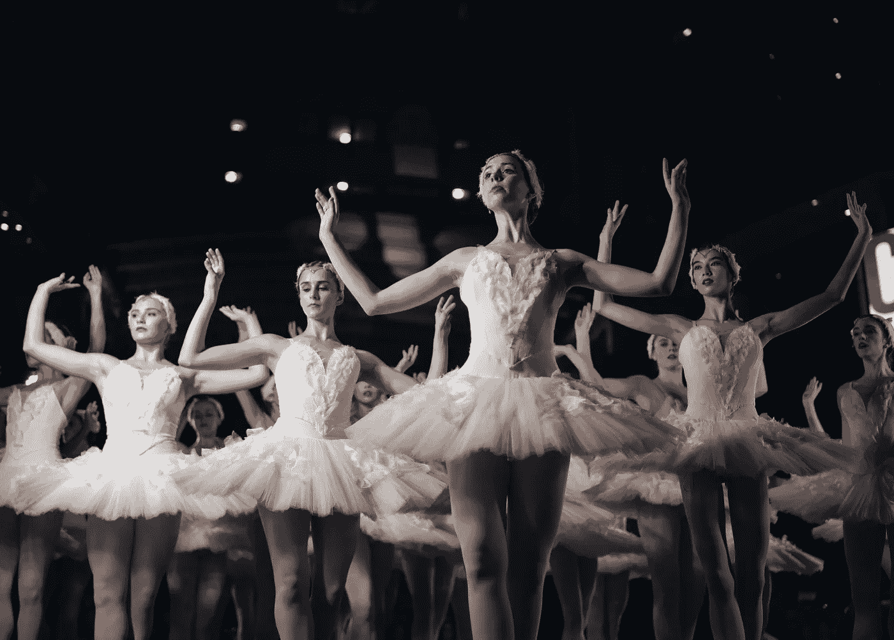

# 如何控制自己的情绪，成就更多

> 原文：<https://medium.com/swlh/how-to-control-your-emotions-and-achieve-more-d31f2addcbfb>

Photo by [Michael Afonso](https://unsplash.com/photos/nZU76qWy-T8?utm_source=unsplash&utm_medium=referral&utm_content=creditCopyText) on [Unsplash](https://unsplash.com/?utm_source=unsplash&utm_medium=referral&utm_content=creditCopyText)

有时候，我们的情绪会战胜我们。我们都面临着在压力下表演的挑战，无论是对观众演讲，在截止日期前工作，还是接受测试以证明我们的才能。学生们都非常熟悉标志着一学年结束的考试的重要性。这些测试的结果可能是决定性的:它们通常决定一个学生是否能够…