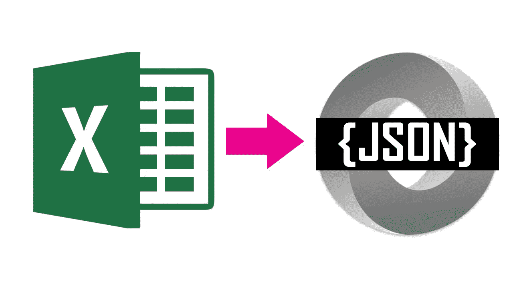

# 如何用 JavaScript 将 Excel 数据转换成 JSON 对象？

> 原文：<https://medium.com/swlh/how-to-convert-excel-data-into-json-object-using-javascript-1c4e0d3e97ee>

这将告诉你我们如何从一个上传到浏览器的 Excel 文件中创建一个 JSON 对象。你可以通过一步一步地完成下面的任务来达到这个目的。

第一件事是从用户那里获得 excel 文件。我们可以在 HTML 中使用 *<输入>* 标签来实现。如下图所示。(*T6)输入 type = " file " id = " file uploader " name = " file uploader " accept =。xls，。xlsx"/ >* )