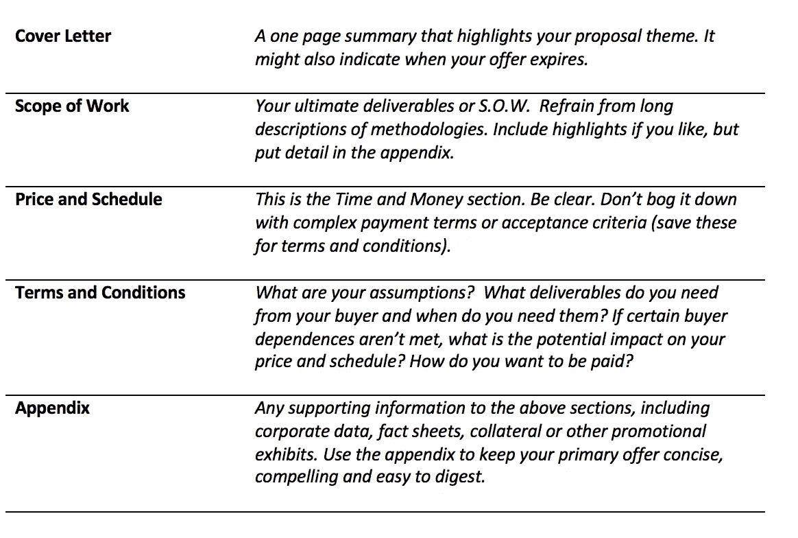

# 如何构思一份成功的提案

> 原文：<https://medium.com/swlh/how-to-craft-a-winning-proposal-94685cf4bad0>

“你什么时候能给我一份建议书？”这是一个很好的购买信号，但是大多数组织把这个问题误解为“你什么时候能给我一份没有人会读的大而厚的文件？”

通过遵循我的三个步骤，你可以创建一个可重复的过程，这将大大减少你投入到推销业务的时间和精力。您还可以保持产品的一致性，并更快、更容易地将其转化为业务。如果你擅长推销业务，你不可避免地会更擅长达成交易。

**第一步。构思一个提案主题(也就是一个购买理由)。**

将您的提案主题想象成一部电影的单行描述符:

*一名大萧条时期的南方律师为一名黑人男子的虚假强奸指控辩护，并为他的孩子的偏见辩护(*杀死一只知更鸟 *)*

一个有组织犯罪王朝的年迈族长将他的帝国控制权移交给他不情愿的儿子(教父*)。*

*我们将在您的预算范围内，聘请一位屡获殊荣的建筑师为您打造一个定制的家，从开工到竣工不到一年。*

**提案主题的区别是什么？**

竞争性投标开始看起来和听起来相似，特别是在成熟市场，公司以相似的方式处理商业问题。

通过创建一个强有力的主题，你可以成为一个脱颖而出的提案，让购买委员会在缩小范围或授予奖项时记住。那么你是怎么做到的呢？召集您的团队，集体讨论这个问题的答案:

**你希望买家记住的最重要(可量化)的结果是什么？**

当我还是一名研究数字商务的分析师时，IBM 以“*大多数客户在我们实施的第一年就将他们的在线收入翻了一番”*(并且他们有参考资料来支持它)开始了它。当我写报告时，我想起了在线收入的翻倍。

**将你的主题与买家的关键决策标准紧密结合**。

虽然这听起来是显而易见的，但我很惊讶有这么多供应商把主题放在他们身上，而不是买家身上。我曾经告诉五家竞争对手，根据客户意见研究，我的公司被认为很难做生意(然而，只有一家竞争对手发现了这一点)。猜猜哪个供应商赢得了这项业务？

不要忘记你的影响陈述。

始终、始终指出是什么阻碍了您的购买者实现他们想要的结果，*也称为影响陈述。没有影响，就没有商业案例。没有影响力，就没有购买的理由。将您的影响陈述与结果联系起来。*

考虑一下 Vantos Software 的这个例子:

*< <主题> >*

我们建议帮助您将结束调查的时间缩短 50%,同时让您的调查人员有更多的时间进行调查。

*< <冲击> >*

*太多的调查人员将有限的机会窗口转移到收集数据和填写报告上。这使他们无法进行调查和解决案件。当这种情况发生时，起诉水平下降，肇事者逍遥法外。*

*< <结局> >*

*平均而言，Vantos 软件的用户将完成调查的时间缩短了 50%以上。一位地方检察官报告说，结案的平均时间从 5 个月缩短到了 2 周。调查人员喜欢它，因为我们的分析为他们指出了具体的调查领域。在线报告取代了手动流程，因此他们可以专注于自己最擅长的领域。*

> Vantos 有一个很棒的提议主题:帮助调查人员进行调查，同时将结束调查的时间减少 50%。

**步骤 2:确定建议书的范围(使用工作说明书)。**

许多提供商*不*将 SOW 包括在提案中，更愿意首先获得意向书或提案的口头接受。一旦他们确定了这一点，他们就开始起草工作报告。这通常是一个错误。为什么？这只会延长你的销售周期(对你不利，对你的竞争对手有利)。

使用这个三管齐下的范围界定工具(表 1) 来指定您将交付什么，需要多少时间和金钱，以及您的条款(也称为假设)。

**表 1:提案范围回答了三个对任何交易结构都通用的问题:**

1.  你将交付什么？通常最好通过工作说明书、产品列表或 SLA(服务水平协议)来实现。
2.  需要多少时间和金钱？也被称为价格和时间表，这一部分清楚地说明了它的成本以及您的产品将于何时交付。
3.  你的条件是什么(或用来给作品定价的假设)？你采取了什么措施来确保顾客收到你承诺的所有东西——在你指定的时间和金钱限制内？这一部分还可以包括有关知识产权所有权的条款。

当需要将所有内容放在一起时，请使用我的目录(表 2)。

**表 2:任何类型要约的标准目录。**

第三步:提出你的提议

不要错过亲自或通过视频提交提案的机会。你声音中关于解决买家问题的激情远比在屏幕上阅读文字更有效。总是从回顾你用来制作你的出价的开始假设开始。在您继续之前，请询问您的买家自上次交谈后是否有任何变化。

当你提出报价时，尽早沟通价格。

这不是一个硬性规定，但是当你谈论你所做的事情时，观众往往会走神——因为他们真的想知道这将花费他们多少。越早提出价格越好，这让大多数销售人员感到害怕，但这正是买家想要的。

如果你认为你的价格标签会引起标签休克，更重要的是有一个坚实的，令人信服的影响陈述。展示你提议的解决方案是如何减轻影响的(或者甚至让影响消失)。要相信你值高价。当事情出错时，没有人会说，“但他们是低成本供应商。”

另一个很好的规则(如果你的价格可能会引起恐慌)，在你的提案到期日之前由你的买家浮动。记住:在截止日期之前，你可以做任何事情来使你的提议社会化，这是一件好事。

**总之……**

**用提议来表达和你做生意的感觉。**

有两次，我雇佣的供应商提交了包含大量细节的复杂提案(我的错误是被过分打动了)。两人都因为解决不了问题而产生了噩梦般的关系。他们无法摆脱自己的方式。寻找阿尔伯特·爱因斯坦喜欢一起工作的人(他常说“我喜欢把事情简单化的人”)。

**利用提案阶段评估与潜在客户开展业务的情况。**

如果售前关系很难，售后关系会更差。相信我。我曾经卖给一个潜在客户一年。这是一家拥有巨额预算的大公司，但售前过程充满了不信任和羞辱。(我的设计师后来说，“他们一定是自己创立了一个供应商滥用学校。”).我们在这笔交易上赔了钱，主要是因为客户没有认真对待他们的依赖性。

**提防滥用职权的买家**。

我们都经历过。如果你的买家是一名受过供应商虐待的毕业生——考虑离开。当我在惠普从事销售支持工作的时候，我在南加州爱迪生公司打电话，那里的首席信息官不停地抱怨他有多讨厌电脑公司。

我永远不会忘记那个客户经理(简·诺斯)。她说，“如果你继续不尊重我的人民，我将结束会议。”买家没理她(确信她在虚张声势)。六十秒钟后，简礼貌地说:“很抱歉我们今天不能为你服务。”说完，我们就离开了(那天晚些时候，首席信息官道了歉，并邀请我们再来)。

小心那些过早要求报价的买家。

即使您有一个标准的、可重复的流程和良好的模板，提案也可能是一项繁重的工作。但是根据我的经验，过快要求报价的买家要么是 1)不合格，要么是 2)只是想甩掉你，因为他们已经做出了决定。

你可以说，“我没有足够的信息来做提案”，或者说一些更能让人放下心来的话，“现在要求提案还为时过早。能分享一下是怎么回事吗？”如果你得到一个好的答案，你可以同意提交一个工作范围，没有价格标签(就需求达成一致)。

利用提案请求进行谈判，例如，“如果你让我见你的首席执行官，我会给你一份提案。”或者，“如果你把你的 CMO 交给我，我会给你一个提议”。

**包含一个常见问题**。

买家害羞。他们并不总是问那些难以回答的问题，因为他们害怕正面冲突。使用常见问题解答来传达与您做生意的简明答案。客户如何在非工作时间获得支持？在极少数需要的情况下，您的上报途径是什么？谁是客户的单一联系人？谁保留 IP？有保修吗？常见问题是很好的工具，因为它们增加了由外向内的视角。

**让你的提议变成协议或合同变得容易。**

服务行业的大多数供应商都在等待买方索取工作说明书或合同。将这些文件放入您的提案中。诚然，事情会发生变化(可能在谈判期间)，但提前进行评估会让你比竞争对手领先一步。

**满足提案截止日期。**

25 年来，我从未要求延期求婚。如果你的买家要求周转时间，这是根本不可能的，谈判日期提前。

想办法避免求婚。

你有免费试用吗？或者，如果你从事咨询行业，你能提供一次免费的战略会议吗？还是免费审计？如果你能提供有意义的价值，作为一个提案的替代品，你就从你的竞争对手中脱颖而出(并开始建立关系)。

我从一位销售老手那里学到了这一点，他对一位潜在客户说:“我可以花 10 个小时在一份提案上，或者花 10 个小时交付你可以马上使用的真正价值。”这是一种令人信服的做生意方式。而且，它提供了一种衡量未来关系基调的方法。

**玩得开心(别忘了晋级)。**

在经历了所有这些陷阱和需要避免的事情之后，我还有脸告诉你玩得开心？我曾经问过我最小的妹妹(一名演员)，为什么她在试镜前如此平静。她的回答是，“我喜欢试镜。这是一个练习我所做的事情的机会，我喜欢和导演开玩笑。”她有 90%的接近率(最终增长到 100%)，这归功于她选择了她完全胜任的试镜。最终，董事们会向她推销*以及为什么她应该为*他们工作。**

看到这么多销售人员在永远不会向他们购买的潜在客户身上浪费时间，我感到很痛苦。做你的作业。永远保持资格。别忘了练习你的推销技巧。

再次强调，相信你的直觉。问问你自己，“我们的提议对吗？这家公司会是一个好的参考吗？化学好吗？我们互相尊重吗？”

记住，你不只是在为他们试镜，他们也在为你试镜。