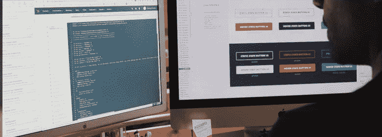

# 如何在 2019 年创建一个 B2B 电子商务网站

> 原文：<https://medium.com/swlh/how-to-create-a-b2b-e-commerce-website-in-2019-71e7513d42ae>

大多数 B2B 客户更喜欢直接从供应商那里在线购买。他们中 93%的人寻求与 B2C 电子商务网站一样顺畅的电子商务体验。

这就是为什么 B2B 电子商务网站发展的新兴领域将在未来几年继续增长。根据一项预测，通过电子商务网站进行的 B2B 销售的总份额预计将从 2015 年的 9.7%增长到 2021 年的 13.1%，到 2023 年总额将达到 1.8 万亿美元[。](https://www.forrester.com/report/US+B2B+eCommerce+Will+Hit+12+Trillion+By+2021/-/E-RES136173)

> Zfort Group 是一家[软件开发公司](https://www.zfort.com/?utm_source=MEDIUM&utm_medium=The_StartUp&utm_campaign=How_to_Create_a_B2B_E-commerce_Website_in_2019)。我们提供符合成本效益的最佳解决方案来满足您的需求。[联系我们](https://www.zfort.com/contacts?utm_source=MEDIUM&utm_medium=The_StartUp&utm_campaign=How_to_Create_a_B2B_E-commerce_Website_in_2019)免费咨询。

B2B 电子商务网站设计就是为了迎合这种偏好，为买家简化流程，形成新的业务关系。考虑到这一点，今天我们将分享我们简单的 B2B 网站开发十步法。

# B2B 和 B2C 电子商务有什么区别？

B2B 和 B2C 电子商务网站有很多相似之处，很少有不同之处。事实上，两者之间最大的区别是销售的产品类型，因为许多 B2B 公司提供服务而不是产品。然而，这并不意味着电子商务对 B2B 不起作用——他们只是需要重新思考电子商务网站到底是什么。

B2C 电子商务往往更具可见性，品牌可以利用用户生成的内容来展示真实的产品被真实的人使用。好消息是，B2B 电子商务公司可以通过整合推荐和客户评论来弥补这一点，并寻找其他方式来引入社交证明的元素，以鼓励人们进行购买。

值得注意的是，B2B 和 B2C 电子商务网站都迎合真实的人，所以不是企业对企业，它实际上是人对人。同样的技术也适用，从行动号召和相关产品推荐，到当人们在结账过程中看不到自己购买的商品时自动发送电子邮件。

# 关于建立 B2B 在线商店的快速事实

还是对建 B2B 电商店不太服气？这些指标不会说谎，而且不乏成功的案例研究，展示了 B2B 电子商务的强大力量。下面是一些最有说服力的统计数据:

*   89%的 B2B 买家在网上寻找自己需要的产品；
*   73%的 B2B 购买者使用谷歌搜索他们企业的新产品；
*   57%的 B2B 购买决策是在提交请求之前做出的；
*   76%的 B2B 购买者认为网站设计是购买决定中最重要的因素；
*   只有 5%的 B2B 买家的决策受到社交媒体的影响；
*   B2B 批发买家的平均转换率为 10%，而 B2C 为 3%

所有这些统计数据，结合不断增长的行业规模和消费者对 B2B 市场不断增长的需求，确保 B2B 电子商务网站不仅仅是最新的趋势。它们是一种面向未来的方式，可以确保你的公司在未来继续赚钱。

# 如何开发一个 B2B 网上商店

## 步骤 1:让业务和 IT 在同一页面上

这是我们清单上第一步的原因。您需要在流程的早期将您的技术需求与您的业务需求相匹配，以便每个人都朝着一个共同的目标努力。这样，你就不会在华而不实的东西上浪费时间和金钱，而错过可以提高投资回报率的关键功能。

## 步骤 2:收集需求

开发 B2B 电子商务平台的下一步是收集项目的需求，并使用它们来开发一个简介。项目的需求决定了您期望得到的响应，因为输入决定了输出。务必从您自己的角度和客户的角度来考虑需求。

## 步骤 3:构建用例

在最后一点的基础上，你会发现 B2B 网站开发最困难的部分是识别潜在客户的用例。记住 B2B 客户的购物方式和 B2C 客户完全一样——毕竟，他们也是人。试着站在这些人的立场上，理解他们在你的网站上寻找什么。

## 第四步:选择平台

我们相信最好的 B2B 平台是 [Magento](https://www.zfort.com/magento-development-services) 2，这就是为什么我们坚持为我们的客户服务。尽管如此，不同的平台在不同的情况下工作得更好，因此也值得考虑 Big Commerce，Woo Commerce，X-Cart 和 Zen Cart。我们更喜欢 Magento 开源 B2B 平台，因为它的多功能性和易用性。

## 第五步:雇佣开发团队

你的开发团队的任务是将你的愿景变成现实，所以要确保他们明白你要联系谁，以及你希望他们采取什么行动。沟通也是关键，所以当你面试潜在的合作伙伴时，一定要选择一个对你的邮件有反应的，并且渴望回答你任何问题的人。

## 第六步:选择主题

大多数顶级 B2B 电子商务平台都有不同的第三方主题，可以帮助你定制网站的外观和感觉。有些是免费的，有些则需要一次性的许可费。不要害怕在你的主题上花一点钱，如果需要的话，甚至可以要求你的开发者进一步调整它。

## 第七步:整合

如果选择主题就是定制外观和感觉，那么选择集成就像改变它的实际行为方式。例如，由于 Magento 是一个开源的 B2B 电子商务平台，因此有许多第三方集成，涵盖从支付、条款和条件到运输、营销等所有内容。

## 步骤 8:检查 SEO 指标

B2B 网站开发公司和 SEO 代理公司有很大的区别。这就是为什么这通常是一个好主意，特别是如果你没有内部技术搜索引擎优化专业知识。在你发布之前，确保你已经填写了元标题、元描述和 alt 标签，并且你已经遵守了 SEO 最佳实践。一旦你启动了这个网站，一定要确保它能被搜索引擎看到。

## 第九步:上线

当你的网站上线时，它很容易被荣耀地启动。不过，一般来说，最好选择一个软启动来开始，这样你就可以发现意想不到的错误。您还可以监控跳出率和转换率等指标，以确定结账过程中的特定步骤是否会导致人们点击离开。通过选择试运行，你可以解决这些初期问题，一旦你知道网站准备好了，就可以开始你的广告和营销工作。

## 第十步:定期更新并检查漏洞

一旦你的网站启动，你才刚刚开始。仅仅创建一个网站并向全世界发布是不够的。你还需要承诺进行定期更新，无论是以新服务的形式还是以新内容的形式。您还需要继续您在上一步中开始的 bug 测试。

# 结论

你的 B2B 电子商务网站的目标应该是提供 B2B 服务，但以 B2C 的方式。这包括提供 B2C 购物者已经了解和喜爱的所有功能，从特别优惠和独特折扣到推荐和浏览不同产品和服务的能力。

请记住，仅仅创建一个电子商务网站已经不够了，即使是在 B2B 市场，这个市场的竞争比 B2C 市场略弱，在 B2C 市场，每个人都在与亚马逊竞争。即使是最好的 B2B 电子商务网站也不是靠自己的实力获得成功的。

这就是营销和广告的用武之地，即使只是为了带来最初的几个用户。如果你的网站足够好——如果它是互动的，吸引人的，并且有你的客户需要的所有服务——那么他们会代表你去卖它。你甚至可以用附属计划和介绍费来鼓励。

最终，B2B 和 B2C 电子商务非常相似，这两个学科可以互相学习。它们也有足够的不同，对一个人有效的不一定对另一个人有效。发现什么对你有效的最好方法是尝试新事物并衡量结果。祝你好运。

还需要帮助你理解 B2B 电子商务吗？不要默默承受。在 Zfort 集团，我们建立网站，所以你不必。我们从了解你和你的客户开始，并引导你完成这个过程，使你的网站尽可能做到最好。因此，如果你正在寻找一个新的 B2B 电子商务网站，但你不知道该去哪里，请联系我们以了解更多:[https://www.zfort.com/magento-development-services](https://www.zfort.com/magento-development-services?utm_source=MEDIUM&utm_medium=The_StartUp&utm_campaign=How_to_Create_a_B2B_E-commerce_Website_in_2019)，我们很乐意帮助你！

> 如果您想了解更多，请随时联系来自一流外包软件开发公司 [Zfort Group](https://www.zfort.com/?utm_source=MEDIUM&utm_medium=The_StartUp&utm_campaign=How_to_Create_a_B2B_E-commerce_Website_in_2019) 的专家。自 2000 年以来，我们一直在各个行业提供定制软件开发服务。[联系我们](https://www.zfort.com/contacts?utm_source=MEDIUM&utm_medium=The_StartUp&utm_campaign=How_to_Create_a_B2B_E-commerce_Website_in_2019)或填写表格，让我们知道如何为您提供帮助。

最初发表于[zfort.com](https://www.zfort.com/blog/create-b2b-ecommerce-website-2019?utm_source=MEDIUM&utm_medium=The_StartUp&utm_campaign=How_to_Create_a_B2B_E-commerce_Website_in_2019)。

## 这篇文章发表在 [The Startup](https://medium.com/swlh) 上，这是 Medium 最大的创业刊物，拥有+439，678 读者。

## 在这里订阅接收[我们的头条新闻](https://growthsupply.com/the-startup-newsletter/)。

