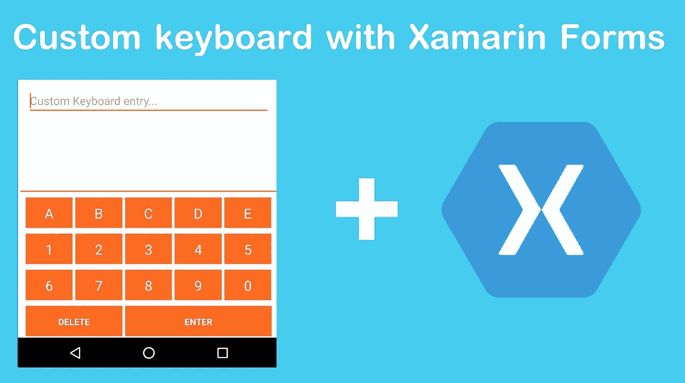
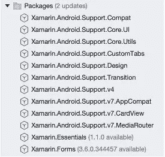
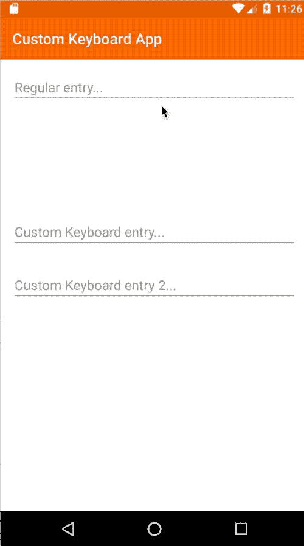

# 如何用 Xamarin Forms 创建自定义键盘(Android)

> 原文：<https://medium.com/swlh/how-to-create-a-custom-keyboard-with-xamarin-forms-android-4fa3b83dad1d>

如果你喜欢用西班牙语阅读这篇文章，请点击这个[链接](/@fabricio.bertani/cómo-crear-un-teclado-custom-con-xamarin-forms-android-dc9fd8bdd2cd)

前一段时间，一个客户要求为他的应用程序提供一个特殊的键盘，这个键盘必须具备常规 Android 键盘所不具备的某些条件。

# **正在研究**

我想到的第一个选择是添加一个禁用的`Entry`和一个`GestureRecognizer`来显示一个带有动画的控件，以模拟键盘的外观，但很快就放弃了这个想法，因为它不可重用。最好的选择是走本地道路，所以我花了很多时间研究，但我只找到了创建键盘即服务的解决方案。我知道我们的客户不会喜欢必须下载一个单独的键盘以便只在应用程序中使用的想法，我需要一个能够处理 Xamarin 表单的解决方案！
由于我不得不考虑它在 Xamarin 表单中的实现，我决定最好的选择是尝试使用入口控件的[自定义渲染器](https://docs.microsoft.com/en-us/xamarin/xamarin-forms/app-fundamentals/custom-renderer/)，因为它使用 *EditText* 作为本机控件的基础，并尝试应用我之前在其中读到的所有解决方案。幸运的是，我不是一个人在完成这项任务，我得到了尼科·米尔科夫和费德里科·马卡罗尼的帮助，谢谢你们！

# 让我们开始工作吧！

**注意:**为了正确实现自定义键盘，我们需要 Xamarin Forms 版本为`3.6.0.135200-pre1`或更高版本，因为我们需要 [OnFocusChangeRequest](https://github.com/xamarin/Xamarin.Forms/blob/release-3.6.0-rc1/Xamarin.Forms.Platform.Android/Renderers/EntryRenderer.cs#L113) 方法，该方法仅在该版本中可用。

首先，我们将创建自定义控件，它将具有下一个可绑定属性:

*   `EnterCommand`:键入`ICommand`，绑定*回车 k* ey 按键动作。

我们的自定义控件将是这样的:

现在我们转移到我们的 Android 项目，并继续在那里工作(稍后我们将返回到我们的 Xamarin Forms 项目)。
在我们继续之前，请确保准备好所有必需的 Android 软件包:

接下来我们将编辑我们的 Android `MainActivity`以避免显示本机键盘，为此我们将使用`SoftInputMode.StateAlwaysHidden`属性

我们接下来要做的是开始定义我们的自定义键盘。
在*资源/布局*文件夹中，我们将创建一个名为`CustomKeyboard`类型的`*InputMethodService.Keyboard*`的 Android 布局

首先，我们将`alignParentBottom`属性设置为 *true* ，因为我们希望我们的键盘从屏幕底部可见。
其次，我们将`keyPreviewLayout` 属性设置为 *null* ，因为在这个示例中，我们不希望在某个键被按下时出现响应布局。
正如你在`keyBackground`中看到的，属性引用了一个名为 *keyboard_background* 的 drawable，它还不存在，所以我们将在 Drawable 文件夹中创建它作为一个 xml 文件，在那里我们将为我们的键可以具有的两种状态定义一个状态选择器:*正常*(未按下)和*按下*。

如你所见，我们将不得不在 Drawable 文件夹中创建另外两个 xml，在其中我们将定义键盘的*外观和感觉*以匹配(或不匹配)我们的应用程序主题。

现在，在 *values* 文件夹中，我们将创建一个名为 **ids** 的 xml，我们稍后会用到它。

接下来，在 *Resources* 文件夹中，我们将创建一个名为 *xml* 的新文件夹。在其中，我们将创建一个 xml，我们将在其中定义特殊键盘的键。
在我们的例子中，我们的键盘将被称为 *special_keyboard* ，它将是`Keyboard`类型，我们将在其中定义我们的键的水平和垂直尺寸，`horizontalGap`和`verticalGap`属性指的是间距和尺寸类型`%p`(以防你从未见过它)是一种相对于父视图的百分比。
每一行键都将包含在由`<Row></Row>`标签界定的部分中。
我们的第一行将被一条分隔线占据，以标记我们键盘的限制。Row 标签的高度为`4dp`，我们将通过`rowEdgeFlags`属性表明它位于键盘的顶部。然后我们将在*行*标签中添加一行作为`Key`，它将占据键盘的整个宽度。我们的分隔符只是我们将在 Drawable 文件夹中创建的另一个 xml:

每个*键*将有两个严格必要的属性:`**codes**`和`**keyLabel**`**代码**将是一个数字，告诉操作系统该键对应什么字母或符号。**在这一点上，我想澄清一些事情:**我发现了几十个关于为 Android 创建自定义键盘的示例，他们使用了许多不同的代码来指代某个符号或按键。在我尝试过的所有代码中，已经实现的最好的代码列表如下: [Android 键码](http://www.temblast.com/ref/akeyscode.htm)。你也可以看到官方的 Android 文档，甚至是 Xamarin Android 文档，但是没有一个是精确的。
**keyLabel** 是将要在我们的键中显示的字符串，即使我们不想在我们的键中显示任何文本，放置这个属性也是非常重要的(在那种情况下它将是`keyLabel=""`)。
为了决定样式，在每一行的开头和结尾，我添加了一个键，其*代码*等于 0(所以你没有任何动作)，宽度也为 0，间距为`2%p`，这些键也将携带`*keyEdgeFlags*`属性，其值为`left`或`right`。
这里我们的全键盘:

最后，在开始使用我们的渲染器之前，我们将在资源中创建另一个文件夹，名为 *anim* 并带有一个 xml，我们称之为`slide_in_bottom`这将是我们的键盘出现在屏幕上的动画。

现在，我们将在我们的 Android 项目上创建一个新文件夹，名为 *Renderers* ，在那里我们将创建我们的渲染器，我们称之为`EntryWithCustomKeyboardRenderer`，它将从`EntryRenderer`扩展并实现接口`IOnKeyboardActionListener`同样在我们的自定义渲染器中，我们将创建一个名为`NullListener`的私有类，它将从`Java.Lang.Object`扩展并实现接口`IOnKeyboardActionListener`，我们将在渲染器中使用它来避免空异常。

最后，我们回到 Xamarin Forms 项目，实现我们的特殊键盘。

在我们后面的代码中，我们实现了之前创建的`EnterCommand`,用于我们在自定义键盘上按下 *Enter* 键时想要发生的动作。

下面是最终结果:

您可以在 GitHub 上看到完整的样本库

 [## FabriBertani/CustomKeyboardXamarinForms

### 如何使用 Xamrain Forms (Android)创建自定义键盘 GitHub 是超过 5000 万开发人员的家园…

github.com](https://github.com/FabriBertani/CustomKeyboardXamarinForms) 

在下一篇文章中，我们将看到如何制作一个复杂的自定义键盘！

感谢阅读😁