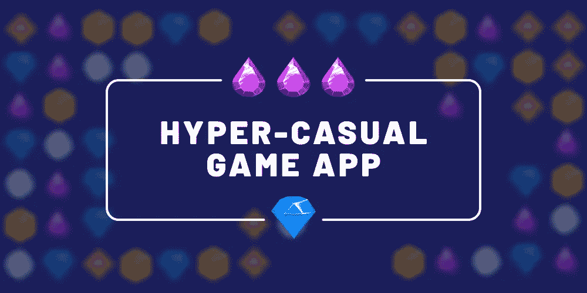
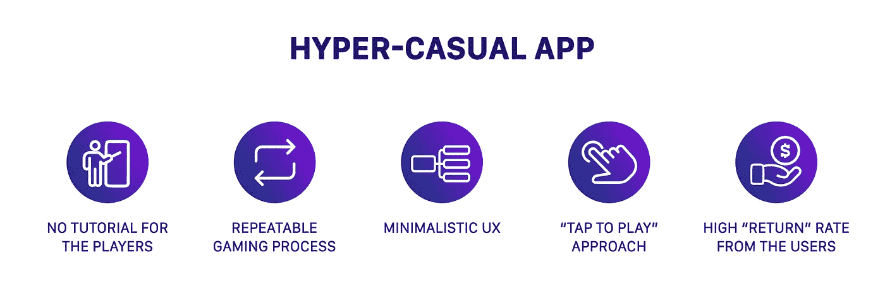
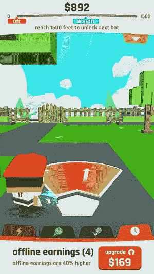
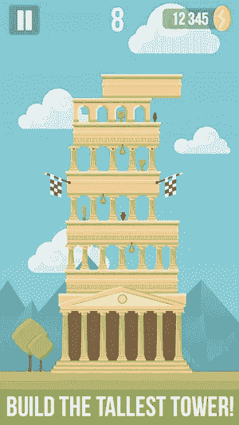
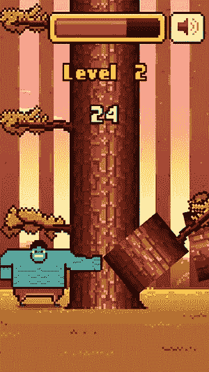
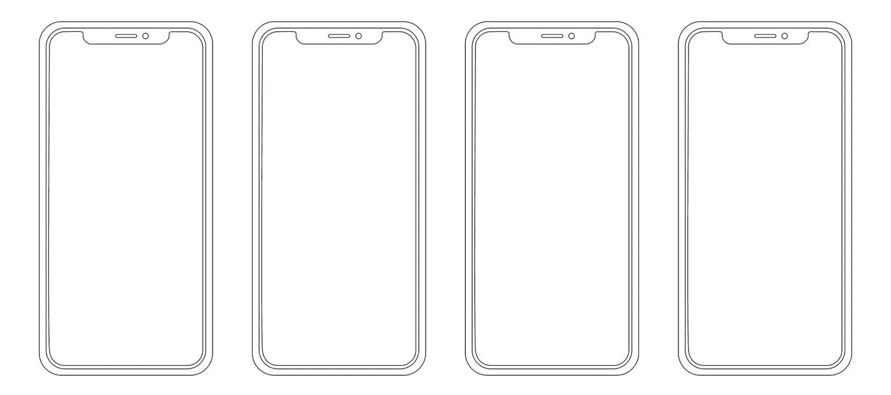

# 如何创建一个超休闲游戏应用程序

> 原文：<https://medium.com/swlh/how-to-create-a-hyper-casual-game-app-2eb567ebb86c>

超休闲的移动应用已经成为一件大事，并引起了人们的讨论。虽然这种类型的游戏并不新鲜，但它只是在最近几年才开始飙升，并获得了大投资者的关注。2016 年，育碧[收购了](https://www.eurogamer.net/articles/2016-09-28-ubisoft-buys-mobile-game-company-behind-threes-clone-2048) Ketchapp，著名的伏都教公司[看到了](https://blog.applovin.com/hyper-casual-mobile-gamings-newest-genre/)2 亿美元的投资。

超休闲应用是怎么回事，如何创建一个能让你领先的应用？让我们来分解一下科学。

# 超休闲应用:它们是什么？

总的来说，有三个 app 类别，休闲类，中核心类，硬核类。休闲游戏是其中最简单的，而硬核应用的游戏玩家需要更多的社交，并愿意进行应用内购买。现在，又出现了一个应用类别，那就是超休闲应用。

顾名思义，超休闲的应用程序是即时可玩和轻量级的。

关于超休闲游戏的另一个问题是，他们没有太多的 IAP(应用内购买),有些人根本不在乎这些游戏。这种类型的应用程序是通过广告盈利的，但我们很快就会看到盈利策略。

你现在需要记住的是:超休闲是即时的、有趣的、令人上瘾的。

# 超休闲应用的机制:前三个例子

如果你正在考虑开发一个超级休闲的应用程序，你必须熟悉最流行的机制。

## 敲击/计时

这种机制是最受欢迎的机制之一。它的想法很简单:用户必须点击准确的时间，完美的点击会带来最高分。这种游戏的设计非常简单，因为没有什么会分散玩家对游戏过程的注意力。

对于点击/计时游戏来说，重要的是视觉元素。它们应该清楚地表现糟糕的击球，并对“完美的拍子”有一个有吸引力的、可见的正面强化。

*例子*:伏都教的棒球男孩

## 堆垛

顾名思义，玩家必须通过点击来堆叠对象。在这类游戏中，先前的点击会影响整体进度，并且随着用户进一步进行，游戏复杂度会增加。

堆叠游戏通常有 5-10 个失败点，但是每个失败点允许玩家继续。同样，让游戏足够困难，这样玩家有高达 40%的不完美计时。

*例子:*凯查普的塔

## 灵巧

这些游戏需要用户的技巧、速度和灵巧。游戏过程通常非常简单，只有一个可重复的动作，但游戏速度加快，难度加大。

在灵巧游戏中，一个错误将结束这一轮，玩家从最开始开始。因此，游戏最重要的部分是控制和输入敏感度。

*例子:* Timberman by Digital Melody

# 游戏开发过程的概要

在这里，我们将看看游戏开发过程的基本步骤。要创建游戏应用程序，您需要:

*   电脑:在上面安装游戏引擎。根据你想要的平台，你需要一台 PC 或者 Mac。
*   智能手机:测试游戏。同样，它要么是 iPhone，要么是 Android(或者两者都是！).
*   开发者的帐户:能够提交游戏到商店。
*   工具:你既可以使用免费的可用资源，也可以创建自己的资源(比如音乐或背景)。

至于游戏引擎，有四个选项可供选择:

*   游戏模板:你只能改变角色，背景和音乐。这是一个现成的选项，您不需要创建任何新的东西，而是使用可用的组件。
*   拖放:这也是初学者的一个选择。您将能够对游戏对象应用特定的行为(例如，如果我点击，一个球将会跳动)。
*   可视化脚本:你不需要编码，但是仍然能够创建“节点”来代表游戏对象的动作。
*   编码:这个很清楚。有了这种类型的游戏引擎，你可以从头开始创造一切，这就是游戏应用大师所做的。

查看这篇[文章](https://apptooltester.com/how-to-make-a-game-app/)以获得更多关于游戏引擎及其概述的信息。

现在让我们进入实际的开发过程。因为超级休闲应用的创建，一般来说，和几乎任何手机游戏应用的创建是一样的，所以我们描述了一个标准框架。

# 第一步。[设定目标](https://dashbouquet.com/blog/mobile/blog/startups/6-steps-to-develop-mvp)并列出所有事项。

虽然看起来很容易，但这些步骤很重要。

你想要概述你的战略，定义商业目标(是成功，大量的金钱还是第一次尝试？)，并列出你未来应用的愿景。根据目标和应用程序，您可以继续选择平台和制定营销策略。

# 第二步。三维线框模型

通过创建一个线框，你将能够可视化的应用程序，并创建其初始设计。这将作为进一步开发应用程序的基础。

你可以在网上找到很多创建线框的工具。

# 第三步。定义后端

在这一步，开始考虑服务器、API 和数据图。清晰的图表是必要的，因为它们将向团队中的每个人展示项目大纲及其进展。

做一些研究，查看可用的应用构建器或类似服务(如[解析](https://parseplatform.org/))。一旦您确定了后端，就可以设置服务器、数据库和 API。

# 第四步。构建应用程序。

这是实际的开发阶段，你将把你的应用程序放在一起。既然你想了解超休闲应用的创建，这里有几个方面可以考虑:

*   选择机制:[在这里](https://mobilefreetoplay.com/top-10-game-mechanics-for-hyper-casual-games/)你可以找到超级休闲游戏的 10 大机制。
*   坚持简约设计。
*   非常注意控制。
*   不要要求注册、登录或其他任何东西。尽可能保持简单。
*   关注 UX 和用户界面。

# 第五步。测试并上传

应用程序开发的另一个关键部分是测试。确保没有 bug、滞后或恼人的元素，直到你的测试用户 100%满意为止。

之后，学习商店指南，并按照指南[上传](https://dashbouquet.com/blog/mobile/blog/mobile/practical-guide-how-to-register-account-in-itunes-and-submit-an-app-to-the-app-store)你的应用程序。

# 创建一个应用程序的成本

应用程序的成本取决于平台、组件、设计复杂性和其他因素。更简单地说，在 DashBouquet，我们提供了一个 MVP [计算器](https://dashbouquet.com/blog/mobile/mvp-calculator)来给你一个平均价格的概念。

但是，也有一些平均数。正如 Clutch 所言，一个应用程序开发的中值成本约为 17 万美元，范围可以在 10 万美元到 50 万美元之间。

我们能给你的建议是找一家专门开发移动应用的公司。这些公司通常拥有丰富的投资组合和良好的专业知识，可以根据您的要求提供高质量的结果。

# 总结

如果你想创造另一只“Flappy Bird ”,那就做好要么成功要么失败的准备。有数百个类似的游戏，但只有几十个能做大。然而，如果你有一个独特的想法或出色的设计，你很有可能会成功。

只要记住开发这类游戏的各个方面，并坚持下去。想一个下面的例子:一个人在等公交车，有几分钟时间玩你的游戏。够了吗？在巴士来之前，玩家至少能完成一轮吗？

作为经验丰富的应用程序开发人员，DashBouquet 团队知道可能存在的陷阱，并乐意帮助您避免它们。

[*德米特里·布科*](https://www.linkedin.com/in/dmitrybudko/%5C) 撰写

## 这篇文章发表在 [The Startup](https://medium.com/swlh) 上，这是 Medium 最大的创业刊物，拥有+415，678 名读者。

## 在此订阅接收[我们的头条新闻](http://growthsupply.com/the-startup-newsletter/)。

