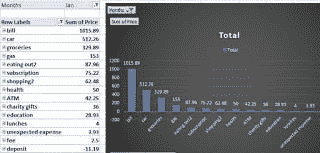

# 如何创建每月预算？

> 原文：<https://medium.com/swlh/how-to-create-a-monthly-budget-55c2efd49e5c>

曾经有一段时间，我不知道我的钱去了哪里，也不知道我该拿这些钱做什么。

不用说，我靠一张张的薪水支票和信用卡债务生活。

我当时不知道的是，任何人都可以建立一个缓冲垫，一个应急基金，即使它很小或从零开始。

如果你保持一致性，养成正确的习惯和系统，你就能看到你的应急基金开花结果；也是通向更好、更有条理的财务生活的直接途径。

我从未想过我会成为写如何做预算的人。我觉得预算听起来太“严格”了。我曾经认为我可以自己想出省钱的方法，而不需要做预算。不对。或者至少对我来说是这样。

我敢打赌，世界如此之大，以至于有些人不需要预算，也从来没有使用预算的必要；但是对于我们 90%的人来说，这是最好的开始方式。

以下是我在制定每月预算的过程中学到的一些技巧。

1.收入:首先要清楚你的收入来源。这很容易，因为对我们大多数人来说，当我们只有一种收入来源时，我们就需要预算:我们的工作。或者当我们入不敷出，过着入不敷出的生活。

清楚地知道你有多少收入来源，每个月挣多少钱。一旦有了这个数字，就要内化为你的开销不能超过这个数字。

是的，听起来很明显；但是用信用卡支付是如此的简单，因为“不管怎样，我们下周会得到报酬”。不对。这种行为只会让你生活在不断的债务中。债务就像一个雪球，它可能开始很小，但它会变得不可阻挡。确保在量入为出上做出妥协，不要向未来的自己、未来的薪水支票或信用卡借钱。

澄清一下，信用卡不是邪恶的，但是你需要学会使用它们，我们中的很多人都经历了惨痛的教训。

2.你的钱去哪了？。如果你对自己的可变开支有一个非常清晰的概念，那就固定开支；你在汽油、订阅、外出就餐上的花费；直接跳到第三点。否则，继续读。

首先，你需要弄清楚你的钱去了哪里，这样你才能制定一个准确的预算。这可以分两步完成。

a)。通过你的支票账户/信用卡账单回顾上个月的支出。如果你在任何地方都使用借记卡或信用卡支付，这将特别有用；因为它们会登记在你的账户里。如果你用现金，却不记得怎么花的，你应该把注意力放在下一步。

b)。记录你的开销:这不是我第一次提到记录开销有多重要；这真的很重要。我向任何想更好地了解自己财务状况的人推荐，这是第一步。在开始追踪你的开销之前，试着回顾一下你上个月的开销；当月及次月，共 3 个月。这不需要很多时间。每周只需半小时或更少。我通常在周三晚上做。我最好的建议是计划一下，检查一下你账户上上周的花费。你会对你能找到的东西感到惊讶。你忘了你正在支付的订阅费，可能连续 3 或 4 天外出就餐，甚至没有意识到这一点。不要相信你的记忆，相信你的银行对账单。

第二；如果你认为需要钱，你应该认真考虑一些关于钱的自我意识的工作。

你是强迫性购物者吗？，你会把所有东西都花在特定的东西上吗(比如酒、钱包、鞋子)？，你有关于金钱的童年剧本吗？，你对于金钱，储蓄，量入为出是什么心态？，你花钱是为了给别人留下深刻印象吗？。

像那样的问题很难问自己，答案可能是痛苦的；但是这种自我意识的练习会让你超越你的剧本和关于金钱的精神障碍，以及你如何使用它。

3.一旦你非常擅长追踪你的开销。你需要定义什么是值得保留或削减的，什么是值得花费的，什么是你的固定开支。

首先确定你的固定基本开支，租金或抵押贷款，贷款付款等。

遵循你的固定的非基本开支，如订阅费、会员费、每月支付相同价值的东西；但不是基本的，当然你会在财政紧急情况下削减，比如失业。

定义你的可变基本开支，如食物、汽油、公用事业。既然你已经成为跟踪你的花费的大师，你可以为这些花费定义一个平均值。记住这些数字，因为它们将是你预算的一部分。

找出你可变的非基本开支，例如购物、外出就餐、娱乐等。这有时被称为金钱乐趣类别。

你不必从生活中削减可变的非基本开支，你只需要为自己确定合适的金额，根据你的中长期目标进行调整。

4.在你目前的花费和你想要的财务状况之间找到一个折中的办法。

我建议一开始避免紧绷。这会让你失望。

缓慢但持续地开始，从你的开销和生活中削减任何你不需要的东西，找到让你开心的好的替代品。您知道自己没有使用的订阅；也许从零花钱中削减一些钱，有时烹饪而不是外出就餐，有时带午餐去工作而不是购买，这些都是从长远来看会为你节省很多钱的替代例子。

到这个时候，你应该对你的开支和你这个月的开支目标或预算有一个非常清楚的想法；虽然有几件事要考虑，以完善你的预算。

5.预算大额购买/支出:有时你知道你将来会有一笔大额支出；但是你仍然不愿意把它包括在你的预算里。我就是这种人。

包括在你的预算开支中，你知道你会有，会让你省去许多头痛和失望。

生日礼物、朋友的婚礼、假期、周年纪念、文件更新都是这一类的例子。

在制定我的每月预算之前；我会考虑特殊场合以及我会花多少钱买礼物。例如，在二月份，我会确保在我的预算中为我父亲的生日预留一些钱。

这真的很有帮助，并提供了一种为未来事件进行规划和建立系统化结构的方法。

6.意外预算:

为意料之外的事情留有余地真的很有帮助；许多人会从他们的应急基金中拿出钱来应对突发事件。我认为预算一些小的意外开支会更进一步。

基本上，你只需将月收入的 10%左右用于意外情况，比如你忘了的账单(汽车注册更新)，爆胎，生病时医生的共付额。

当然，会有这样的时刻，你对意外事件的预算不足以应付一个大的意外事件，但是处理小的意外事件就是处理大部分的意外事件。

如果你发现你没有用你的预算来应付这个月的突发事件；你可以把它加入你的储蓄，花掉它，或者把它作为下个月的盈余。

7.首先支付自己:

记得在你的预算中包括一些储蓄，不一定要很多；但它必须是一致的。

一致性是成功的关键和动力。

与其把剩下的钱存起来，不如采取双重方法。首先通过把钱存入你的储蓄来支付你自己，在月底，无论剩下什么，假设你在你的预算之内，也可以加入你的储蓄。

8.制定预算。

通过将你的固定基本支出+固定非基本支出+可变基本支出+可变非基本支出+预算支出+意外支出相加；你的总预算会有一个神奇的数字。

下面是它看起来的一些例子。

9.计划最好的情况会让你泄气。关键是试着给自己一点压力，通过明智的购买而不是冲动的购买，削减不必要的开支；但请记住，生活总是会发生，有时我们无法控制或避免事情的发生。

为一个现实的场景而不是一个最好的场景规划和建立你的预算会让你走得更远，让你更快乐。

你了解你自己，你知道你是否有可能遵循你所设定的条件。

我记得当我开始做预算时，我不包括外出就餐或在家分娩的钱。那时候，我根本不做饭。这是一个需要立即完成的巨大目标。第一次很惨的失败了，当我终于有一个月没有出去吃饭的时候，我并不享受。

我发现我有时确实喜欢在外面吃饭，为此我在预算中加入了一些；最重要的是，这是我愿意支付的金额，并意识到要量入为出。

10.做对了就奖励自己。

当你持续达到预算，并有空间开始积累，最终达到应急基金或储蓄目标时，这种感觉真是太棒了。

给自己一个鼓励，奖励自己出色的工作。

把自己和过去的自己比较一下，看看自己已经走了多远。

留点庆祝的空间。

通常在年初，当我设定目标时，包括预算目标，这意味着每个月都要达到我的预算，我也喜欢包括对进展的奖励。

比如，如果我连续三个月达到预算，我会允许自己做一次日间水疗，或者买一些我渴望已久的东西。

这很有趣，同时给你完成预算目标的动力。

记住，成功没有捷径，要成为最好的自己，你必须努力工作。

祝你努力成功！

链接到您将找到的最简单的预算和跟踪表:

[https://drive . Google . com/file/d/1 tc9 nm 20 agzjzal 6 bxtxvmib 3 oqo _ jUur/view？usp =共享](https://drive.google.com/file/d/1Tc9nM20aGzJzaL6BxtXvMIB3OqO_jUur/view?usp=sharing)

2019 年 3 月 10 日