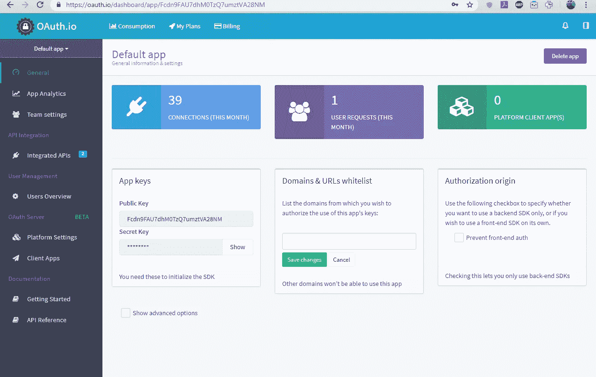
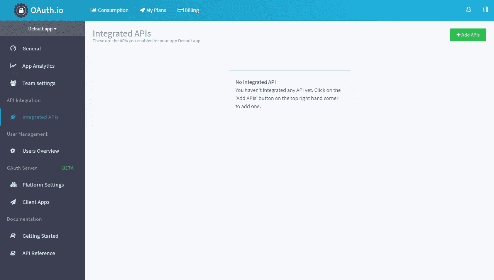
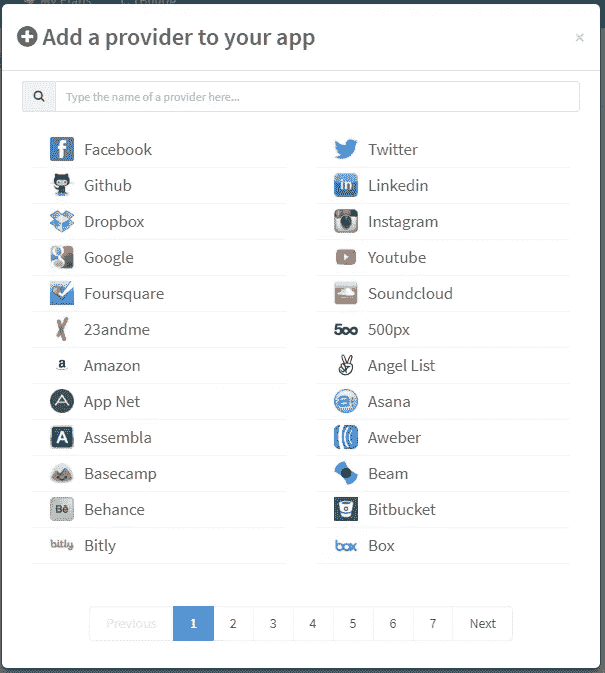
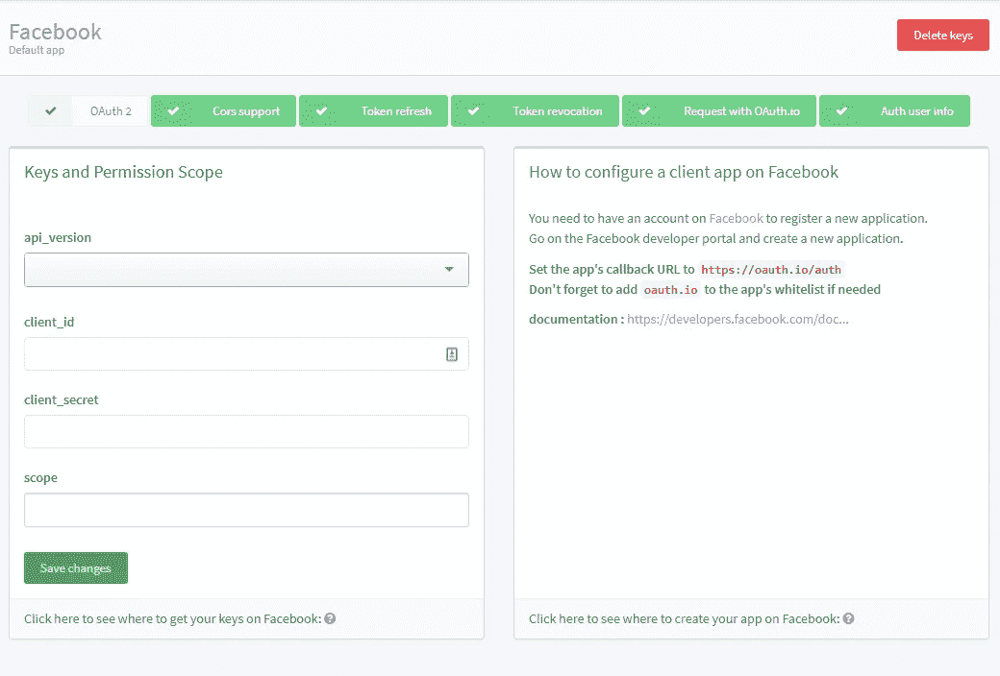
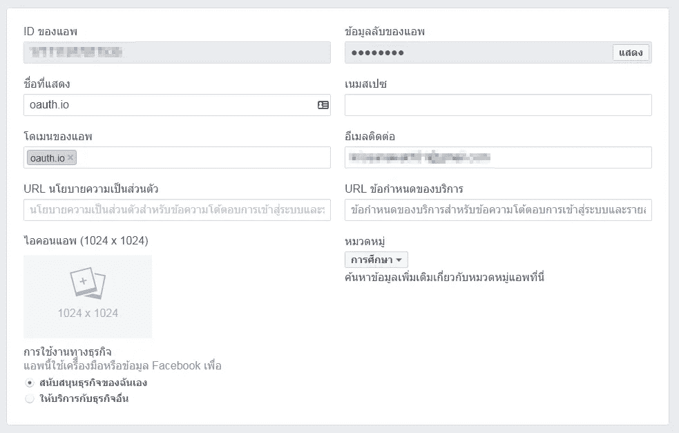
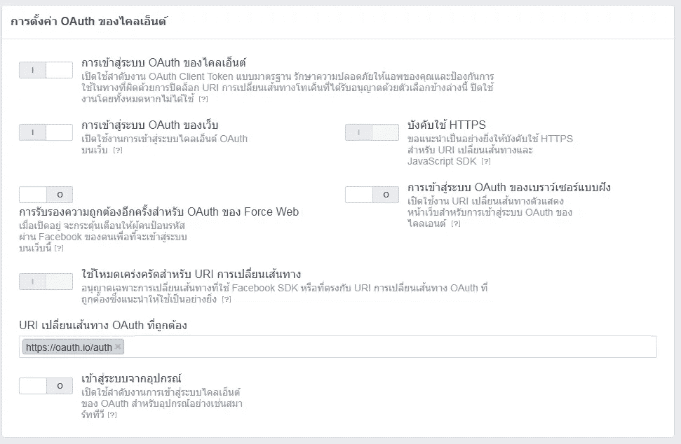
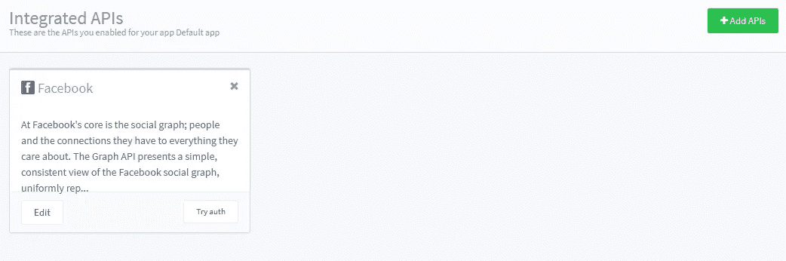
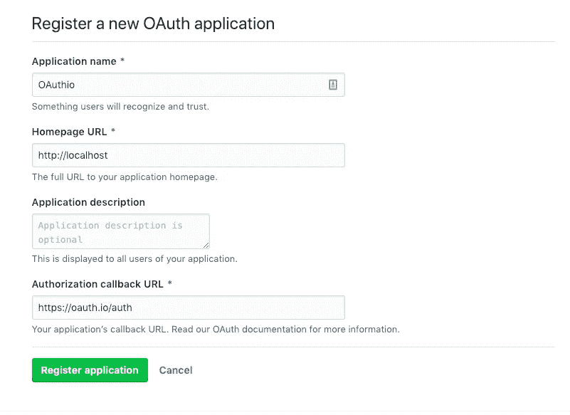
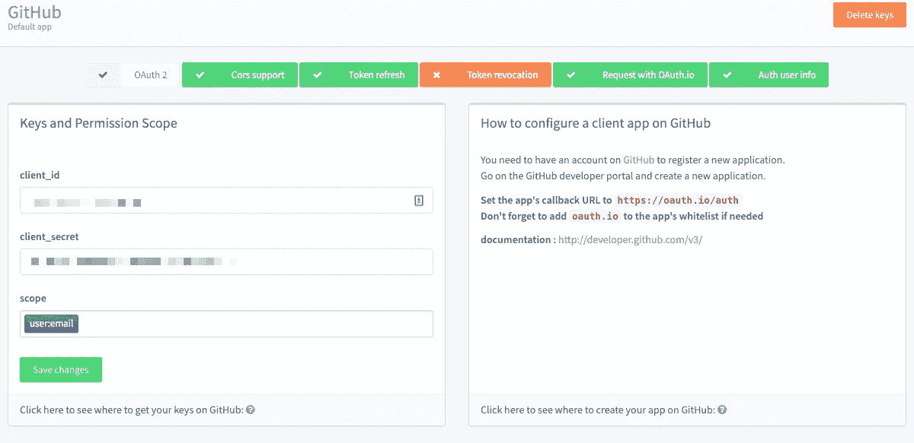
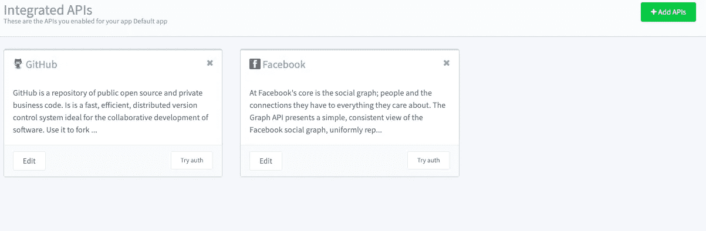

# 如何用 Oauth.io 创建一个简单的 OAuth 角度组件

> 原文：<https://medium.com/swlh/how-to-create-a-simple-oauth-angular-component-with-oauth-io-ca92e77590fd>


# 特色课程

## [掌握 Angular (Angular 2+，包括 Angular 7)并使用 Angular 的继任者构建出色的反应式 web 应用。js](https://click.linksynergy.com/link?id=qt/jYwyHv8A&offerid=507388.756150&type=2&murl=https%3A%2F%2Fwww.udemy.com%2Fthe-complete-guide-to-angular-2%2F)

## [完整的角度课程:从初级到高级](https://click.linksynergy.com/link?id=qt/jYwyHv8A&offerid=507388.1987226&type=2&murl=https%3A%2F%2Fwww.udemy.com%2Fangular-js-complete-course%2F)

谁不想专注于创建产品而不是处理代码中的 OAuth 逻辑呢？将代码中的 OAuth 占用减少到一个请求！

在这篇文章中，我们将在 Angular 中用 [OAuth.io](https://oauth.io?utm_source=medium&utm_medium=post&utm_content=krissanawat&utm_campaign=oauthio-angularjs) 创建一个简单的 OAuth 组件。更容易使用 5 线


## 设置 OAuth.io 用户

在 Oauth.io 注册，免费！


登录后，您将进入如下所示的仪表板。



您可以尝试任何集成，但首先要设置集成的 API。

# 添加 API

点击添加 API。



选择脸书作为应用程序的提供商。



现在，您需要 client_id 和 client_secret。因此，创建一个脸书应用程序来获取这些凭证。



转到[https://developers.facebook.com](https://developers.facebook.com)创建一个应用并插入 oauth.io 作为应用的域。



将回拨 URI 添加为 oauth.io/auth



将 id 和秘密放入 OAuth.io 的表单中。


点击保存，你也可以添加更多的 API。让我们先利用脸书 API。



Github 的第二个服务是

转到[开发者设置](https://github.com/settings/developers)


创建新应用程序


填写应用信息



复制应用程序 id 和应用程序密码



我们得到两种服务



# 创建角度分量

创建角度组件以使用 Oauth.io SDK。oauth.io 的文档位于 [http://docs.oauth.io](http://docs.oauth.io/)

为了快速演示，我将使用 Codesandbox 准备一个小组件。


1.  打开`oauth.component.css`并导入必要的 CSS

```
@import "https://cdnjs.cloudflare.com/ajax/libs/twitter-bootstrap/3.4.0/css/bootstrap.css";
@import "https://cdnjs.cloudflare.com/ajax/libs/bootstrap-social/5.1.1/bootstrap-social.min.css";
@import "https://stackpath.bootstrapcdn.com/font-awesome/4.7.0/css/font-awesome.min.css";
```

2.打开`oauth.component.ts`并导入必要的类

```
import { Component, Input } from "@angular/core";import { OAuth } from "oauthio-web";
```

3.用名称选择器构造组件并包含一个模板文件

```
@Component({
  selector: "oauth",
  templateUrl: "./oauth.component.html",
  styleUrls: ["./oauth.component.css"]})
```

4.创建类和属性来存储与属性一起传递的服务名

```
**export** **class** OauthComponent {
  @Input() provider: string;
}
```

5.用`initialize`初始化 OAuth-io SDK，并从 OAuth.io 仪表板添加 API-key

```
**constructor**() {
    OAuth.initialize("Fcdn9FAU7dhM0TzQ7umztVA28NM");
  }
```

6.创建 OAuth 处理程序方法

```
Auth() {
    OAuth.popup(**this**.provider)
      .done(res => {
        console.log(res.access_token);
      })
      .fail(err => {
        *//todo when the OAuth flow failed*
      });
  }
```

7.添加一个登录按钮和类，事件句柄到`oauth.component.html`并连接属性和类

```
<a (click)="Auth();" class="btn btn-block btn-social btn-{{provider}}">
	<span class="fa fa-{{provider}}"></span> Sign in with {{ provider }}
</a>
```

8.在`app.module.ts`中导入并注册该组件

```
import { BrowserModule } from "@angular/platform-browser";
import { NgModule } from "@angular/core";

import { AppComponent } from "./app.component";
**import { OauthComponent } from "./oauth/oauth.component";**
@NgModule({
  declarations: [AppComponent, **OauthComponent**],
  imports: [BrowserModule],
  providers: [],
  bootstrap: [AppComponent]
})
export class AppModule {}
```

9.最后，通过放置在`app.component.html`来激活组件

```
<div class="container">
	<div class="row">
	<h1>Social login with OAuth.io</h1>
	<div class="row">
		<div class="col-sm-4 col-md-offset-4">
			<oauth provider='facebook'></oauth>
				<hr>
			<oauth provider='github'></oauth>
		</div>
	</div>
</div>
```

在 Codesandbox 上查看实时结果

# 包扎

本教程到此为止！

我们创建了一个有角度的 OAuth 组件，使用 [OAuth.io](https://oauth.io?utm_source=medium&utm_medium=post&utm_content=krissanawat&utm_campaign=oauthio-angularjs) 来呈现一个简单的脸书和 Github 登录选项

希望你玩得开心，随时评论和询问任何事情。鼓掌表示支持！

[](https://medium.com/swlh)

## 这篇文章发表在 [The Startup](https://medium.com/swlh) 上，这是 Medium 最大的创业刊物，拥有+415，678 名读者。

## 在这里订阅接收[我们的头条新闻](http://growthsupply.com/the-startup-newsletter/)。

[](https://medium.com/swlh)