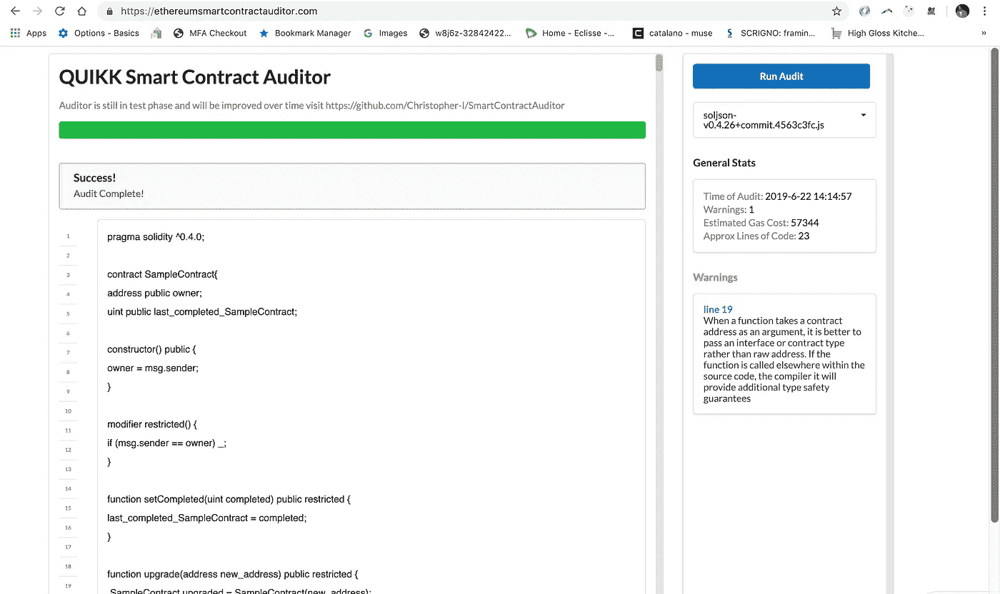

# 如何为 Web 创建一个以太坊自动智能合同审计器？

> 原文：<https://medium.com/swlh/how-to-create-an-ethereum-automated-smart-contract-auditor-for-the-web-e0ac5c9dfa77>

如今，审计高级智能合同的成本可能在 50，000-100，000 美元之间，有时甚至更高，此外，通常需要几个月才能完成一次全面的审计。那么为什么不将这个过程的大部分提取给自动化的软件审计员呢？如果有一件事我们称为 devs，那就是验证复杂和高度详细的东西，如代码…