# 如何创建一个赚钱的 Instagram 转发账号

> 原文：<https://medium.com/swlh/how-to-create-an-instagram-repost-account-that-makes-money-928a404560>

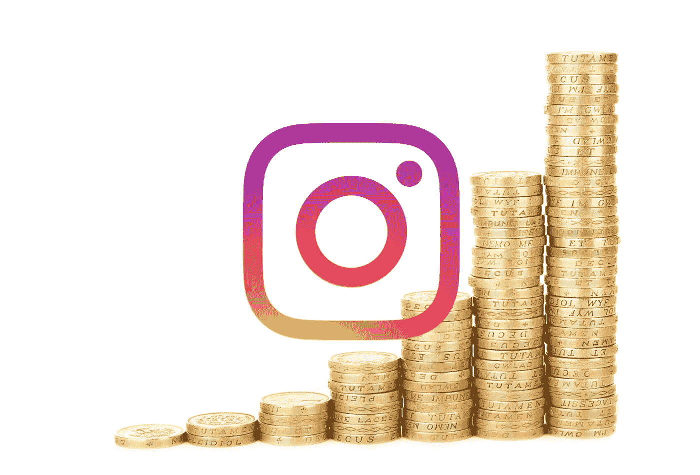

建立一个创造价值的转发账户是任何人在 Instagram 上获得收入的最便捷方式。

在我开始[、](https://www.instagram.com/pinlord/)[、【potteryforall】、](https://www.instagram.com/potteryforall/) [@macramemakers](https://www.instagram.com/macramemakers/) (我的 Instagram 转帖账号)之前，我是一个很少使用 Instagram，内容创作技能有限，但对一个话题([搪瓷别针](https://www.pinlordshop.com/))充满热情，并愿意投入必要的工作来建立一个在线小企业的人。现在，我每月收入超过 3500 美元，近 3 年来我一直靠账户谋生(我通过 [Instagram 小企业课堂](https://theinstaclass.co/)分享我用来发展业务的每一项活动和策略。看看这个。它帮助我能够继续为你写这些文章)。

创建一个 Instagram 转发账户并不是为了赚钱，也不是为了擅长拍照，或者写标题，或者成为“[有影响力的人](https://hackernoon.com/how-to-measure-what-an-instagram-influencer-is-worth-cb488f605ffe)”。这是关于理解转帖账户如何创造价值，并愿意投入必要的工作来长期有效地执行正确的策略。

如果我能做到，你也能…方法如下:

# 转帖账号是做什么的？

从技术上来说，一个转发账户通过 [Instagram 标签](/swlh/instagram-hashtags-everything-you-need-to-know-3761a825a268)和 Instagram 上的账户进行分类，收集关于某个小众主题的内容，并将其发布在一个地方。

就我个人而言，我倾向于认为转发账户做的是杂志曾经做过的事情，但在 Instagram 的背景下。

你收集关于某个特定主题的所有最有趣/最吸引人/最有价值/最新的内容，以吸引尽可能多的对该主题感兴趣的观众，然后你向广告商收取费用来吸引这些观众。

例如，[Better home and Gardens Magazine](https://www.bhg.com.au/)创建了关于如何打理你的家和花园的内容，以吸引想要了解该主题的读者。在他们建立了庞大的读者群后，他们向销售家居和园艺相关产品的公司收费，向他们的读者做广告，因为通过在杂志上宣传他们的产品，他们销售了产品。

我的 [@potteryforall](https://www.instagram.com/potteryforall/) 账号也做同样的事情。我在 Instagram 上发布最好的独立陶器相关内容，以吸引那些想了解平台上最好的陶器的用户，并在一个页面上轻松找到所有内容。一旦我有了一大批粉丝，我就开始向陶器卖家收取费用，让他们在我的 Instagram 账户上获得推广，因为通过推广，他们会被关注他们账户并购买他们陶瓷的新观众发现。

转帖账户通过建立一个页面，为其推广的账户带来流量和销售额，从而创造价值。赚钱，这才是你转帖账号应该做的。

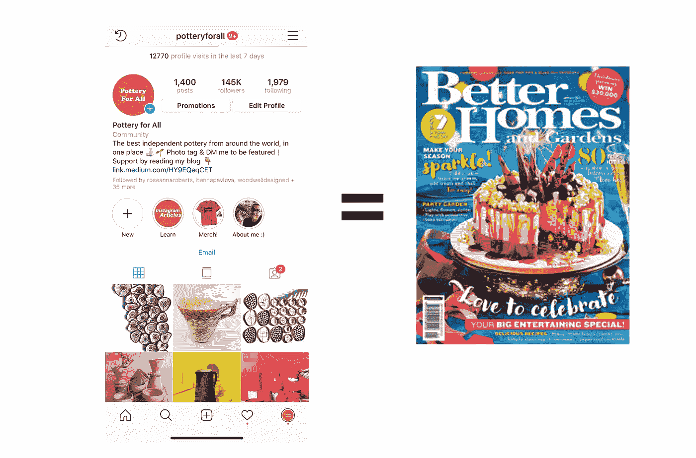

Btw, here’s an awesome about the best [Instagram content scheduling and post automation tools](/better-marketing/the-best-instagram-content-scheduling-and-post-automation-tools-2e52e48373d3). Using the will help you make your posting process MUCH more efficient.

# 你如何创造一个？

通过执行以下步骤，您可以创建一个快速增长的转贴账户，并从中获利:

1.  **选择合适的利基市场:处于引进或成长阶段的利基市场，受商业驱动，没有或只有少数其他已建立的转帖者。**我强烈推荐你在开户前阅读我的关于** [**Instagram 小生境**](http://in an introduction or growth phase) **及其阶段的文章。在正确的阶段处于合适的位置是能够发展转帖账户的最重要的部分，你可以现实地赚钱。****
2.  **选择正确的用户名:**短而易记，以人们搜索你的职位时会输入的单词开头。
3.  **找到高参与度的内容，请求创作者允许发布，每天发布一次:**通过在你的领域发布最高参与度的照片和视频，你众包了已经被证明能有效产生兴趣的内容。
4.  **创建一个高度差异化的账户:**其他竞争转帖账户将被创建或已经存在。除非你是最与众不同的，否则你无法建立长期的业务。
5.  **产生大量与利基相关的互动:**通过最大化与利基相关的互动，你可以更快地接触到你的目标受众，从而更快地成长。
6.  **收费:**一旦你建立了一个推动流量和销量的账户，你就可以对转帖收费。你越专业，越有效，你就越有可能建立长期的业务。

为了向你展示所有这些是如何应用的，我将用我的转帖账户 [@potteryforall](https://www.instagram.com/potteryforall/) 作为例子。

# 1.选择合适的利基市场。

要想建立一个快速增长的转帖账户并从中赚钱，你首先需要专注于满足以下要求的利基市场:

**答:这是一个专注于商业的利基市场:**当我说专注于商业时，我指的是一个有大量创作者通过他们的 Instagram 出售一些东西的利基市场，比如[陶器](https://www.instagram.com/potteryforall/)、 [macrame](https://www.instagram.com/macramemakers/) 或[珐琅别针](https://www.instagram.com/pinlord/)。基本上任何一个话题，创作者在你的账号上推广的时候会靠卖东西赚钱。如果创作者可以通过在你的账户上转帖赚钱，他们会愿意为此付费。

比如在 [@potteryforall](https://www.instagram.com/potteryforall/) 中我专注于 Instagram 上的独立陶艺小众。我推广的大多数独立陶工都是通过将 Instagram 的流量带到他们的网站来销售作品的，所以通过在他们的账户上获得流量，他们卖出了更多的陶器，赚了更多的钱。

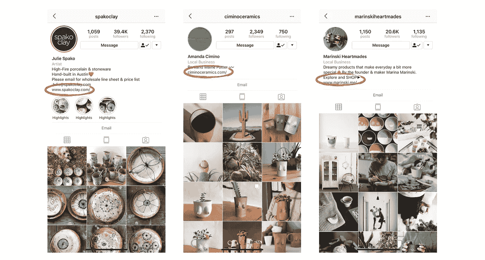

Have you ever asked yourself [if your Instagram is worth growing?](/better-marketing/how-to-know-if-your-instagram-is-actually-worth-growing-c0874be37fc5) You should. It might save your a whole lot of time and effort…

**B)你必须成为利基市场中的第一个(或第二个)转发者:**为了从你的账户中可靠地赚钱，你必须在你的转发利基市场中拥有第一个或第二个最大的追随者和参与度(b [@potteryforall](/the-mission/why-your-instagram-account-isnt-growing-and-why-it-s-not-because-of-the-latest-instagram-523f6137014b#当代陶艺</a>与我在<a class=) 上发布的独立陶艺非常相关。为了找到相关的账户，我会浏览排名靠前的帖子(Instagram 归类为最吸引人的贴有#contemporaryceramics 标签的帖子)，查看发布我最感兴趣的内容的账户，如果它们相关，我会关注它们，并查看 Instagram 推荐的类似账户，就像我之前在浏览器页面中所做的那样。

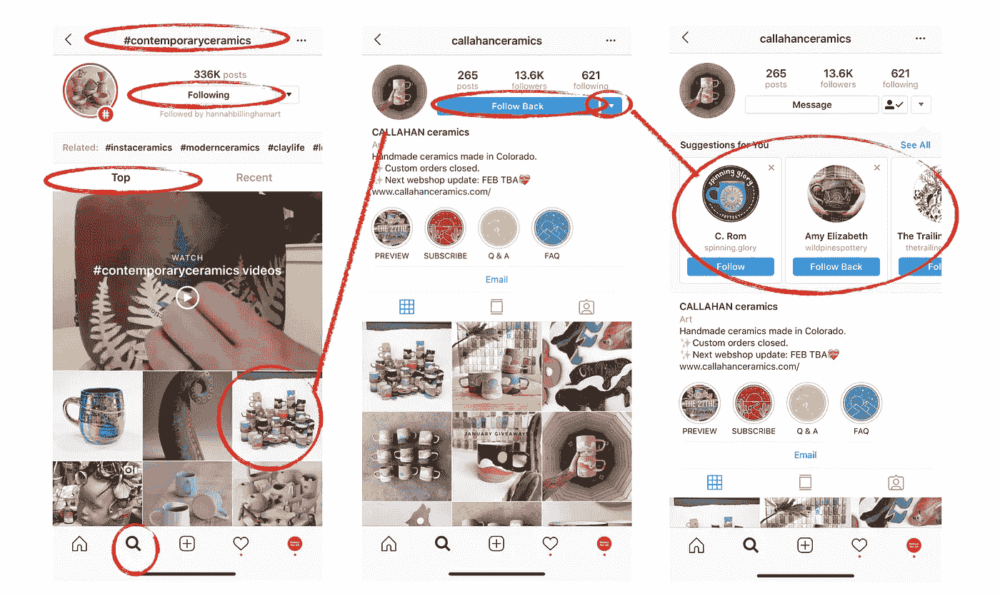

The process is similar to what I do when looking through my Explorer page. Btw, it’s also important to note that you should only follow interesting and relevant accounts to your specific niche. The more discerning you are, the more likely it is that you’ll feature the posts that are *actually* the most engaging.

冲洗并重复。

通过尽可能经常地持续这个过程，你最终会找到足够多的高参与度、有趣的账户来关注和转发。

**B)从你要展示的客户中找到并保存参与度最高的帖子，并请求他们允许你展示这些帖子:**一旦你发现了最有趣的客户，你就想找到他们的帖子中最有吸引力的。这些是你想转发的照片和视频，因为它们也可能在你的页面上获得高参与度。

我的做法是快速查看最近 9-15 篇帖子的“赞”数，然后“保存”获得最多赞的帖子。

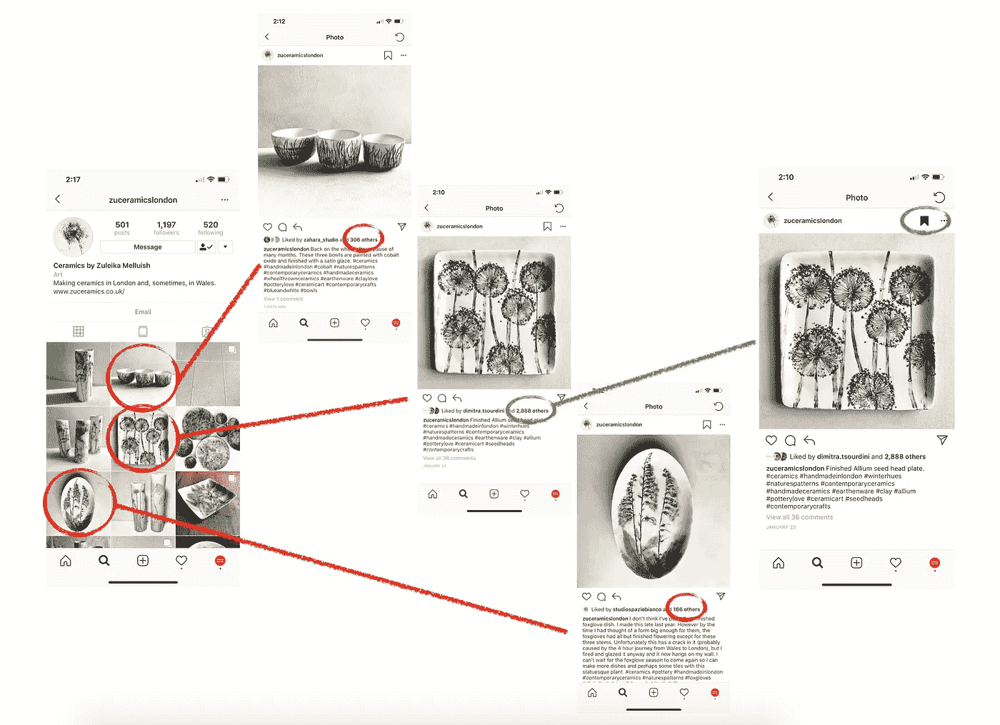

By reposting the posts that have the highest engagement you’re basically choosing the post that their audience already voted as the most engaging. Although not perfect, this system will greatly increase the likelihood of you picking posts that will get high-engagement on your page in comparison to picking the posts that you like the most. Most of the time what we like doesn’t necessarily match what our audience likes.

一旦你找到了你想在未来发表的确切帖子，确保跟踪你找到它的账户，给他们发那个确切的帖子，并请求他们允许发表它。没有得到原创者的同意，你不应该发布帖子。这不仅是正确的做法，而且从长远来看，未经艺术家许可的转发将极大地减少你为其他账户以及你自己创造的价值，因为你的账户将被视为一个从其他账户内容中获利的匿名机器人，而不是一个可以为小创作者带来有机流量和价值的有益平台。这里有一个例子，当我请求艺术家们允许我转贴时，我给他们发了一条信息，还有一个声明，我清楚地规划了选择和收费的过程。

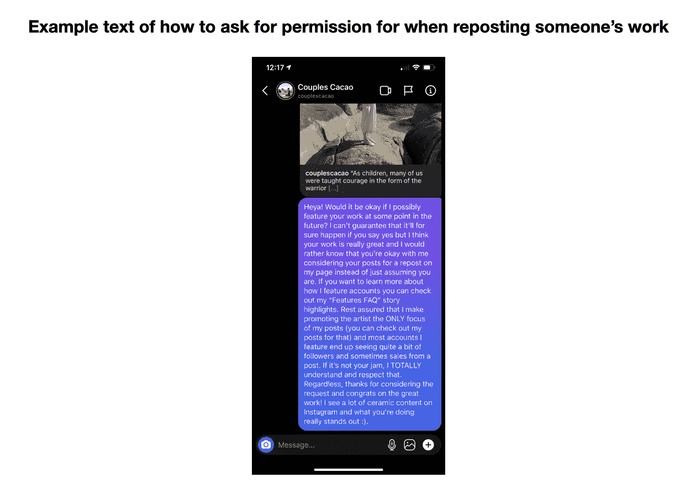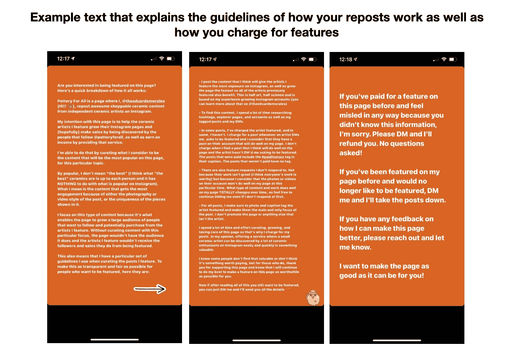

通过这个寻找最吸引人的内容并请求同意转贴的过程，你将在你保存的照片中建立一个最吸引人的帖子库(见下文)。在这里，你可以很容易地引用和保存你以后要转贴的所有内容。

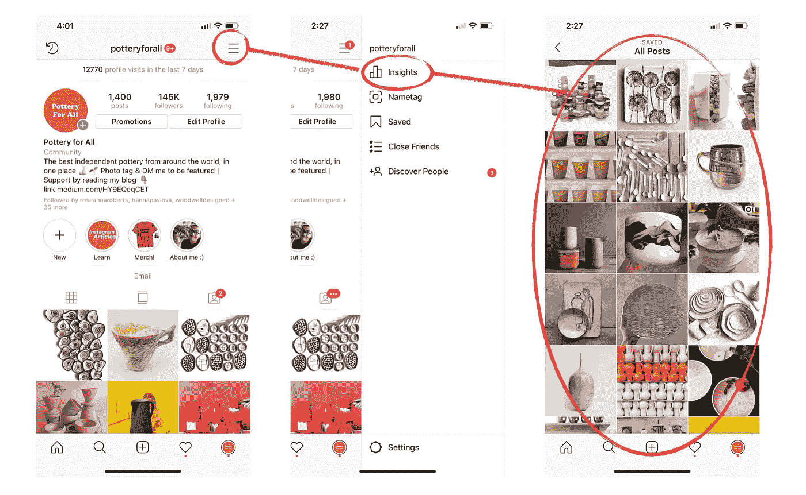

And don’t forget! You need to post [at least once per day to grow at a fast rate](/the-mission/how-to-grow-your-instagram-without-buying-followers-76e1d984d00e?source=user_profile---------2------------------), which means that you’ll have to save at least one post per day as well. The more of a “cushion” of content you build, the easier it’ll be to maintain an efficient workflow down the line.

**C)使用** [**Dinsta**](https://www.dinsta.com/photos/) **和/或**[**w3 toys**](https://www.w3toys.com/)**下载您要转贴的照片或视频的高分辨率版本:**现在您已经有了一个高参与度照片和视频库可以转贴，您可以通过在浏览器中找到帖子，然后提取其中的。照片来自 [Dinsta](https://www.dinsta.com/photos/) 的 jpg 文件，视频来自 [W3toys](https://www.w3toys.com/) (这是你将用来通过 [Instagram 调度器](/the-mission/how-to-schedule-instagram-posts-from-your-computer-7138ba26658f)自动发布帖子的文件)。

他们不仅会给你高分辨率的文件——这是必不可少的，因为高质量的照片表现更好——而且你还会避免大多数转帖应用使用的讨厌的白色小标签。这些看起来很糟糕，对你的参与度有负面影响。

**D)使用内容调度程序每天自动发布帖子:**一旦你有一系列要转发的高分辨率图片，使用 Instagram 内容调度程序自动发布帖子，节省大量时间和精力。为了让你的账户增长最大化，确保每天发一次帖子(看看[这篇文章](/the-mission/how-to-grow-your-instagram-without-buying-followers-76e1d984d00e)中的“帖子”部分就知道为什么了)，使用最有效的小众标签，在你的大多数粉丝活跃在 Instagram 上的时候发帖。

我喜欢使用 [**OnlyPult**](https://onlypult.com/?io=pinlord) 来[自动发布我的帖子](/the-mission/how-to-automate-posts-on-instagram-from-your-computer-7138ba26658f) ，因为它允许你自动在第一条评论中放置你的标签，并保持你的标题整洁(有些人不喜欢关注标题中使用大量标签的账户)。

**E)清楚地标记和推广你转发的账户:**如果你想从你的账户中赚钱，你分享的每篇帖子最重要的元素是清楚地标记和推广你所展示的账户，而不是你自己。为什么？你能为你的帖子收取的费用完全取决于你能为你推广的客户带来的流量和销售额。如果你的账号不是你帖子的主要焦点，它可能不会给你的帖子带来尽可能多的流量，这将导致你不得不收取更低的广告价格。

为了最大化每篇帖子的价值，请确保只对你所展示的帐户进行照片标记，在标题的第一行提及他们的用户名(人们更有可能阅读帖子的第一句话，而不是第二、第三或第四句)，并包括行动号召，鼓励人们访问他们的帐户并关注/购买/联系他们。下面是我如何在 [@potteryforall](https://www.instagram.com/potteryforall/\) 上执行的:

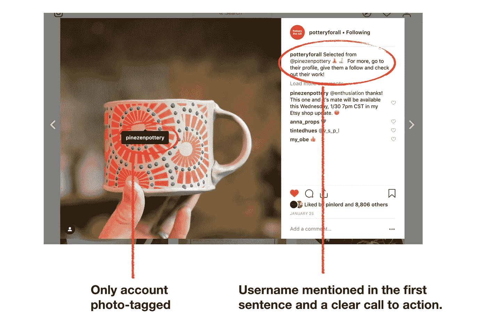

Most repost accounts make the mistake of including their own username in the caption of their posts thinking it’ll help them grow faster. All it does is make the messaging convoluted and drive less traffic to the people you are featuring. If people are interested in your account they’ll tap on your username and follow you. No need to promote yourself — it’s not effective and often appears spammy.

# 4.打造高度差异化的客户:

创建一个转帖账户是如此容易，以至于你最终肯定会看到其他转帖账户出现在你的领域。确保你的账户比这些新的竞争对手增长得更快(这意味着你将来可以收取更多的费用)几乎完全取决于你的转帖账户的差异化程度。你的差异化越明显，相对于其他人而言，它迅速发展成为有机受众的可能性就越大。

为了最大化你的差异化，首先你要有最吸引人的内容(在第三步中详述)，其次，要有视觉上最吸引人的网格。在这篇文章中，你可以更深入地了解区分你的网格[的过程，但总体而言，这取决于当人们浏览你的网格时，你能在一个看起来赏心悦目的布局中排列你的帖子。](/the-mission/why-your-instagram-account-isnt-growing-and-why-it-s-not-because-of-the-latest-instagram-523f6137014b)

在 [@potteryforall](https://www.instagram.com/potteryforall/\) 的例子中，我通过三人一组张贴看起来相似的照片来做到这一点。我从不偏离格式，这在我的网格中创造了一种独特的视觉风格，在我开始的时候没有其他转帖者有过。

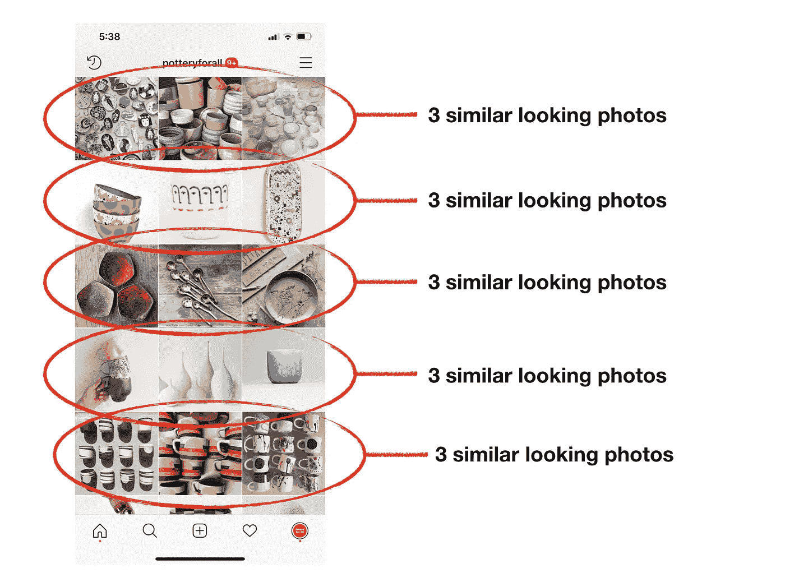

[Here’s an article](https://skedsocial.com/blog/instagram-grid-layout/) with some other grid differentiation ideas that might help.

你越有创造力，你越能更好地执行你的网格，其他转发账户复制你的风格的可能性就越小。

# 5.产生大量与利基相关的互动:

起初，即使你选择了正确的领域，找到了正确的用户名，并且用视觉上有区别的网格发布了很好的内容，你也很难快速增长，除非你能迅速吸引大量的目光。最好的方法是最大化你与可能对你的内容感兴趣的人的互动次数(赞/评论/关注)。这样，他们会在他们的活动源中发现你的用户名，检查你的帐户，如果他们喜欢，就关注你。

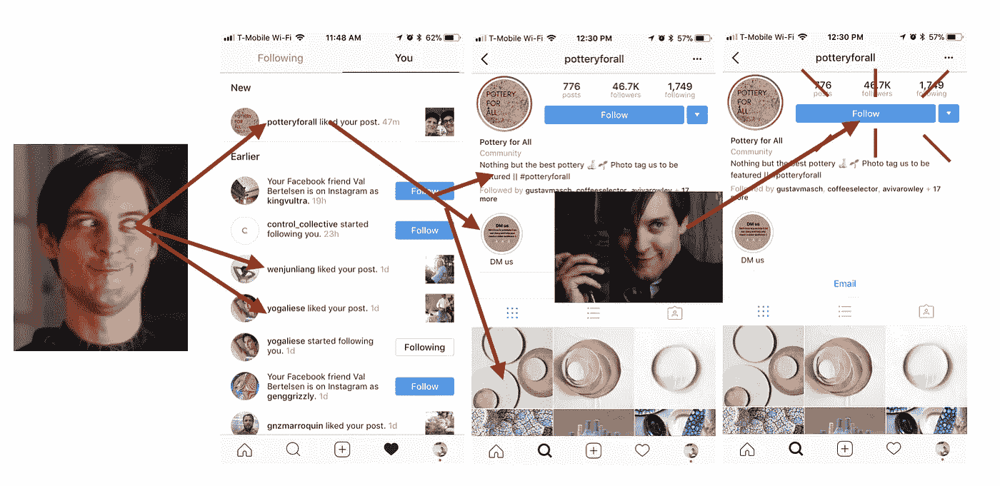

Mindfully executed [instagram bots](https://bettermarketing.pub/the-best-instagram-bots-for-2022-the-most-effective-options-everything-else-you-need-to-know-73fa36f4e433) help you reach a larger audience of people who might be interested in your account by interacting with their posts and showing up on people’s activity feeds. Most people check their activity feeds and this leads to your username being discovered by many more eyes in comparison to just having a great account that doesn’t interact with anyone. Here’s a guide on how to automate an [Instagram bot](/the-mission/how-to-automate-an-effective-instagram-bot-that-isnt-spammy-b2146a2c0b19) safely.

找到可能对你的内容感兴趣的人的最好方法是，在你的领域内确定最相关的内容创建者和标签，然后与尽可能多的关注他们的账户互动(喜欢/评论/关注)。

您可以手动执行，或者通过自动运行一个有效的非垃圾邮件机器人来执行。[这里有一篇文章](https://hackernoon.com/the-best-instagram-bot-that-will-keep-your-account-safe-4aaf0ccaee4d)列出了最有效和最安全的账户，而[这里有一篇](/the-mission/how-to-automate-an-effective-instagram-bot-that-isnt-spammy-b2146a2c0b19)会给你一步一步的指导，告诉你如何以一种有效但不垃圾的方式自动化它们。

# 6.收费:

让我们明确一点，拥有大量的追随者不会为你建立一个企业；推动销售和交通的人，你会转贴。所以，在你这么做之前，不要收钱。一旦你做到了(通过正确执行步骤 1-5 ),这是我发现的对转发收费的最佳策略。

**A)让人们更容易联系到你，从而最大限度地增加转发的入站请求:**你收到的转发入站请求越多，你就能赚到越多的钱。问题是，大多数人并不直觉地知道你愿意推广他们的 Instagram 账户，所以在你的简历中清楚地说明这一点很重要。一个简单的“转发给我”标题就可以了:

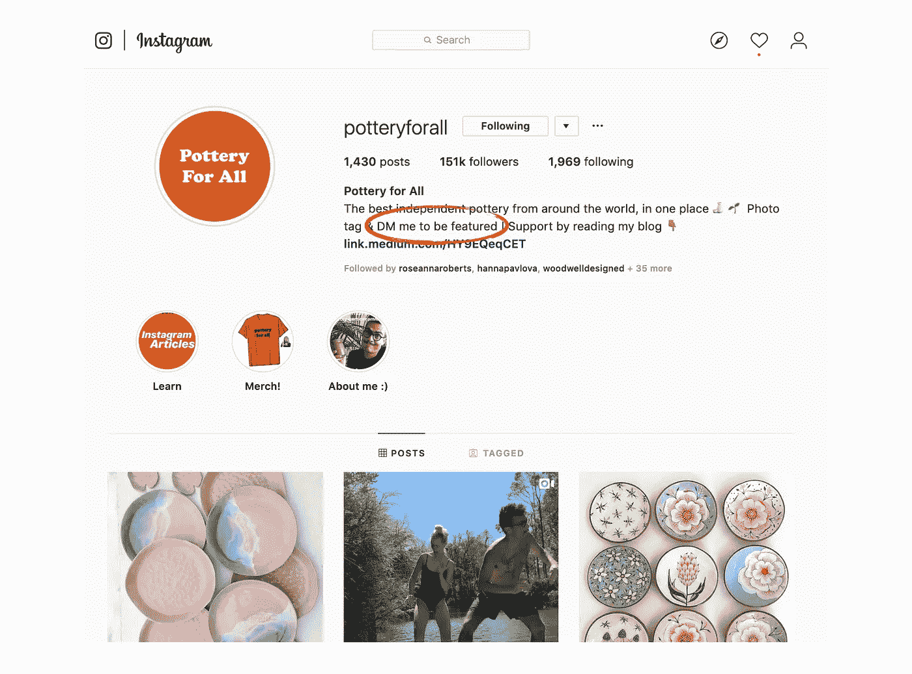

**B)提供清晰具体的可交付成果:**一旦你开始收到客户的 DM，要求在你的账户上添加某个功能，你的长期生存能力就取决于你的专业程度以及你对待同事的态度。因此，在收钱的时候，提供清晰具体的交付内容是很重要的。根据你的内容不同，每个账户都会有所不同，但就我而言，以下是我在 [@potteryforall](https://www.instagram.com/potteryforall/) 上提供的具体交付内容和流程:

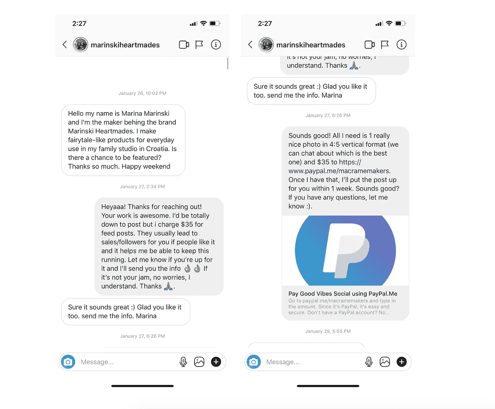

让支付变得简单而安全:成为专业人士的一部分也是为人们提供安全的支付选择，在出现问题时保护他们。就我而言，我更喜欢使用贝宝。大多数人都有，它很容易使用，它提供了买家保护，你可以创建自己的简单支付网站(你可以学习如何创建自己的贝宝支付网站[这里](https://www.paypal.me/))。

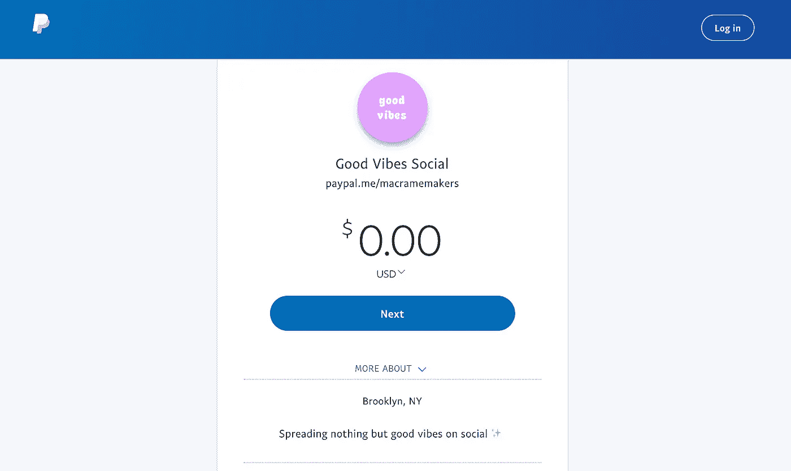

In my case, I use [https://www.paypal.me/macramemakers](https://www.paypal.me/macramemakers) but I would recommend you use a less-specific name for your site since you might one day accept payments from differently named businesses there. I use this paypal.me link to charge for my posts on @potteryforall, but something like [https://www.paypal.me/](https://www.paypal.me/macramemakers)goodvibessocial would’ve been better as it’s a nice umbrella name from which I can charge on all of my accounts.

**D)友善、友好、专业并认真对待你的业务:**除了推动业绩，你作为一家企业的长期生存能力将在很大程度上取决于与你共事的人的友善、友好和专业程度，所以要认真对待。感谢请求转发的人，对他们在你的帖子后得到的结果感兴趣，询问你的客户的反馈，每当有人询问时给予真诚的建议，并且总是尽力做好你能做的。除了好的生意，你可能最终会帮助生意兴隆，并在此过程中结交一些好朋友。

**E)继续改变和测试，以保持交付结果:**最后但同样重要的是，记住你能收取多少钱取决于你能带动多少流量和销售额，因此优化你的账户以获得高参与度应始终是你的首要任务。不断衡量您的参与度，测试新内容，发展您的业务。如果你在自己的领域做得很好，不可避免地会出现其他转发账户，因此，最具差异化和最有效地推动结果是你继续健康发展的唯一保证。

就是这样，伙计们…

要创建一个成功的 Instagram 转发账户，让你赚钱，你必须找到正确的定位，正确的用户名，每天在你的定位中发布最吸引人的内容，创建一个高度差异化的账户，并产生大量与定位相关的互动，以建立一个快速增长的受众，并在你介绍某人时推动流量和销售。 一旦你增加了流量和销售额，你就可以开始赚钱，并继续改进和优化，以建立长期业务。如果你想知道这是否真的有用，可以看看 Instagram 上的 [@bonsaibooth](http://instagram.com/bonsaibooth/) 和 [@stikerfreaks](https://www.instagram.com/stickerfreaks/) 。它是由一个日本人发起的，他读了我的文章并决定使用同样的技术。

顺便说一句，如果你想更深入地研究其他策略和系统，以更快地发展你的 Instagram，请阅读这些关于[insta gram 到底是什么以及如何工作的文章](https://theeduardomorales.medium.com/what-instagram-really-is-how-it-works-ad5d7ff5b6a0)，[insta gram 正在消亡吗？](https://bettermarketing.pub/is-instagram-dying-yes-but-not-for-everyone-and-not-for-the-reasons-youd-expect-349538bdd78)、 [Instagram 利基市场以及为什么它们是增长的关键](/better-marketing/instagram-niches-why-they-are-the-new-key-to-growth-on-instagram-beca2878d55d)、[如何在 Instagram 上赚钱](/the-mission/how-to-make-money-on-instagram-7b13ce4b300d)，你需要知道的关于[抖音机器人](/better-marketing/tiktok-bots-the-best-bot-providers-ca6ebe9a0134)、[为什么你的 Instagram 账户没有增长](/the-mission/why-your-instagram-account-isnt-growing-and-why-it-s-not-because-of-the-latest-instagram-523f6137014b)、[如何选择正确的 Instagram 用户名](/better-marketing/how-to-pick-the-best-instagram-username-9af1b49b7ad)、 [Instagram 机器人 2021](/better-marketing/instagram-bots-in-2021-everything-you-need-to-know-b57fb0a3b8e9) 、h [如何创建有效的 Instagram 故事广告](https://hackernoon.com/how-to-create-an-effective-instagram-story-ad-bf9aef9eb9)、 [如何](/better-marketing/how-to-pick-the-best-instagram-username-9af1b49b7ad)[检查你是否被屏蔽](https://hackernoon.com/3-simple-steps-to-check-if-youre-shadowbanned-what-shadowbanning-is-what-causes-it-and-how-to-175723df938b)，如何[将你的媒体文章货币化](https://hackernoon.com/how-to-monetize-a-medium-article-b4c1aeb7fdae)，[如何提高你的 Instagram 参与度](/swlh/how-to-measure-influencer-marketing-roi-on-instagram-321b9b397ef4)，如何[找到发布的最佳时机](/the-mission/how-to-optimize-posting-times-to-fix-your-falling-engagement-rates-on-instagram-f9ecf87e82aa)，以及[如何找到最有价值的 Instagram 影响者](https://hackernoon.com/how-to-search-for-and-find-the-most-valuable-influencers-on-instagram-df8ddd5b2243)，[如何衡量一个影响者的价值](https://hackernoon.com/how-to-measure-what-an-instagram-influencer-is-worth-cb488f605ffe)，[如何衡量你的影响者营销投资回报率](/swlh/how-to-measure-influencer-marketing-roi-on-instagram-321b9b397ef4)，以及

希望这有帮助！别忘了，建造东西的最好方法就是开始。不要让问题或分析阻止你。在开始转帖之前，我在内容创作方面很糟糕，现在我以此为生。如果我能做到，你也能！

## 非常感谢您花时间阅读我的文章！如果你喜欢它，你可以通过注册我的 [Instagram 小企业班](https://theinstaclass.co/)来支持我，分享这篇文章并给它一堆掌声。你也可以[在 Instagram](https://www.instagram.com/theeduardomorales/) 上关注我，每当我发布❤的新作品，你就可以获得更新

## 这篇文章发表在[《创业](https://medium.com/swlh)》上，这是 Medium 最大的创业刊物，有+436，678 人关注。

## 在这里订阅接收[我们的头条新闻](https://growthsupply.com/the-startup-newsletter/)。

