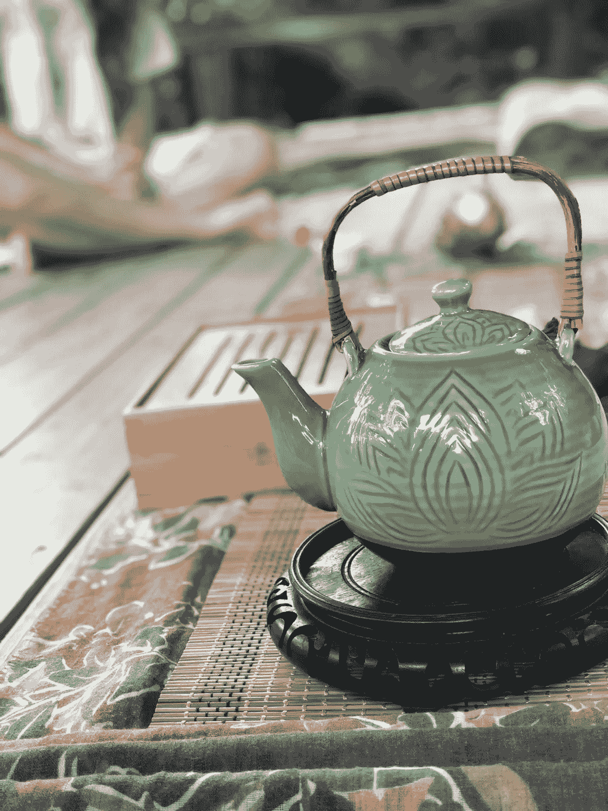

# 如何创造一个有意图的早晨

> 原文：<https://medium.com/swlh/how-to-create-an-intentional-morning-352c92f195ad>

## 以及为什么它很重要

早上的例行公事有一个时刻。

Youtube 上有很多视频，展示了美好而放松的早晨，人们写日记，喝咖啡，悠闲地为一天做准备。它们可爱又鼓舞人心。但是早晨的例行公事真的有必要吗？