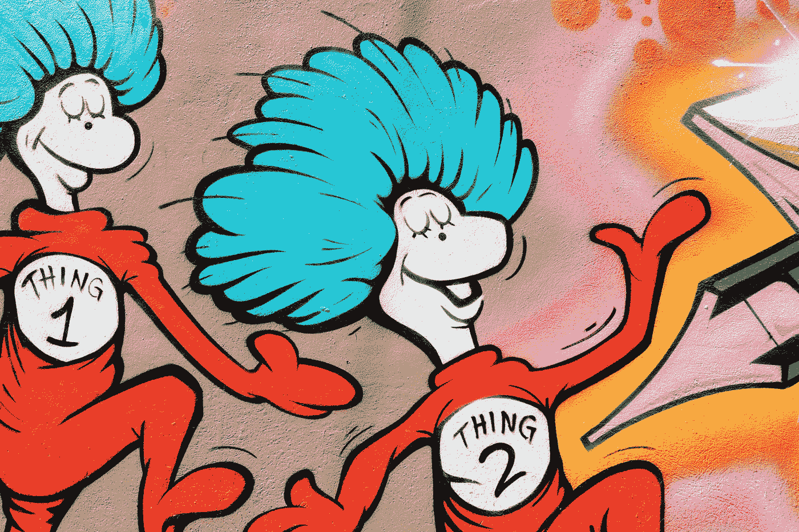

# 如何治愈持续的迟到

> 原文：<https://medium.com/swlh/how-to-cure-the-constant-tardiness-86ce7fb6daea>

## “迟到总比不到好”不是一种好的心态

Photo by [Scott Webb](https://unsplash.com/photos/KesWZ9GyJ5k?utm_source=unsplash&utm_medium=referral&utm_content=creditCopyText) on [Unsplash](https://unsplash.com/?utm_source=unsplash&utm_medium=referral&utm_content=creditCopyText)

我在欧洲南部长大，在那里迟到从来不被认为是一种冒犯。甚至预计会迟到 10 到 15 分钟。这一社会规范超越了生活的每一个领域。商务约会开始的时间总是比宣布的时间晚。