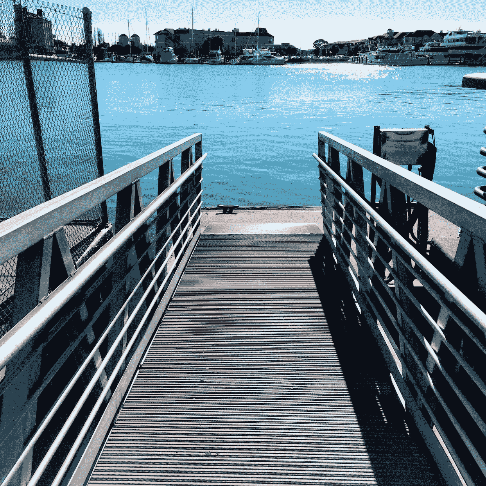

# 如何投入工作，找到自己的心流

> 原文：<https://medium.com/swlh/how-to-dive-into-work-and-find-your-flow-b386421e0e17>

我的高中历史老师，赖特先生，比我想象的更健康。他轻盈地走上跳板，走到顶端，凝视着水中。他表现得好像他想确保池里的水还在，而我们，学生团体，欢呼和嘲笑。我想，莱特先生光着膀子穿着泳裤出现在我们面前是多么勇敢啊。如果他像我们其他老师一样身材走样，那会更好，或者更可笑。另外，体型越大，腹部溅起的水花也越大。

我想知道这个向任何感兴趣的老师提供的肚皮朝下挑战背后的原因是否是为了重新树立游泳池的坏运气名声。几个月前的一天，身材娇小的跳水队员凯莉准备在跳板上练习跳水。与此同时，有人在隔壁的棒球场上练习打了一个界外球，球以一个不可思议的角度飞了一段不可思议的距离，打在了凯莉的头上。嘉莉掉进水里，爬了上来，过了一会儿，她说不出连贯的句子。她康复了；水池的图像没有。但如果有人能改变我们的想法，那就是勇敢的赖特先生，穿着宽松的蓝色泳裤，站在跳水板上——除非出了什么差错。

# 目的和流程

每个上学的早晨，我的其他高中老师都皱着眉头，拖着沉重的脚步走向他们的教室。我经常想，如果他们这么不喜欢当老师，为什么还要继续教书。他们对待工作的态度就好像他们找不到更好的工作，或者好像这个角色远没有他们预期的那么令人满意。结果，他们的教室成了无色能量的漩涡。

莱特先生的教室与众不同。他对学生的参与抱有很高的期望，引导着一天的课程，让我们保持警觉。如果你没有阅读，或者表达你的好奇心，莱特先生会让你觉得这堂课和你的同学一样，缺少你的贡献。他不是坐在桌子后面上课，而是站着教我们。他在白板上涂鸦的时候没有背对着我们站着，而是面对着我们，进行眼神交流。他不看钟，他的上课时间消失了。

如果你想在工作中融入潮流，或者打算改善你对自己工作的感觉，问问自己这个问题:*我为什么在这里？我从莱特先生那里学到的一大教训是，工作中的满足感始于确定你的目标的**。没有目标，找到心流的机会很小。***

# **心流只针对少数人吗？**

**艺术家和运动员把“流动”说成是一种精神状态，在这种状态下，时间消失了，表演者想要创作的任何东西都很容易从他们的努力中流出。他们推断，当参与者经过多年的勤奋练习，正在做他们生来注定要做的事情时，就会“进入状态”，或者“进入状态”。这是事实，但不是全部。**

**如果“心流”是一种存在状态，那么“心流”就像快乐、悲伤或任何其他精神状态一样容易接近。诀窍在于搭建舞台，让心流出现。虽然莱特先生的老师同事允许其他精神状态主导他们的表演，但莱特先生知道秘密的舞台设置策略来吸引心流。**

# **找到你的心流你需要知道什么**

**首先，莱特先生采取措施避免分心。他上课时不拿咖啡杯，也不拿讲稿。他把手机放在背包里，要么静音，要么关机。当他工作的时候，他已经**订婚了，并且完全处于状态**。**

**接下来，莱特先生朝着一个短期目标努力——发表演讲、主持讨论和布置任务。然而，他的方法并不死板。他允许并鼓励我们的投入，尽管他无法预料内容或结果。换句话说，Wright 先生能够**保持一个明确的最终目标，并在实现目标的道路上保持灵活性**。**

**莱特先生确保自己表现出积极的态度，并传达出对自己能力的信心。他把自己可能对办公室政治和资源匮乏的不满放在一边。他的自信吸引了我们的注意力，激发了全班前进的动力。**

**莱特先生经常谈论他如何喜欢徒步旅行和骑自行车，并以这种方式鼓励我们保持健康。莱特先生的健康状况给了他足够的力量和精力来满足教学要求，这有助于他的教学。他不是一个健康迷；他只是让健康成为一种习惯。**

**最后，赖特先生会在他的工作范围内积极寻求新的挑战，无论是教授新概念还是与学生交流的新方式。在课堂上，他接受了我们的问题(有思想的问题),并在此基础上继续。我几乎可以看到他在演讲时努力创新他的演讲。此外，当有机会通过主演一部腹部飞溅的电影与他的学生在一个新的水平上互动时，赖特先生说是的。**

# **流动的最后一个障碍**

**莱特先生从跳板的顶端退了出来，摇了摇头，好像他有别的想法。我们，他的学生，没有上当。我们欢呼的声音更大了，对他的诘问也更多了。我钦佩他延长表演的本能，但我担心他会表现得太像一个小丑，减少我们的期待。**

**莱特先生一定很紧张。他可能希望自己不会受伤。至少，从高处拍打水面通常会造成瘀伤。此外，如果他受伤了，这项活动将无法恢复我们的游泳队的不幸池我们学校的骄傲。**

**莱特先生再次走上跳板。这一次，他花了一点时间来静止他的身体，集中注意力。我们也变得安静了。然后，他沿着冲浪板朝水面大步走了三步，在尖端弹了一下，然后飞向空中。他不知何故向后伸出手，抓住他的两个脚踝，然后在他入水前松手伸展身体。溅起的水花并不令人印象深刻，但我们站起来欢呼，就好像我们目睹了一场海啸。莱特先生从游泳池里爬出来，微笑着向我们敬礼。**

**流动的最后一道坎是什么，或者说全身心投入工作的最后一道屏障是什么？莱特先生会说是犹豫，或者说是恐惧。当我们走到可能性的边缘，或者有机会一头扎进去的时候，我们都会遇到这种情况。如果有帮助的话，记住我在为你加油，不是为了让你引起轰动，而是为了让你飞起来。当你选择克服这最后一个障碍时，记住这些提示来诱导工作中的心流期:**

1.  ****避免分心。****
2.  ****保持一个明确的最终目标，并在实现过程中保持灵活性。****
3.  **表现出积极的态度，传达出对自己能力的信心。**
4.  ****保持身体健康。****
5.  ****寻求新的挑战。****

***这篇文章是我在古怪的职业生涯中学到的教训的系列文章之一。话题包括求职面试失误、被解雇有多容易、对错误有更好的心态等等。***

**工作中感到不知所措或没有成就感？或者，不敢相信自己在事业上有多幸运？我去过那里，我有经验可以分享。我希望它们对你有所帮助。**

***原载于 2019 年 6 月 13 日*[*http://authoralisawilson.com*](http://authoralisawilson.com/2019/06/13/how-to-dive-into-work-and-find-your-flow/)*。***