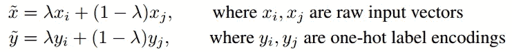
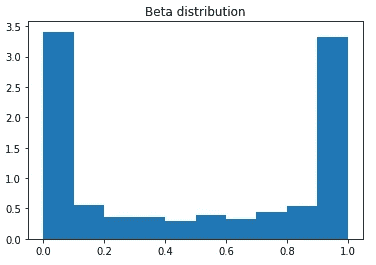
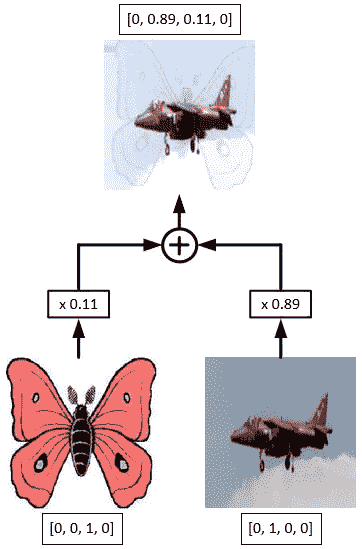

# 如何从 Keras 中的图像文件进行混音训练

> 原文：<https://medium.com/swlh/how-to-do-mixup-training-from-image-files-in-keras-fe1e1c1e6da6>

之前，我们在 Keras 中介绍了[用卷积网络提高图像分类性能的一系列技巧](https://www.dlology.com/blog/bag-of-tricks-for-image-classification-with-convolutional-neural-networks-in-keras/)，这一次，我们将仔细看看最后一个叫做 mixup 的技巧。

# 什么是 mixup 培训？

论文 [mixup:超越经验风险最小化](https://arxiv.org/pdf/1710.09412.pdf)提供了传统图像放大技术如缩放和旋转的替代方案。通过对两个现有示例进行加权线性插值来形成新示例。

(Xi；yi)和(XJ；yj)是从我们的训练数据中随机抽取的两个例子，λ∈[0；1]，实际中λ是从β分布中随机抽样的，即β(α；α).

α ∈ [0.1;0.4]导致性能提高，较小的α产生较少的混合效应，而对于较大的α，混合导致拟合不足。

正如您在下图中看到的，给定一个小的α = 0.2，beta 分布采样更多更接近 0 和 1 的值，使得混合结果更接近两个示例中的任何一个。

Beta distribution (α = 0.2)

# 混搭训练有什么好处？

虽然像 Keras [ImageDataGenerator](https://keras.io/preprocessing/image/#imagedatagenerator-class) 类中提供的那些传统的数据扩充一直导致改进的泛化，但是该过程依赖于数据集，因此需要使用专家知识。

此外，数据扩充没有对不同类的例子之间的关系进行建模。

另一方面，

*   Mixup 是一个数据不可知的数据扩充例程。
*   它使决策边界从一个类线性过渡到另一个类，提供了更平滑的不确定性估计。
*   它减少了损坏标签的记忆，
*   它增加了对抗样本的鲁棒性，稳定了生成对抗网络的训练。

# Keras 中的 Mixup 图像数据生成器

试图给 mixup 一个旋转？让我们实现一个图像数据生成器，它从文件中读取图像并开箱即用 Keras `model.fit_generator()`工作。

mixup 生成器的核心由一对迭代器组成，通过在`__next__`方法中执行的 mixup，一次一批地从目录中随机采样图像。

然后，您可以创建用于拟合模型的训练和验证生成器，请注意，我们在验证生成器中没有使用 mixup。

我们可以用 Jupyter 笔记本中的以下代码片段来可视化一批混乱的图像和标签。

下图说明了 mixup 的工作原理。

# 结论和进一步的思考

您可能会认为一次混合两个以上的示例可能会导致更好的训练，相反，三个或更多示例与从 beta 分布的多元泛化中采样的权重的组合不会提供进一步的增益，但会增加混合的计算成本。此外，仅在具有相同标签的输入之间进行内插不会导致混合的性能增益。

在我的 Github 上查看完整的源代码。

 [## Tony607/keras_mixup_generator

### 如何从 Keras-Tony 607/Keras _ mixup _ generator 中的图像文件进行混音训练

github.com](https://github.com/Tony607/keras_mixup_generator) 

[在推特上分享](https://twitter.com/intent/tweet?url=https%3A//www.dlology.com/blog/how-to-do-mixup-training-from-image-files-in-keras/&text=How%20to%20do%20mixup%20training%20from%20image%20files%20in%20Keras) [在脸书分享](https://www.facebook.com/sharer/sharer.php?u=https://www.dlology.com/blog/how-to-do-mixup-training-from-image-files-in-keras/)

*原载于*[*www.dlology.com*](https://www.dlology.com/blog/how-to-do-mixup-training-from-image-files-in-keras/)*。*

## 这篇文章发表在 [The Startup](https://medium.com/swlh) 上，这是 Medium 最大的创业刊物，拥有+409，714 名读者。

## 在这里订阅接收[我们的头条新闻](http://growthsupply.com/the-startup-newsletter/)。

