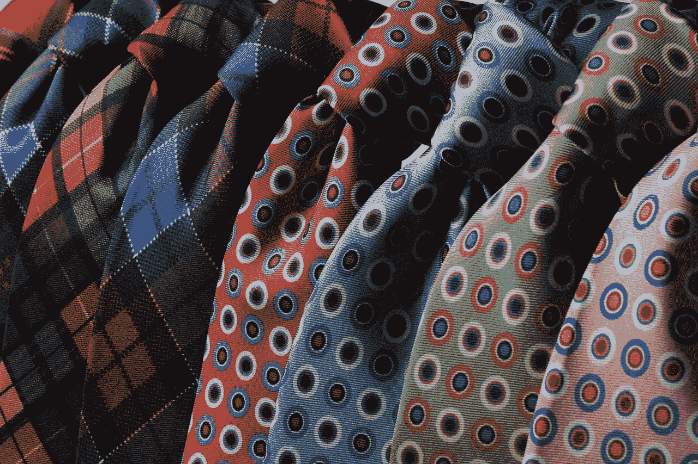

# 如何穿着成功

> 原文：<https://medium.com/swlh/how-to-dress-for-success-ad94e547c49e>

## 穿什么去参加最重要的第一次面试

Photo by [Fulvio Tognon](https://pixabay.com/users/fulvio_tognon-75805/) via [Pixabay](https://pixabay.com/photos/neckties-cravats-ties-fashion-men-210347/)

## 只需几秒钟就能给人留下良好的第一印象。

但是“良好的第一印象”是什么意思呢？面试，从**服装开始。**

婴儿潮一代和 x 世代的人将商务休闲装理解为一种不太正式的服装风格，比……