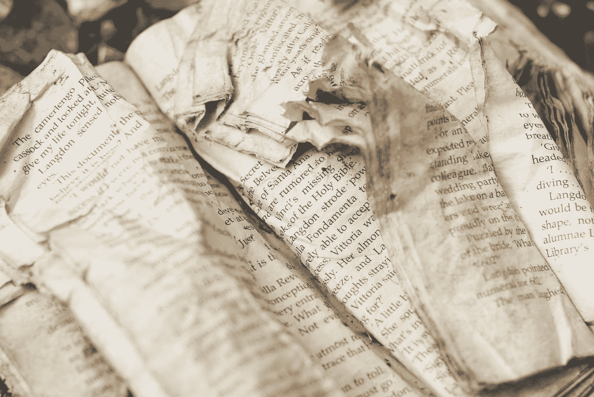

# 如何吃 Sh*T 不死

> 原文：<https://medium.com/swlh/how-to-eat-sh-t-and-not-die-e9430b2a18e0>

## 以写作为生

Photo by [Hello I'm Nik](https://unsplash.com/@helloimnik?utm_source=medium&utm_medium=referral) on [Unsplash](https://unsplash.com?utm_source=medium&utm_medium=referral)

丹·布朗那张皱巴巴的“天使与魔鬼”的照片很合适，因为作为作家，我们几乎每天都在与我们的天使和魔鬼搏斗。*周日两次——好吧，开个玩笑，有点*。

我相信我们的恶魔更容易对付。或者至少更容易被认出来。好像是同一批人一直出来玩。我们不得不一直面朝下…