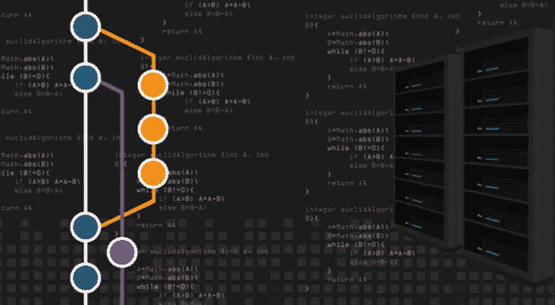

# 如何有效地管理复杂的代码库

> 原文：<https://medium.com/swlh/how-to-effectively-manage-complex-code-bases-6afea8118cbe>

源代码控制是软件开发不可或缺的一部分。当代码被正确地存储和管理时，我们的生活变得非常容易，特别是在大型产品团队持续发布的场景中。

仅开发和测试 Windows 的微软产品团队就有 2000 多名员工。对于如此庞大的团队，想象一下当……