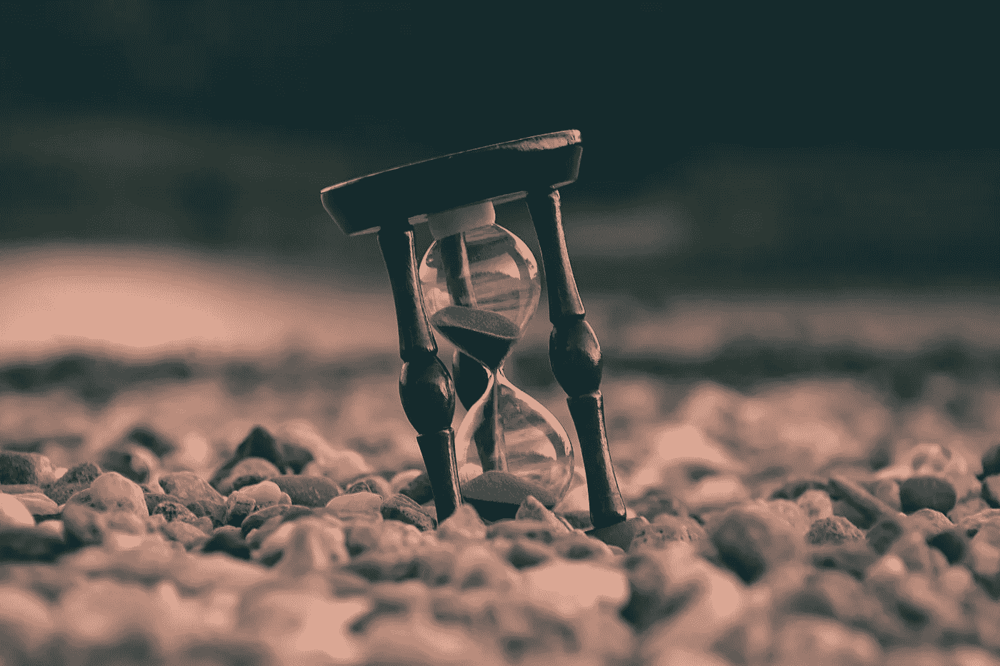

# 如何在还来得及的时候享受生活

> 原文：<https://medium.com/swlh/how-to-enjoy-life-before-its-too-late-f5ceb2b42e52>

## 来自聪明头脑的智慧宝石

Photo by [Aron Visuals](https://unsplash.com/@aronvisuals) on [Unsplash](https://unsplash.com/photos/BXOXnQ26B7o)

“但生命的意义是什么？”爱丽丝问。

“生活的意义就是活着，”他回答。

> “这是如此简单明了。然而，每个人都在巨大的恐慌中四处奔忙，仿佛有必要实现超越自己的目标。”艾伦·瓦茨，哲学家

艾伦·沃茨在上面指出的是，我们很幸运能享受生活的礼物，但我们仍然不停地四处奔波寻找它。我们没有意识到生活已经在我们心中。我们就是生命:我们呼吸，感受，我们本身就足够了。

## 人们倾向于以两种不同的方式思考生活。

阅读并挑选。

有些人认为他们会活得足够长，并有推迟事情的奢侈:一次、两次或多次，这往往会成为一种生活方式。

另一些人认为生命短暂，他们没有时间把他们喜欢的东西都放进去。所以，为什么要在乎呢？

如果第一类给了你一丝认可，你一定经历过那种促使你推迟事情或情况的感觉。几率表明你仍有可能经历它。你可能会想，你*将来会*做点什么，你*会*去做你一直想要的旅行，你*会*辞掉工作去追求你的作家梦，你*会*成为你一直想要的人。你*会*幸福。

*将*。

你似乎把所有的愿望和梦想都寄托在未来，期望事情有一天会改变，但不是现在。如果你认为下一个时刻包含了这个时刻所缺少的，那么你的未来就是不确定的。

时间在不知不觉中流逝，你没有享受过“现在和今天”。

总有一天，你满头雪白的头发，满脸皱纹，你会说“*我希望我曾经尝试过跳舞*”或者“*我本可以追求成为一名教师的梦想*”。

”*我为什么没做？我拥有世界上所有的时间。*

我来告诉你为什么。因为你忘记了你的死亡。你忘记了你在这里的具体时间，有一天，你的生命将走到尽头。

我还没有白头发，脸上也没有皱纹，我不知道当你意识到你浪费时间做你并不真正想做的事情或不做你想做的事情时，你会有什么感觉。但我向你保证我不想知道。

如果你倾向于认为你的生命是短暂的，你不可能把所有的东西都放进去，请允许我告诉你，你错了。人生不短，我们*让*更短。

不要从我这里拿走它；这是古罗马斯多葛派哲学家塞内卡的话，他在谈到生命的意义时说:

> “这并不是说我们的生命很短，而是我们浪费了很多时间。生命够长了，如果投资得当，我们已经获得了足够多的回报，可以获得最高的成就。但是，当它被浪费在轻率的奢侈中，被花费在无益的活动上时，我们最终被死亡的最终约束所迫使，意识到它在我们意识到它正在逝去之前就已经逝去了。事实就是这样:我们缩短了它，我们不是供应不足，而是浪费了它。如果你知道如何利用它，生命是漫长的。”

二十世纪前的塞内卡想用通俗的语言表达什么？

人生绝非短暂。我们是人类，我们比地球上的其他动物更有生存的天赋。我们的生命由几分钟、几小时和几天组成，如何度过它们取决于我们自己。我们会像塞内卡说的那样把它们花在“没有好活动”上吗？还是我们充分利用了它们？

我们是享受我们的小时光、我们的人和我们爱的事物，还是不停地四处奔波，试图融入一切，取悦所有人？

我打赌你知道答案。我们让自己变得忙碌，充满义务，我们远离了自己。我们全神贯注于我们的工作、我们的老板、我们的账单、其他人的看法，以至于我们忘记了放慢脚步，倾听自己的内心。

如果我们花点时间，那个自我会告诉我们什么？

也许我们需要放轻松，倾听我们的需求，为自己腾出时间，把宝贵的时间花在让我们充满快乐的事情上。

## 带回家的东西

很难。我明白了。你必须去工作，即使你不喜欢它；你需要钱来支付你的账单。你必须关心你的家庭，花更少的时间在你自己喜欢做的事情上。你必须去那个聚会，否则他们会觉得你很奇怪。

但是，你知道吗？不需要成为一种义务。它不需要成为一件苦差事。你可以做点什么。即使你不能辞掉令人精疲力竭的朝九晚五的工作，你也可以找到一种方法愉快地打发时间。

你可以练习你一直想要的手艺。你可以和家人一起做有趣的事情。你可以和你的朋友见面并享受它。你不需要这样做，但是你可以选择你想用什么来充实你的一天。无论你选择什么，确保它能让你充满快乐。

现在，你可能会问我:“如果我想每天躺在沙滩上，沐浴阳光，喝我的莫吉托酒，那会怎么样？”好吧，既然这样，那就去吧。然而，你可以考虑做一些调整。如果你不是生活在海边温暖气候中的幸运人群的一部分，你可能会很高兴躺在公园里享受一口你的咖啡，读你最喜欢的书。

无论你选择做什么，确保你享受其中的每一点。

> “我们如何度过我们的日子，就是我们如何度过我们的一生。”安妮·狄勒德

我们的生活是由时刻组成的，时刻充斥着我们的每一天。让我们充分利用它们。

参考文献: *《生命的短暂:塞内卡论忙碌和活得宽而不活得长的艺术》*，作者玛利亚·波波娃。

 [## 生命的短暂:塞涅卡论忙碌和活得宽而不活得长的艺术

### “我们如何度过每一天，”安妮·狄勒德在她关于当下生活的灵魂伸展冥想中写道，“是…

www.brainpickings.org](https://www.brainpickings.org/2014/09/01/seneca-on-the-shortness-of-life/) 

**如果你喜欢这篇作品，你可能也会喜欢我的文章******。****

***下次见…感谢阅读！***

***如果你想了解作者的更多信息，请关注她的推特***或*[*LinkedIn*](https://www.linkedin.com/in/sara-tsompanidi-75a535138/)*。****