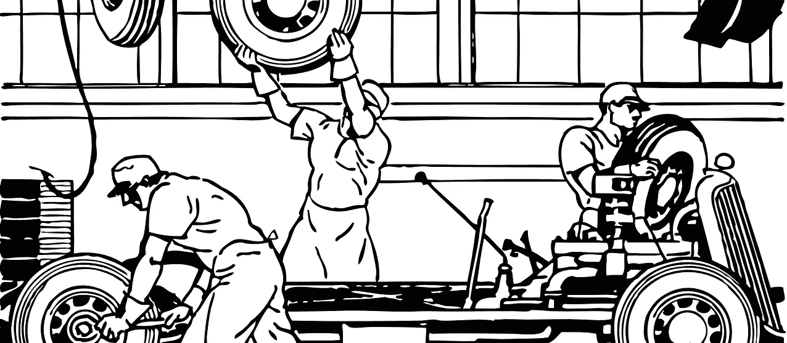

# 如何逃脱雇主赞助的健康保险陷阱

> 原文：<https://medium.com/swlh/how-to-escape-the-employer-sponsored-health-insurance-trap-f8714828e4e2>

几个月前，我写了一篇文章解释为什么雇主赞助的医疗保险(ESHI)被称为美国医疗保健系统的[原罪](/s/story/employer-sponsored-insurance-is-the-original-sin-of-the-american-health-care-system-330dcf6b170c)。这篇文章现在转向一些逃离 ESHI 陷阱的想法。

将近一半的美国人通过他们的工作获得健康保险。在其他主要国家中，没有一个国家的医疗保险覆盖面与……