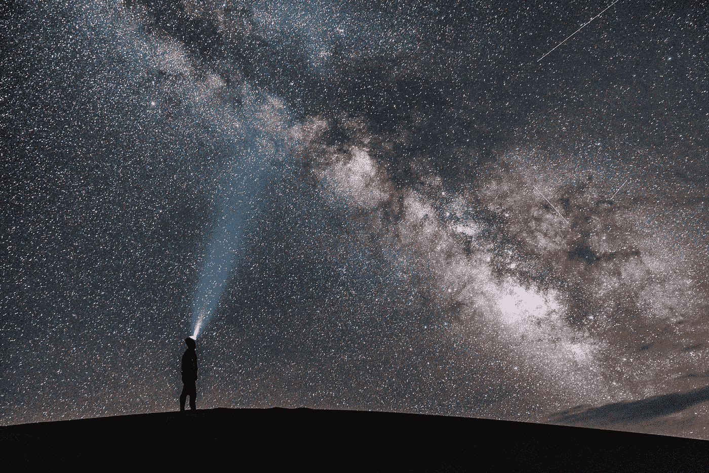

# 如何评估 Moonshot 公司的机会

> 原文：<https://medium.com/swlh/how-to-evaluate-an-opportunity-with-a-moonshot-company-6eb99a11e6dd>

飞行机器人出租车、3D 打印器官、火星殖民和大脑植入让我们能够在没有语言摩擦的情况下相互交流:这些都是我们这个时代最伟大的登月机会。听起来像科幻小说吗？不是的。欢迎来到前沿科技，展示一些最激动人心和大胆的人类愿景。