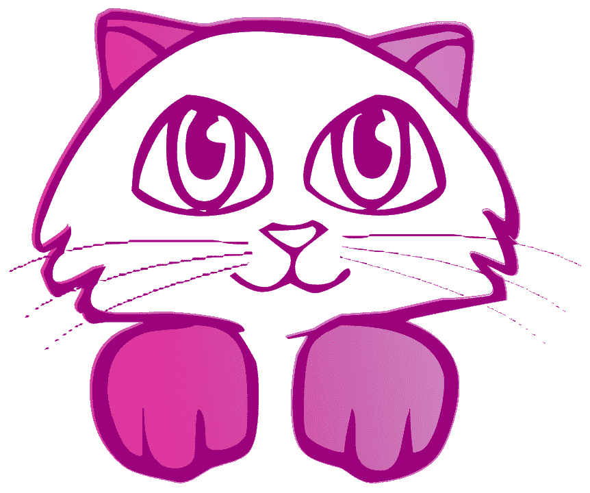

# 如何…收养一只小猫

> 原文：<https://medium.com/swlh/how-to-even-adopt-a-kitty-7f324f7bfd5b>

由[麦家学](https://www.amazon.com/s/ref=nb_sb_noss_2?url=search-alias%3Daps&field-keywords=Michael+Gushue) & [CL Bledsoe](https://www.amazon.com/CL-Bledsoe/e/B00JT19VXS/ref=sr_ntt_srch_lnk_2?qid=1549555892&sr=8-2)

几千年前，猫在埃及被当作神的代表来崇拜，他们不会让我们忘记这一点。如今，人类变化无常。当然，猫可能似乎在整个黑死病事件中犯了错误，但从另一个角度来看，猫想提醒我们谁是老板(剧透:是安吉拉。她支付托尼的工资。).