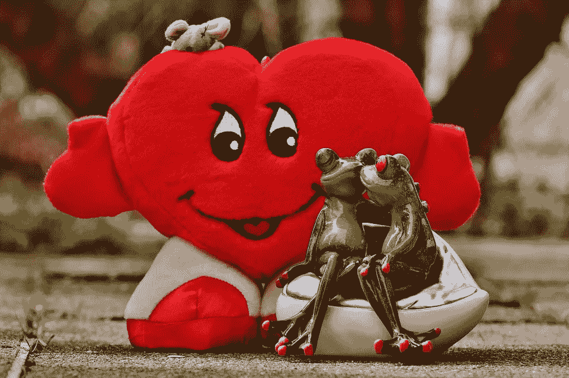

# 如何…调情

> 原文：<https://medium.com/swlh/how-to-even-flirt-ca6d7d22f2f9>

由[麦家学](https://www.amazon.com/s?k=Michael+Gushue&ref=nb_sb_noss_2) & [CL Bledsoe](https://www.amazon.com/CL-Bledsoe/e/B00JT19VXS?ref=sr_ntt_srch_lnk_1&qid=1560181652&sr=8-1)

孤独，阿米利特？那种压倒性的疼痛取代了一个人生存的意愿，迫使我们做出愚蠢的举动，比如希望有一天情况会好转。有一个希腊神话说，人最初是由四只胳膊、四条腿、两个头等组成的。因为神都是混蛋，他们把我们分成两个独立的个体，让我们花费一生去寻找我们丢失的那一半。不禁要问…