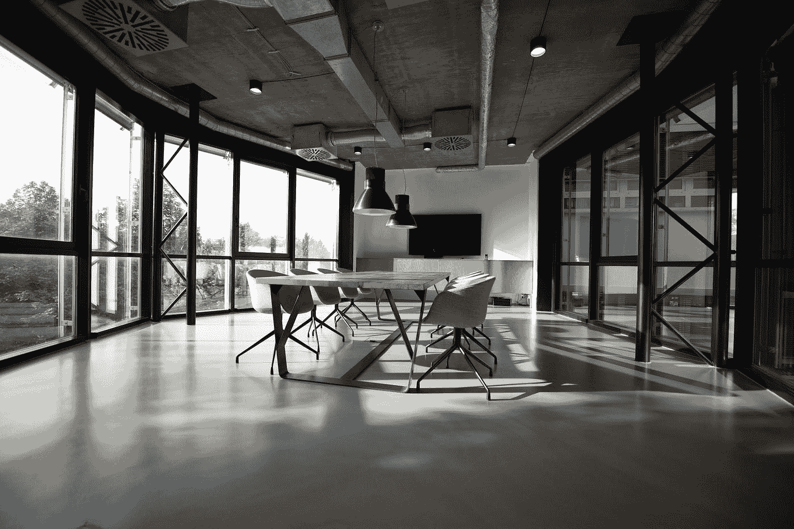

# 如何在当前的工作环境中体验生产力的成功

> 原文：<https://medium.com/swlh/how-to-experience-productivity-success-in-your-current-workspace-f3542c9695fe>

Photo by [Nastuh Abootalebi](https://unsplash.com/@sunday_digital?utm_source=medium&utm_medium=referral) on [Unsplash](https://unsplash.com?utm_source=medium&utm_medium=referral)

## 在三种典型工作环境中提高工作效率

在过去的十年里，我在许多工作环境中工作过。当我大学毕业后开始工作时，我为一个大学体育项目工作。这大约是 50%的办公室工作和 50%的场地工作。很有趣，但是我必须…